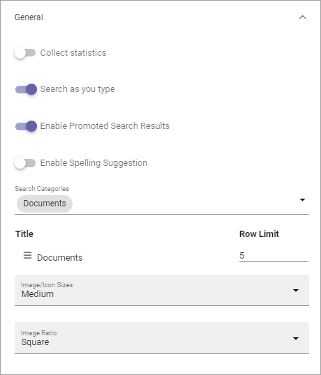
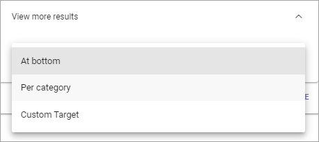
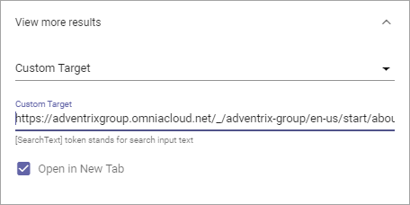

Quick Search settings in Omnia 6.12
==============================================

The settings avilable here are valid in all places where Quick Search is available, both from menus and in the Search block. This page describes the settings in Omnia 6.12 and later.

General
****************
The following settings are available here:

+ **Collect statistic**: If search statistics should be collected from Quick Searh, select this option. Search results can then be displayed in Omnia Admin. For more information, see: :doc:`Search statistics </admin-settings/business-group-settings/search/search-statistics/index>`
+ **Search as you type**: The search can be executed either when the user hits enter or ongoing while the user types in the search field. Decide how it should work here.
+ **Enable Promoted Search Results**: If it should be possible for promoted search results to be displayed in Quick Search, select this option. For more information, see: :doc:`General Block Settings </admin-settings/business-group-settings/search/promoted-search-results/index>`
+ **Enable Spelling Suggestions**: Select this option to display spelling suggestions in Quick Search. It's the same functionality that Microsoft 365 has. 
+ **Search Categories**: One or more Search Categories can be added (if more than one is available).
+ **Row Limit**: You can set Row Limit for each Search Category. Row Limit is the number of objects per Search Results "page".

View more results
******************
Here you can set where the "View more results" link should be placed and if that link should go to a custom target:

"Per category* means after each category, if there are more search results for a category, instead of just at the bottom.

If you select "Custom target", the following is available:

+ **Custom target**: If your organizaton uses another advanced search setup (the View more link goes to an advanced search), you can add the Url here.
+ **Open in new tab**: Select this option if the Custom target link should be opened in a new tab.

