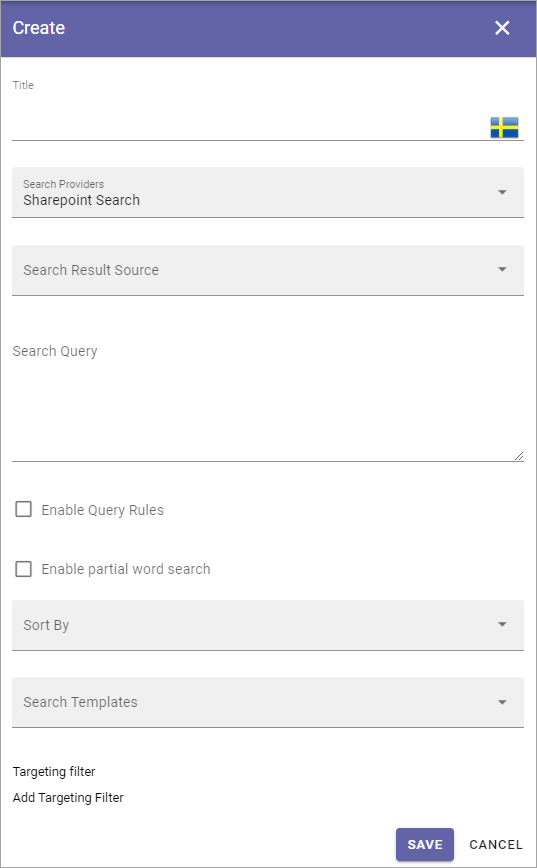

Search Config
=======================================

Here you can work with Search Categories and set default Search Template.

.. image:: search-config-list-new.png

To edit a Search config, click the pen. To delete a Search config, click the dust bin.

Search Categories
*******************
To create a new Search Category, click the plus and use the settings available for the Search Provider. All settings listed below.

+ **Title**: Add a title for the Search Category, in some or all languges available in the tenant (click the flag to change language).
+ **Search Providers**: Select search provider for the category. The following is available: Comments, Shared Links, Sharepoint Search and Microsoft Search. **Note!** In Omnia on-prem only Sharepoint Search and Shared Links can be used as Search Providers.
+ **Search Result Source**: Select Source from the list.
+ **Search Query**: Add the Search Query here. In Omnia 6.12 and later, tokens can be used for a dynamic search query, see below.
+ **Enable Query Rules**: Query rules can be set up in Sharepoint. If these query rules should be used for this category, select this option.
+ **Enable partial word search**: Per default the search will onfly find whole words, so a search for Chris will find just that, not for example Christina. But if you select this option, the search will find parts of words as well, so both Chris, Christina and Christian, for example.
+ **Sort By**: Choose property to sort by, or you can choose to sort by Relevance or Popularity (at the bottom of the list).
+ **Sort Direction**: When you have chosen a property to sort by, you can select a sort direction here.
+ **Search Templates**: Select one or more Search Templates from the list.
+ **Targeting filter**: A search category can be targeted to a specific group of people based on the targeting system in Omnia. This setting will be used both in Quick and Advanced search. More information is found here: :doc:`Using Targeting </general-assets/targeting-in-omnia/index>`

The same settings are available when editing a Search Category.

Tokens in search query
***********************
In Omnia 6.12 and later, tokens can be used in the search category queries. Tokens will be replaced with values in context when the query is executed. This makes it possible to create context dependent queries based on the underlying SharePoint site, app instance or user properties.

Examples of tokens that can be used:

+ {User.Id} - Logged in user's login id (usually email).
+ {User.Name} - Logged in user's display name.
+ {User.Email} - Logged in user's email.
+ {User.Language} - User selected language as ISO language code.
+ {SPSite.Id} - SharePoint id for the current site.
+ {SPSite.FullUrl} - Communication url of the current Omnia page.
+ {Page.Id} - Id of the SharePoint folder.
+ {Page.SPPath} - Full url to the folder where the page is located in Site Pages. Example: (Path:{Page.SPPath}).
+ {Variation.Segment} - Url segment of the current variation.
+ {TargetingProperty.InternalName} - TermID of matching property of current user.
+ {AppInstance.InternalName} - TermID of matching property of current user.

Some examples of how the tokens can be used:

To search this site: Path:{SPSite.FullUrl}*

To search PDF:s in my department: FileType:pdf AND RefinableString110:{TargetingProperty.Department}

To search pages in my language: FileType:aspx AND OmniaVariationSegmentOWSTEXT:{Variation.Segment}

Search Templates
*********************
Search Templates are created by developers and are simply listed here. A Search Template defines how to display a search result. If a search result happens to not match any Search Template, the Default search template is used. You can set Default search template by clicking any of the templates in the list.

In this example the selected Default search template is actually named that, but any other template can be selected.

.. image:: search-templates-new2.png

