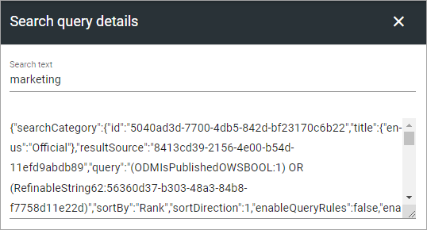
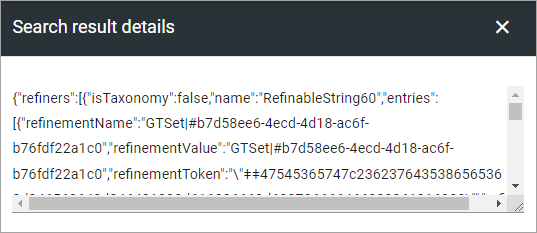

Search feedback
===========================

By default, it is possible for end users to provide search feedback. The feedback feature is available in Advanced Search.

A search administrator can access and analyze the feedback in Omnia admin. If submitted by the end user, the search administrator will get a snapshot of the first page in the search result. The search query and results can be further analyzed using the search data from the end user query.

Here, in the Search settings for the Business Profile, a list of Search Feedback will be shown, for example:

.. image:: search-feedback-list.png

To find contact information for the user, click the name. If a feedback post is no longer needed, you can click the dust bin to delete it.

For more information, click the i-icon

.. image:: search-feedback-list-icon.png

The information can look like this:

.. image:: search-feedback-info.png

Note the message from the user at the bottom.

Three links to more information can be available:

Search result preview
-----------------------
The user sending the feedback can choose to send a preview. If so, something like this will be available when you click the link:

.. image:: search-feedback-preview.png

Search query details
-----------------------
This information is always available and can look like this:

Search result details
-----------------------
This information is always available and can look like this:

