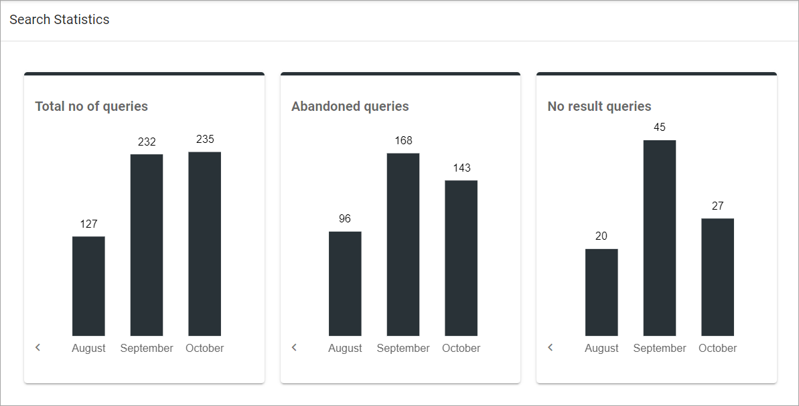
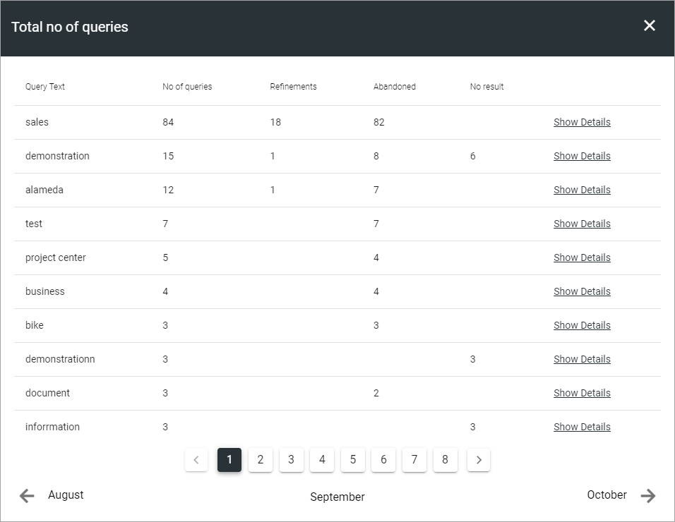

Search Statistics
==============================================

You can can decide to collect search statistics in the settings for either Quick Search or Advanced Search, or both. If you do, statistics can then be displayed here.

 You can click the result for a month for a detailed view. 

+ **Total no of queries**: Displays the total number of queries with the top most used queries on top in the details view.
+ **Abandoned queries**: Here you can see search queries that was started but never completed (the user did not click on any result).
+ **No result queries**: The number of search queries being executed, where the search didn't find anything, is shown here.

Here's an example of details from a test environment:

You can click "Show details" for details of every single search query. Also note that you can go to the previous month or the next month, if available.

