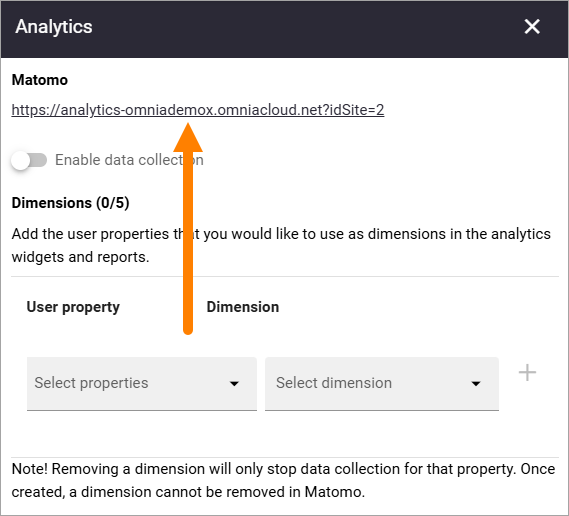
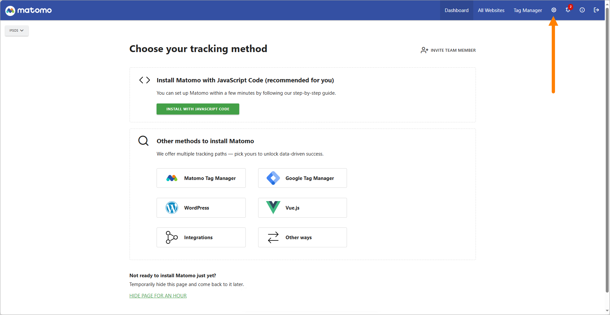
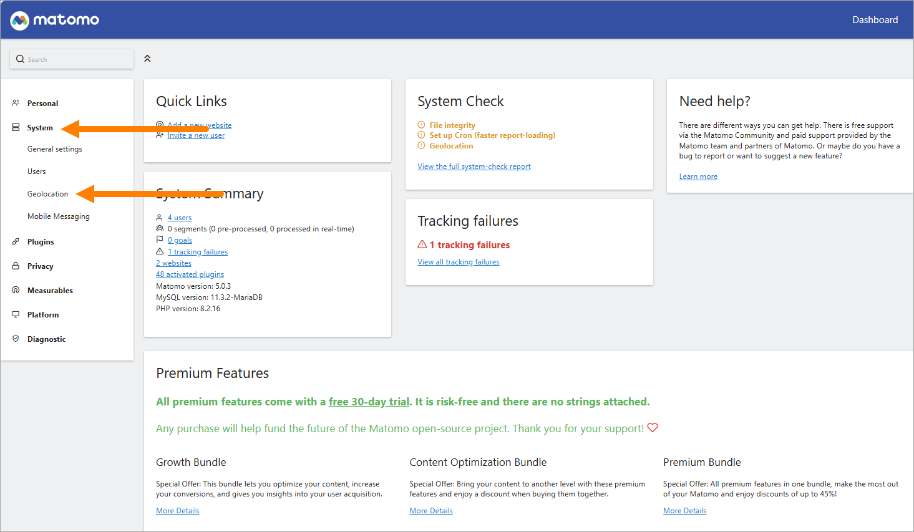
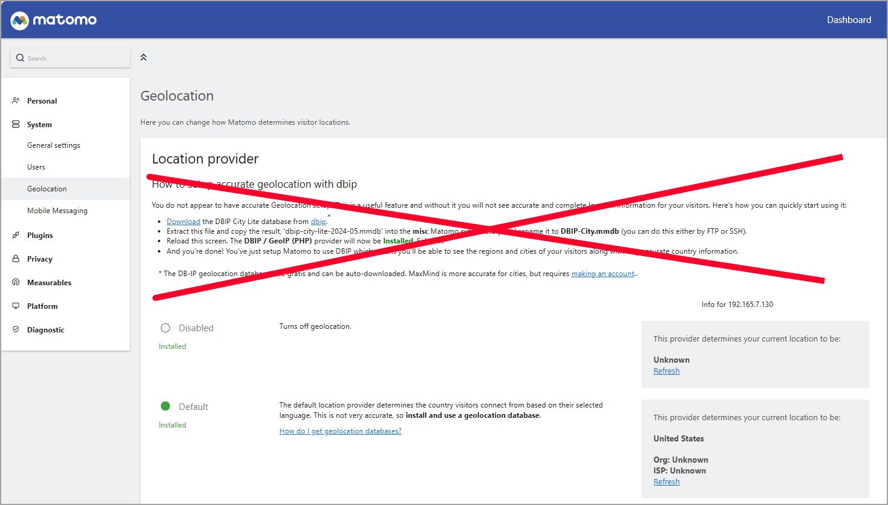
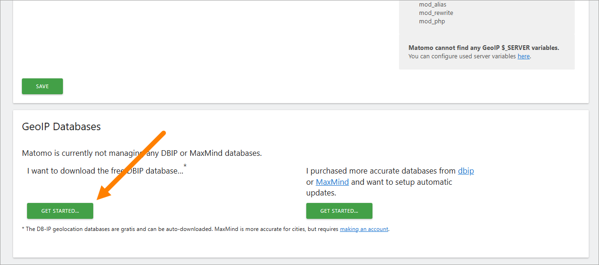
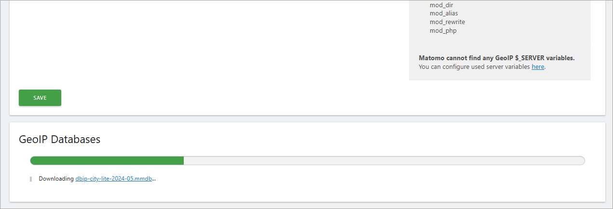
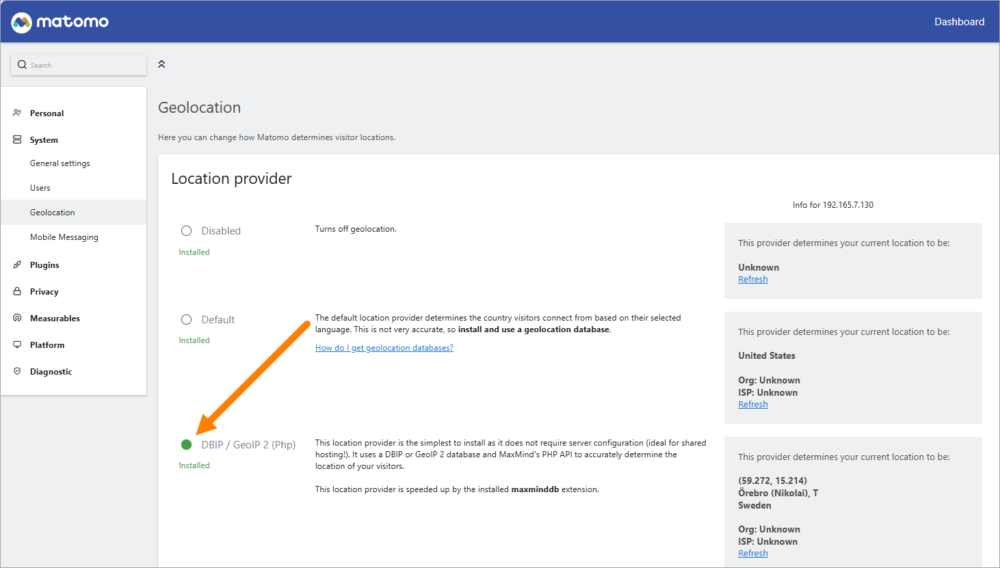
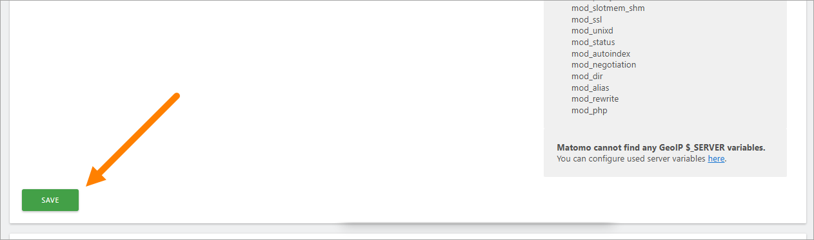

How to setup additional geolocation DBIP databases
========================================================

To set up additional geolocation DBIP databases is pretty straight forward, at least when you know which instruction to follow.

1. Click this link in Omnia admin:

2. In the Matomo settings, click the cogwheel.

3. Then click "System" and "Goelocation".

4. And now the most important information, to get it right. DO NOT follow the instruction at the top.

5. Instead, scroll down to the bottom of the page and click GET STARTED.

You should see that the process starts.

6. Next, you should select DBIP/GeoIP 2 (PhP).

That you should not keep Default is quite obvious when you read the descriptions.

7. And as usual, don't forget to save.

