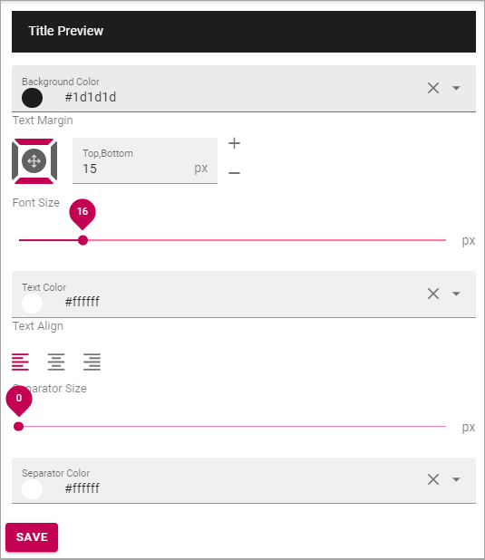

Block Title settings (Business Profile)
=======================================

Use these options to set a default setting for Block Headings. Authors can edit these settings when working with Blocks, if needed.

+ **Title Preview**: Here you see a Preview when you make changes.
+ **Text Margin**: Set the Margin from the text to the border of the header.
+ **Font Size**: Set the Size of the text here.
+ **Text Color**: Set the Text Color here.
+ **Text Align**: The Header Text can be aligned left, right or middle, within the header.
+ **Separator Size**: This is spacing in pixels below the Heading Area (meaning, not just the text, but the whole Header). Default=2.
+ **Separator Color**: You can also set a Color for Separator area. Default=white.