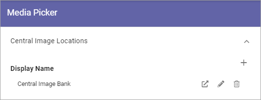

Media Picker settings (Business Profile)
===========================================

You can set central image locations for the editors to use through the Media Picker. One or more locations can be set up in the list:

Click the pen to edit the settings for a Central Image Location, or click the dust bin to delete it.

You can also go to the Central Media Location from here, to handle the images there - by clicking this icon:

.. image:: central-image-locations-new2.png

This option was earlier called "Central Image Location". The reason for the change fo name is that Microsoft is developing functionality for videos within Sharepoint and will remove Stream as an app. So, now both images and videos can be handled centrally the same way, but the settings here remains the same.

Also note that all editing and settings for a video must be handled in the Sharepoint library, not in the Media Picker in Omnia (as is the case with videos from Stream).

Add a new Central Image Location
**********************************
To add a new Central Image Location, click the plus:

.. image:: central-image-locations-click-plus-new2.png

Use these settings:

.. image:: central-image-locations-settings-new.png

+ **Url to Image Library**: Type or paste the Url here.
+ **Display Name**: Add the name to be shown in the lists.
