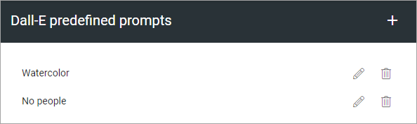
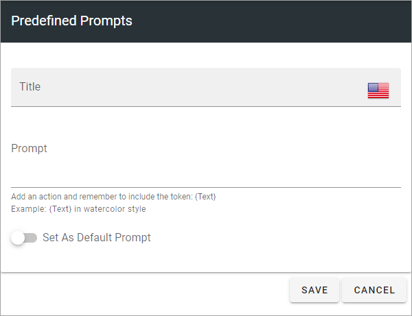

Dall-E settings
=============================================

This option is available in Omnia 7.1 and later.

Dall-E is an AI option that can create images. It can be activated as an image provider, through the feature available for the business profile, and can then be used in the image picker. Here you can create predfined promtpts to be used in Dall-E, for example:

As ususal, click the pen to edit, the dust bin to delete. All settings are available when editing.

**A note about deleting prompts**: When you delete a prompt that is set as the default prompt, a message is shown where you can change your mind. When you delet a prompt that os NOT set as default, the prompt is deleted directly. If you delete the default prompt. there is simply no default prompt until you set one.

Create a new Dall-E prompt
***************************
The following settings are availble for a Dall-E prompt:

+ **Title**: Add a title for this setting, in any available tenant language.
+ **Prompt**: Add the text for the prompt here. The token - {Text} - must be part of the prompt, see the example.
+ **Set as default prompt**: If this prompt settings should be the default for Dall-E, select this option. **Note!** There can be only one default prompt. if there is already a default prompt, that prompt will automatically be deselected as default. Alos note that it's not required to have a default prompt.

