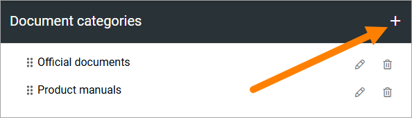
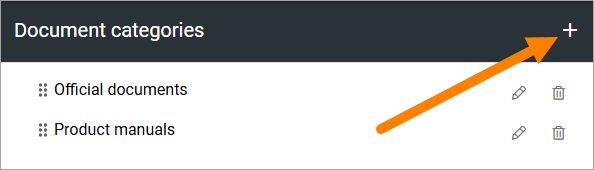
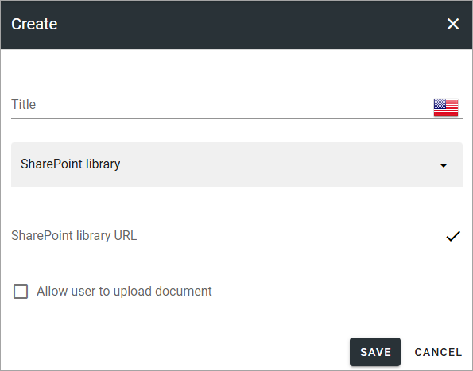
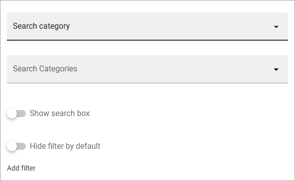
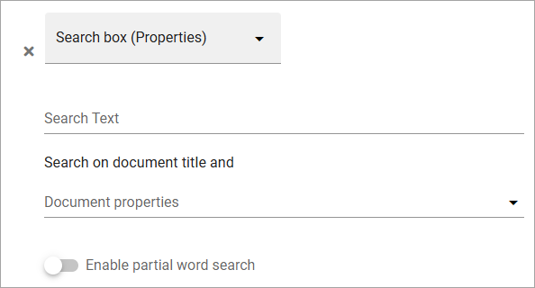
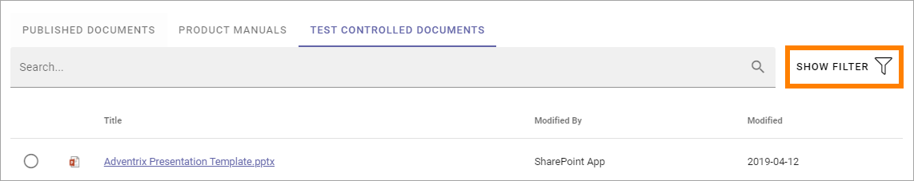
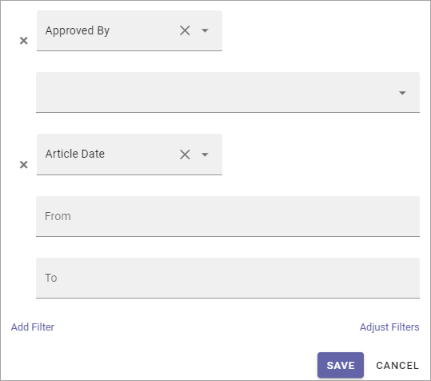
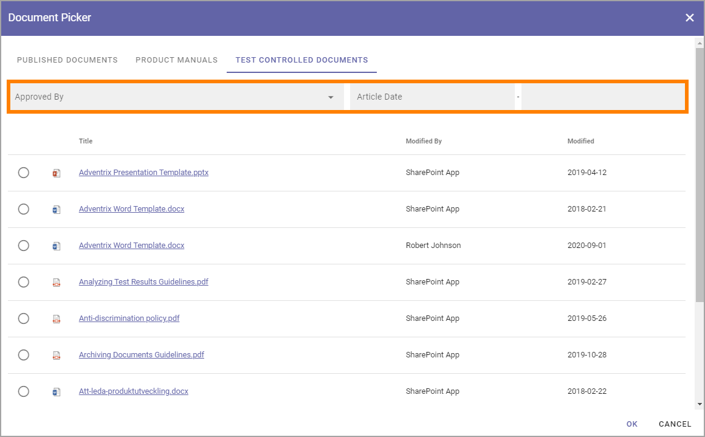

Document picker settings
=============================

Here you set up categories for the document picker. Each category is then available as a tab in the document picker. 

Here's an example. These categories:

Are available this way in the picker:

.. image:: document-picker-new.png

Create a new category
***********************
To create a new category, do the following:

1. Click the plus.

2. Use the following settings:

+ **Title**: You can add a title for the caterogory in any or all available languages. Default language is mandatory.
+ **SharePoint library/Search category**: A document picker category can either be a SharePoint library or a search category. Select what you will create here.
+ **SharePoint library URL**: If you selected "SharePoint library" above, add the URL to the library here.
+ **Allow user to upload document**: If you create a category for a SharePoint library you can allow uppload to this libary in the document picker, by selecting this option.

Settings for search category
------------------------------
The following settings are available for search category:

+ **Search categories**: If you selected "Search category", use this list to select the category (mandatory). The search categories are set up for the business profile, see: :doc:`Search settings </admin-settings/business-group-settings/search/index>`
+ **Show search box**: For a search category, you can add a search box at the top. When you select this option, you can select what to search on, see below.
+ **Hide filter per default**: If you select this options, filters are hidden but users can choose to display them. 
+ **Add filter**: If you are using a search category you can add filters to allow the users to filter the list in the document picker, see below for an example.

For a search box you can set some additional settings:

+ **Search text**: Add a text to be shown in the field before a search is conducted.
+ **Search on document title and**: You can select one or more additional properties to search on here (not mandatory). As stated in the label, a search on document title is always conducted.
+ **Enable partial word search**: Per default the search will only find whole words, but if you select this option, the search will find parts of words as well.

If "Hide filter per default" is selected, a "Show filter" options is displayed for users, for example:

The following filter settings:

is displayed this way in the document picker:

3. Click "Save" when you're finished, to create the document picker category.

Edit or remove document picker categories
******************************************
Use the pen to edit a category and the dust bin to delete it. 

.. image:: dp-categpries-edit-delete-new.png

A deleted Document category is removed from the document picker immediately.

All settings, as described above, can be edited.

