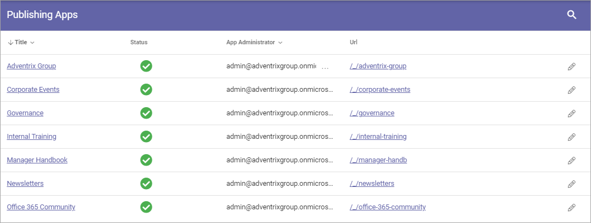
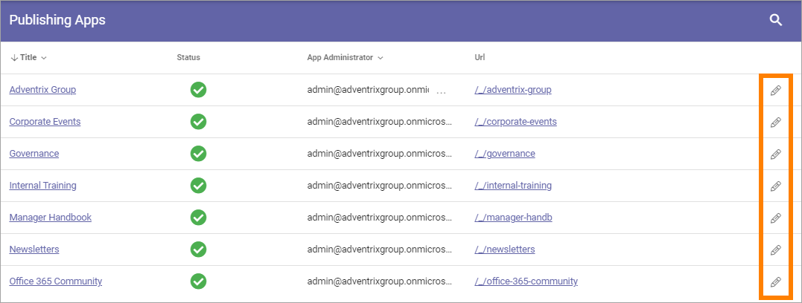

Event management
===================
Here you can select publishing apps in the business profile, to edit settings for event management.

.. image:: bp-event-management-new.png

Here's an example of a list of publishing apps:

You can click a link to go to the publishing app, for example to check that if it is the one you plan to edit.

To edit settings for event management, click the pen for the publishing app.

The page collections in the publishing app is now shown, for example:

.. image:: bp-event-management-collections-new.png

You can click a link to go the page collection, for example to check that if it is the one you plan to edit.

To edit event management settings, click the cogwheel for the page collection.

Here's the settings for Event management:

.. image:: bp-event-management-collections-settings-new.png

Use them this way:

+ **Calendar**: Select the calendar for event management in this page collection, if your event management setup should be connected to a calendar.
+ **Description**: Select the property to be used for the description of the event, shown in the calenders.
+ **Location** Select the property to be used for the location of the event, shown in the calenders.

Don't forget to save when you're done.

For more information about event management, see: :doc:`Working with events </working-with-events/index>`

