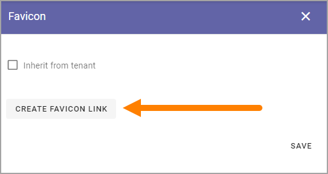
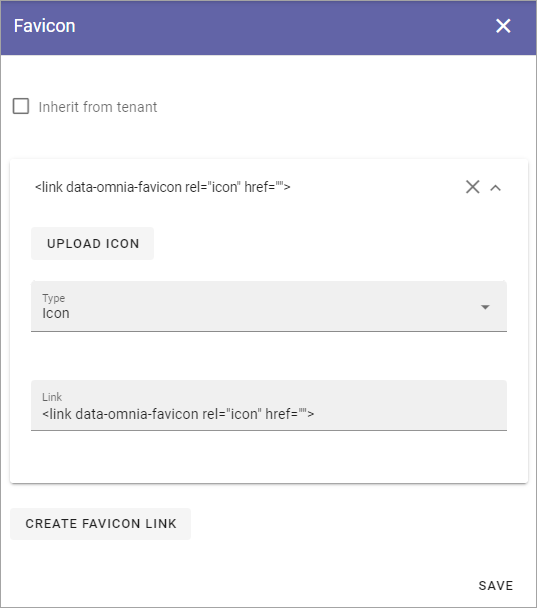

Favicon - Business profile settings
=======================================

Here you can set favicons for the business profile. You can choose to use the Tenant favicons or upload specific favicons for this business profile.

.. image:: favicon-bp.png

If you want to use the favicosn set in the tenant settings (if any), just leave it as is.

If you want to use other favcicons for this business profile, do the following:

1. Deselect "Inherit from tenant".
2. Click CREATE FAVICON LINK.

3. Select the Omnia favicon (Icon) or the Apple Touch icon, or upload any image to use as an icon, using the media picker.

4. Save when you're done.
5. Repeat for all favicons you want to set up.

