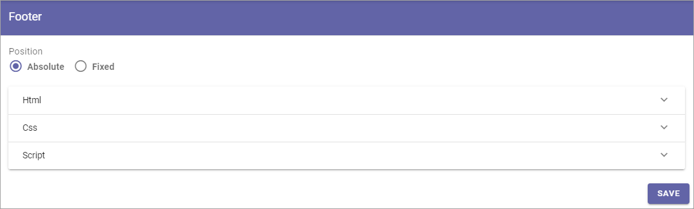

Footer (Business Profile)
============================

Use these settings to add a footer for the business profile's pages.

Decide whether the position of the footer should be positioned at the bottom of the page (Absolute) or the bottom of the screen (Fixed). Then create  the footer using HTML/CSS and Javascript.

As an example, here's how it looks when you select HTML:

.. image:: footer-html-new.png