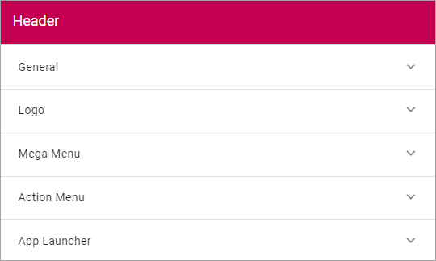
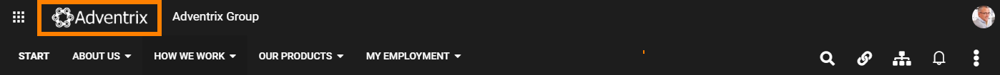
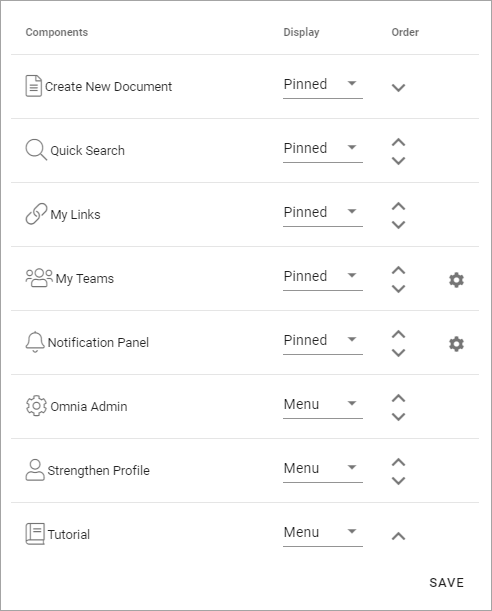

Header settings for the Business Profile
==========================================

The following settings are avaible for the Header:

General
--------
Under General you can set the following:

.. image:: business-profile-settings-header-general.png

+ **Background Color**: Set background color for the header here.
+ **Icon Color**: Set icon color here.
+ **Search Box on Header**: if a search box should be available in the header, select this option.
+ **Default Search Box text to Query string (q) value**: Available when the option above is selected. A descirption will be added soon.

Here's an example with black background color, white icon color and a search box:

.. image:: business-profile-settings-header-general-searchbox.png

Logo
------
Use these settings for the logo in the Heading.

The following settings are available:

.. image:: logo-settings-bp.png

+ **Url**: Add the Url to the Logo Image here (or use the Media Picker, see below).
+ **ADD IMAGE**: To use the Media Picker to select Logo Image, click this link. See this page for information on how to use the Media Picker: :doc:`The Media Picker </general-assets/media-picker/index>`
+ **Padding**: Use these settings to add som padding around the Logo, if needed.

Mega Menu
------------
The Mega Menu makes it possible for the end user to navigate to any page in the navigation structure. It is displayed across all sites in Omnia. 

.. image:: mega-menu.png

The following settings are available:

.. image:: mega-menu-settings.png

+ **Publishing App**: If you use more than one Publishing App in this Business Profile, you can select Publishing App here.
+ **Page Collection**: Select Page Collection the Publishing Pages of the Business Profile.
+ **Static Display Level**: Defines the number of levels in the navigation term set that will always be displayed in the menu.
+ **Dynamic Display Level**: Defines the number of levels in the navigation term set that should be displayed in the mega menu when a user clicks an item in the static menu.
+ **Max Height**: As Default, the menu's Height is dynamic, meaning it adapts to the Height needed. You can set a fixed Height in pixels if you wish.
+ **Max Width**: As Default, the menu's Width is dynamic, meaning it adapts to the Width needed. You can set a fixed Wodth in pixels if you wish.
+ **Background Color**: As Default, the Background Color for the Mega Menu is the same as the Header, but you can set another Background Color if you wish.
+ **Text Color**: As Default, the Text Color for the Mega Menu is the same as the text in the Header, but you can set another Text Color if you wish.
+ **Selected Border Color**: Ypou can set Border Color separately if you wish. Default=no Color.

Action Menu
-------------
The Action Menu is this part of the Heading:

.. image:: action-menu-startpage.png

You can use these settings:

+ **Components**: This column lists the Components that can be displayed in the Action Menu. "My Teams" and "Notification Panel" has additional settings, see below.
+ **Display**: You can decide which Components to display, and how: "Pinned" - is default, an Icon will be displayed; "Hidden" - if you don't want the Component to be available; "Menu" - if you want to display the Component in the menu (the three standing dots) instead as an Icon.
+ **Order**:  You can decide the order for the Components you're displaying, from left to right.

My Teams - additional settings
-------------------------------
Click the cog wheel to set additional settings för My Teams. Here's what you can set:

.. image:: my-sites-settings-new3.png
