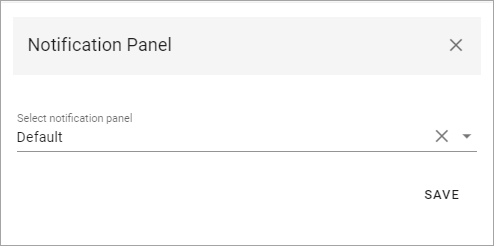
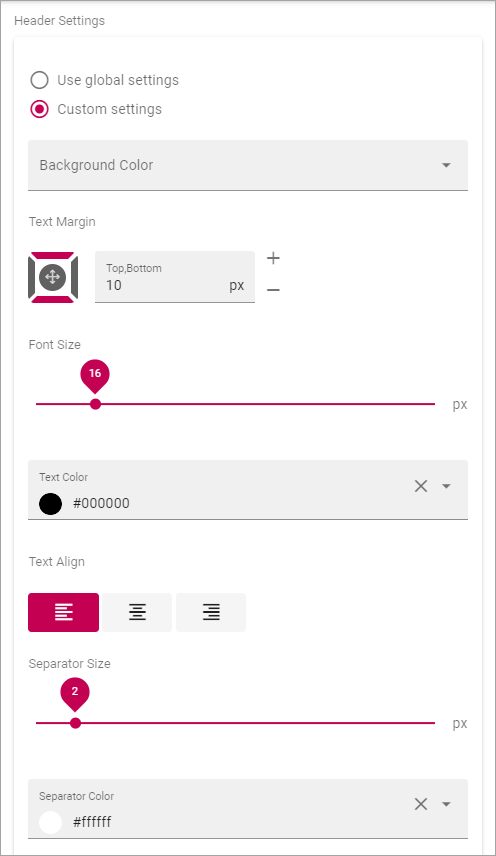

Header settings for the Business Profile
==========================================

The following settings are avaible for the Header:

.. image:: business-profile-settings-header-new3.png

General
--------
Under General you can set the following:

.. image:: business-profile-settings-header-general.png

+ **Background Color**: Set background color for the header here.
+ **Icon Color**: Set icon color here.
+ **Search Box on Header**: If a search box should be available in the header, select this option.
+ **Default Search Box text to Query string (q) value**: Available when the option above is selected. For advanced search implementations. With this option active you can add parameters to the search query string, for various implementations.

Here's an example with black background color, white icon color and a search box:

.. image:: business-profile-settings-header-general-searchbox.png

Logo
------
Use these settings for the logo in the Heading.

.. image:: logo-in-heading.png

The following settings are available:

.. image:: logo-settings-bp-new.png

+ **Url**: Add the Url to the Logo Image here (or use the Media Picker, see below).
+ **Logo Text**: Here you can add a text for the logo, if applicable. You can add it in any or all available tenant languages.
+ **ADD IMAGE**: To use the Media Picker to select Logo Image, click this link. See this page for information on how to use the Media Picker: :doc:`The Media Picker </general-assets/media-picker/index>`
+ **Padding**: Use these settings to add som padding around the Logo, if needed.

Mega Menu
------------
The Mega Menu makes it possible for the end user to navigate to any page in the navigation structure. It is displayed across all sites in Omnia. 

.. image:: mega-menu.png

The following settings are available:

.. image:: mega-menu-settings-new.png

+ **Publishing App**: If you use more than one Publishing App in this Business Profile, you can select Publishing App here.
+ **Page Collection**: Select Page Collection the Publishing Pages of the Business Profile.
+ **Static Display Level**: Defines the number of levels in the navigation term set that will always be displayed in the menu.
+ **Dynamic Display Level**: Defines the number of levels in the navigation term set that should be displayed in the mega menu when a user clicks an item in the static menu.
+ **Max Height**: As Default, the menu's Height is dynamic, meaning it adapts to the Height needed. You can set a fixed Height in pixels if you wish.
+ **Max Width**: As Default, the menu's Width is dynamic, meaning it adapts to the Width needed. You can set a fixed Wodth in pixels if you wish.
+ **Background Color**: As Default, the Background Color for the Mega Menu is the same as the Header, but you can set another Background Color if you wish.
+ **Text Color**: As Default, the Text Color for the Mega Menu is the same as the text in the Header, but you can set another Text Color if you wish.
+ **Selected Border Color**: Ypou can set Border Color separately if you wish. Default=no Color.

Action Menu
-------------
The Action Menu is this part of the Heading:

.. image:: action-menu-startpage.png

You can use these settings:

.. image:: action-menu-settings-new2.png

+ **Components**: This column lists the Components that can be displayed in the Action Menu. "My Teams" and "Notification Panel" has additional settings, see below.
+ **Display**: You can decide which Components to display, and how: "Pinned" - is default, an Icon will be displayed; "Hidden" - if you don't want the Component to be available; "Menu" - if you want to display the Component in the menu (the three standing dots) instead as an Icon.
+ **Order**:  You can decide the order for the Components you're displaying, from left to right.

Teamwork Navigation - additional settings
----------------------------------------------
Click the cog wheel to set additional settings for Teamwork Navigation. Here's what you can set:

.. image:: my-sites-settings-new4.png

Notification Panel - additional settings
----------------------------------------------
Click the cog wheel to set additional settings for Notification Panel. What you can do is to select which Notification Panel to display:

App Launcher
*************
Omnia can replace the Office 365 App Launcher with the Onnia App Launcher, to make it fully configurable. Here you can edit settings for the Omnia App Launcher, for the Business Profile. 

.. image:: omnia-app-launcher.png

The following settings are available:

.. image:: app-launcher-settings-overview.png

There are also a number of Header settings avilable here, see below.

+ **Enable**: The first step is to decide to use the Omnia App Launcher or not (which means using the default Office 365 App launcher). 

Note that there's a feature available for the tenant to install default App Launcher links to make it really easy to get going with the Omnia App Launcher. For more information, see: :doc:`Features - Tenant </admin-settings/tenant-settings/features/index>`

App Launcher Button
--------------------
Here you can set background color, icon color and hover color, if you're not happy with the default color settings.

General
---------
The following settings are available here:

.. image:: app-launcher-settings-general.png

+ **Title**: Set the title for the App Launcher in any or all availbale languages. This is shown as the Tool Tip for the button.
+ **Sorted By**: Open the list and decide how to sort the icons; Custom, Alphabetic or Last Visited. If you choose Custom, use the option "Custom" below for sorting.
+ **View Template**: The icons can be viewed in a number of ways; Simple List, App Icons, Navigation View or App launcher. See below for examples.
+ **Include Non-mandatory links**: (A description will be added soon.) 
+ **Use Targeting**: (A description will be added soon.) 
+ **Include Personal Links**: (A description will be added soon.) 
+ **Include Following Links**: (A description will be added soon.) 
+ **Categories**: (A description will be added soon.) 
+ **Item Limit**: (A description will be added soon.) 
+ **Padding**: Add some padding between the mwnu's border and the icon list, if needed.

In the following View Template examples, the sorting is Custom.

Example of View Template Simple List:

.. image:: app-launcher-settings-general-simple-list.png

When the View Template App Icons is selected, the list can look something lika this:

.. image:: app-launcher-settings-general-app-icons.png

With the View Template Navigation View it can look like this:

.. image:: app-launcher-settings-general-navigation-view.png

(More information about this will be added soon.)

The View Template App Launcher makes the list look like the Office 365 App launcher, for example:

.. image:: app-launcher-settings-general-app-launcher.png

Custom colors
---------------
Here you can set custom colors for the icons, if needed:

.. image:: app-launcher-settings-custom-colors.png

Custom Sort
-------------
If you selected Custom Sort under Sorted By, use these options to customize the sorting. Click the up arrow or the down arrow to move an icon in the list.

.. image:: app-launcher-settings-custom-sort.png

Header Settings
-----------------
Use these settings to customize the look of the heading for the Business Profile.

(More information will be added soon.)

