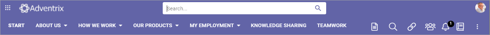
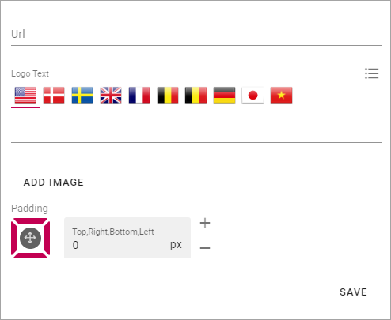
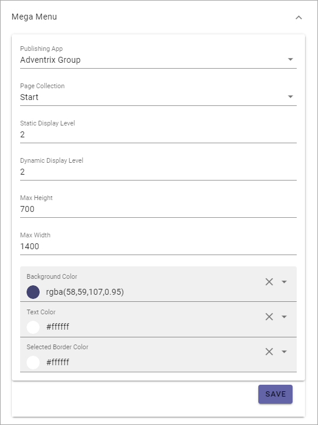
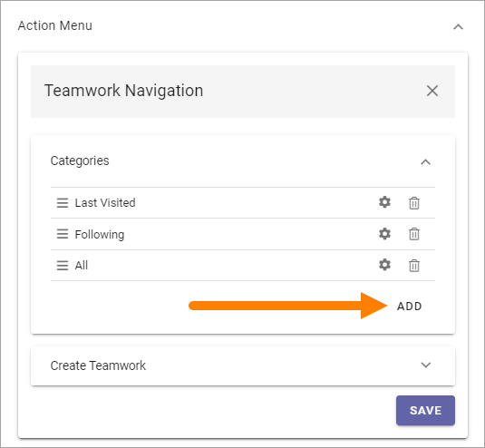
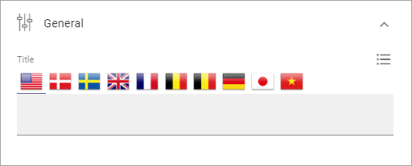
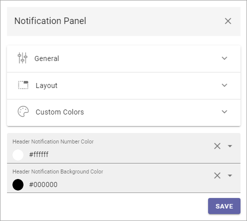
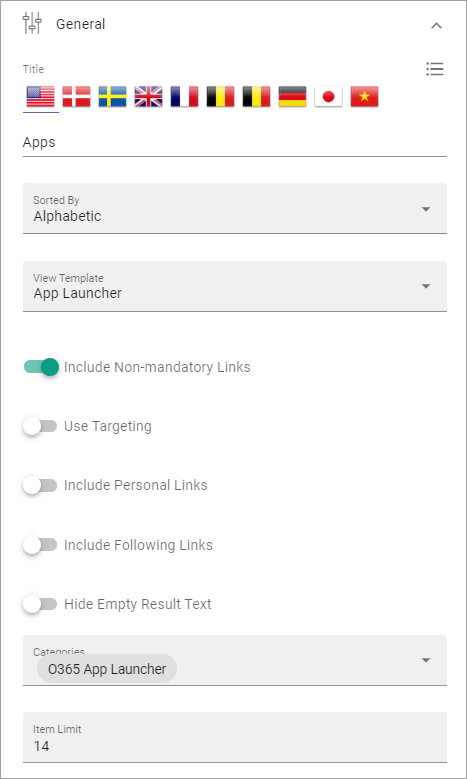
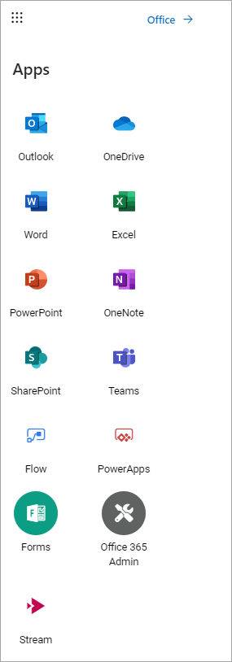
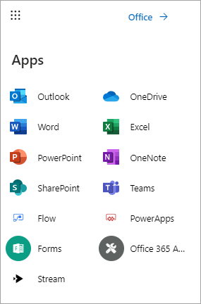

Header settings for the Business Profile
==========================================

The following settings are available for the Header:

.. image:: business-profile-settings-header-new4.png

General
*********
Under General you can set the following:

.. image:: business-profile-settings-header-general-new.png

+ **Background Color**: Set background color for the header here.
+ **Icon Color**: Set icon color here.
+ **Search Box on Header**: If a search box should be available in the header, select this option.
+ **Default Search Box text to Query string (q) value**: Available when the option above is selected. For advanced search implementations. With this option active you can add parameters to the search query string, for various implementations.

Here's an example with blue background color, white icon color and a search box:

Logo
*******
Use these settings for the Business Profiles's logo in the Heading.

.. image:: logo-in-heading-new2.png

The following settings are available:

+ **Logo Text**: Here you can add a text for the logo, if applicable. You can add it in any or all available tenant languages.
+ **ADD IMAGE**: To use the Media Picker to select Logo Image, click this link. See this page for information on how to use the Media Picker: :doc:`The Media Picker </general-assets/media-picker/index>`
+ **Padding**: Use these settings to add som padding around the Logo, if needed.

Mega Menu
***********
The Mega Menu makes it possible for the end user to navigate to any page in the navigation structure. It is displayed across all sites in Omnia. 

.. image:: mega-menu-new.png

The following settings are available:

+ **Publishing App**: If you use more than one Publishing App in this Business Profile, you can select Publishing App here.
+ **Page Collection**: Select Page Collection the Publishing Pages of the Business Profile.
+ **Static Display Level**: Defines the number of levels in the navigation term set that will always be displayed in the menu.
+ **Dynamic Display Level**: Defines the number of levels in the navigation term set that should be displayed in the mega menu when a user clicks an item in the static menu.
+ **Max Height**: As Default, the menu's Height is dynamic, meaning it adapts to the Height needed. You can set a fixed Height in pixels if you wish.
+ **Max Width**: As Default, the menu's Width is dynamic, meaning it adapts to the Width needed. You can set a fixed Wodth in pixels if you wish.
+ **Background Color**: As Default, the Background Color for the Mega Menu is the same as the Header, but you can set another Background Color if you wish.
+ **Text Color**: As Default, the Text Color for the Mega Menu is the same as the text in the Header, but you can set another Text Color if you wish.
+ **Selected Border Color**: Ypou can set Border Color separately if you wish. Default=no Color.

Action Menu
**************
The Action Menu is this part of the Heading:

.. image:: action-menu-startpage-new.png

You can use these settings:

.. image:: action-menu-settings-new2.png

+ **Components**: This column lists the Components that can be displayed in the Action Menu. "My Teams" and "Notification Panel" has additional settings, see below.
+ **Display**: You can decide which Components to display, and how: "Pinned" - is default, an Icon will be displayed; "Hidden" - if you don't want the Component to be available; "Menu" - if you want to display the Component in the menu (the three standing dots) instead as an Icon.
+ **Order**:  You can decide the order for the Components you're displaying, from left to right.

Teamwork Navigation - additional settings
----------------------------------------------
Click the cog wheel to set additional settings for Teamwork Navigation. Here's what you can set:

.. image:: teamwork-navigation-overview-new.png

You can edit which Categories (tabs) to display in Teamwork Navigation and you can work with a number of details for what is actually shown under each category. Using the option Create Teamwork you can edit the settings for what is to be displayed regarding Show Create New Site, and if that option should be available for users at all.

Note that a category is basically a Team Collaboration Rollup, so if you think along this line when you edit the settings for a category, you're on the right track.

Categories
''''''''''''
You can edit categories this way:

+ Click the dust bin to remove a category.
+ Click the cog wheel to handle the detailed settings for a category. 

When editing settings for a category, the same settings are available as when creating a new category, see below.

+ To add a new category, click ADD.

The following settings are available:

.. image:: teamwork-navigation-add-settings-new.png

+ **Category Name**: Add a name for the category (tab) here, in some or all the available languages.

General
----------
Here you can add a Block Title if needed. 

The Title is shown under the Categories.

Query
'''''''
For Query you can set:

.. image:: teamwork-navigation-addquery-new.png

+ **Scope**: Open the list and select the type of query to execute for this category.
+ **Only Current Business Profile**: Below you can select Business Profile to execute the query in. If you want to do that for the Current Business profile only, select this option.
+ **Business Profile**: You can select a Business Profile for the query in this list.
+ **Site Template**: Here you can select one or more Site Templates for the query, meaning all sites that are created from this template, in the selected Business Profile. Don't forget to click ADD when you have salected a Tamplate. It's not mandatory. If you don't select Site Templates here, the query is run for all sites.
+ **Run Query On Load**: For a shorter list of Teamworks, it most likely works fine to run a query when the list is opened, but for longer lists it may not. For a longer list, for example a list of all Teamworks, deselecting this option and instead displaying a search box, may be a better choice. 

To add a search box, use the Filter settings, see below.

Display
'''''''''''
Display has the follwing settings:

.. image:: teamwork-navigation-add-display-new.png

+ **View**: Select type for view for the list; List View or Navigation View. If you select List View you must also add at least one column.
+ **Paging**: Use this option to decide how paging should be handled for this list; No paging, Classic or Scroll.
+ **Icon Mode**: You can choose to use Letter Avatar or the template's icon.  
+ **Item Limit/Page Size**: Set the number of links that should be displayed before a Show more message is shown.
+ **Sort By**: Here you can select what to sort the list by.
+ **Descending/Ascending**: Choose to how to sort the list here.
+ **Show Follow Status**: Set to show the stars for follow status, or not (se below for an example.)
+ **Open in New Window**: Decide if the teamwork should open in a new window or not, when the link is clicked.
+ **Padding**: Set some padding between the border of the list and the lit's content, if needed.

Here's an example with Show Follow Status selected. A filled star indicates that the user follows the teamwork.

.. image:: teamwork-navigation-add-display-follow-new.png

Use the filter settings to make filters available for users, in the list.

Filter UI
''''''''''''''
You can set this for Filter UI:

.. image:: teamwork-navigation-add-display-filterui.png

+ **ADD FILTER**: Click to add filters. It's done the same as for the Teamwork Rollup block, see: :doc:`Teamwork Rollup </blocks/team-collaboration-rollup/index>`
+ **Show search box**: Select this option to display a search box at the top of the list. Also see the comments under Query above.
+ **Hide filter by default**: This could be a handy option to use together with Show search box. Select this option if you want to show filters after a search has been executed (not before).

Don't forget to save your changes, you have to click SAVE both for the detailed settings and under Action Menu for the changes to take effect.

Notification Panel - additional settings
----------------------------------------------
Click the cog wheel to set additional settings for Notification Panel. The following settings can be used:

What you actually do is using a Notification Panel block to display in the heading. Therefore, these settings are exactly the same as are described here: :doc:`The Notification Panel block </blocks/notification-panel/index>`

App Launcher
***************
You can create the feeling that when entering Omnia the user is still in Microsoft 365, by adding the Onnia App Launcher. The Omnia App Launcher is fully configurable. It's placed in the same position as the App Launcher in Microsoft 365. Here you can edit the settings. 

.. image:: omnia-app-launcher-new2.png

The following settings are available:

.. image:: app-launcher-settings-overview-new.png

+ **Enable**: The first step is to decide to use the Omnia App Launcher or not. If it's not enabled, the space is simply empty.

Note that there's a feature available for the tenant to install default App Launcher links to make it really easy to get going with the Omnia App Launcher. For more information, see: :doc:`Features - Tenant </admin-settings/tenant-settings/features/index>`

App Launcher Button
--------------------
Here you can set background color, icon color and hover color, if you're not happy with the default color settings.

General
---------
The following settings are available here:

+ **Title**: Set the title for the App Launcher in any or all availbale languages. This is shown as the Tool Tip for the button.
+ **Sorted By**: Open the list and decide how to sort the icons; Custom, Alphabetic or Last Visited. If you choose Custom, use the option "Custom" below for sorting.
+ **View Template**: The icons can be viewed in a number of ways; Simple List, App Icons, Navigation View or App launcher. See below for examples.
+ **Include Non-mandatory links**: Mandatory links are always displayed. Select this option if non-mandatory links, in the link categories selected, should be displayed as well.
+ **Use Targeting**: Targeting is set per link in the Shared Links sections, one available for the Tenant, and one available for the Business Profile. Here you can choose to use the links targeting setting or not. Default=not selected, meaning the targeting setting for the link is not used.  
+ **Include Personal Links**: If the logged in user's personal links, created using My Links, should be displayed in the App Launcher as well , select this option. Note that one or more categories that contain personal links will have to be selected below, for any personal links to show up.
+ **Include Following Links**: Users can follow links in My Links. If these links should be available in the App Launcher as well, select this option. Note that one or more categories that contain followed links will have to be selected below, for any followed links to show up.
+ **Categories**: Select one or more categories of links to display in the App Launcher. Each link is categorized when set up, either for the Tenant or for the Business Profile. 
+ **Hide Empty Result Text**: (A description will be added soon).
+ **Item Limit**: Set the number of links that should be displayed in the list, before "All Apps" or similar is shown. 
+ **Padding**: Add some padding between the menu's border and the list, if needed.

In the following View Template examples, the sorting is Custom.

Example of View Template Simple List:

.. image:: app-launcher-settings-general-simple-list.png

When the View Template App Icons is selected, the list can look something lika this:

With the Template Navigation View it can look like this:

.. image:: app-launcher-settings-general-navigation-view.png

The View Template App Launcher makes the list look like the Microsoft 365 App launcher, for example:

Custom colors
---------------
Here you can set custom colors for the icons, if needed:

.. image:: app-launcher-settings-custom-colors.png

Custom Sort
-------------
If you selected Custom Sort under Sorted By (This part of the settings is not available otherwise), use these options to customize the sorting. Click the up arrow or the down arrow to move an icon in the list.

.. image:: app-launcher-settings-custom-sort.png

