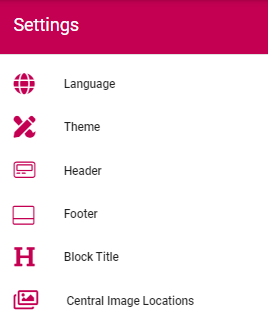
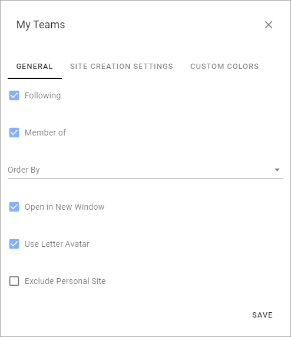
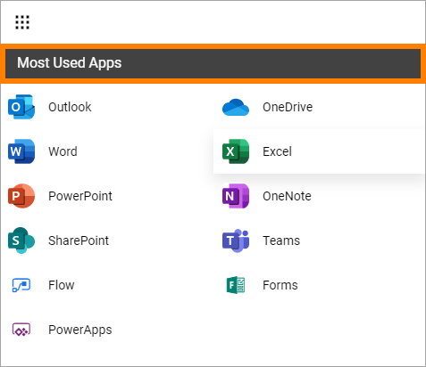
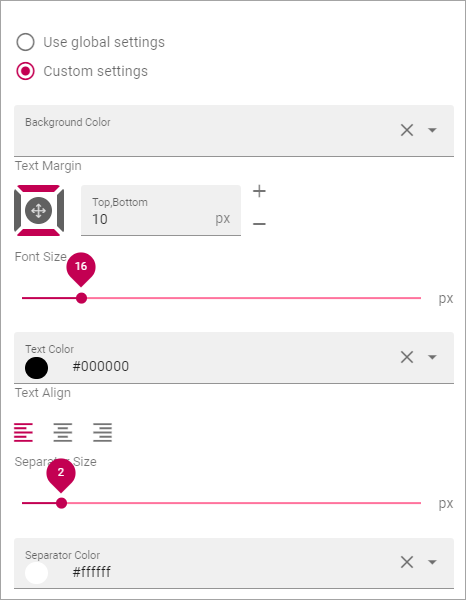
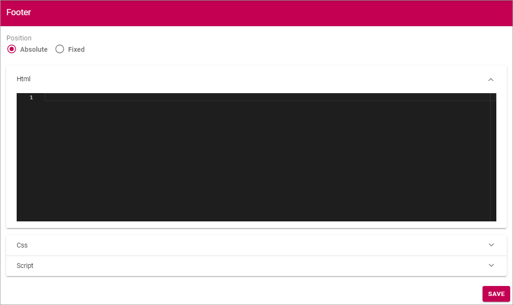
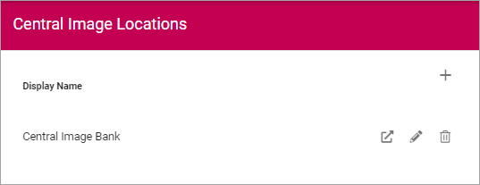

Settings
===========================================

Here the following settings can be edited:

Language
*********
Regarding Languages you can select to inherit settings from the tenant or set different Language settings here. Note that this setting is for the user interface, not for pages. See more information in the Language description for the tenant (link below).

.. image:: business-language-new2.png

To inherit Languages from the tenant, just select that option, and you're done.

To set other language settings for a Business Profile, you add and remove languages exactly the same way as the settings for the tenant, see: :doc:`Language settings </admin-settings/tenant-settings/settings/index>`

If you need to publish a certain page in more than one language, you use the Option Page Variation, see the section Variations on this page: :doc:`Page Settings </pages/page-settings/index>`

Theme
**************
Use these options to set Default Colors for the Business Profile. When working with a Block, an editor can often select other Colors, but if no other Color is chosen for the Block, these settings apply.

.. image:: business-profile-settings-theme-new2.png

+ **Theme**: Select Theme from the list. 
+ **Primary**: If needed, you can adjust the Primary Color. 
+ **Secondary**: If needed, you can adjust the Secondary Color.
+ **Additional Colors**: To make sure editors can't choose any other color freely, you can use this section to set up alternative colors that will be available. Click "Add Additonal Color" to add more colors, and the dust bin to delete a color. (Don't forget to save when you're done.)

Header
*******
The following settings are avaible for the Header:

.. image:: business-profile-settings-header-new2.png

General
--------
Under General you can set Background Color for the Header, and Icon Color. In this example, the Background Color is Black, and the Icon Color is White:

.. image:: heading-example.png

The Icon Color setting apply to the icons to the right.

Logo
------
Use these settings for the logo in the Heading.

.. image:: logo-in-heading.png

The following settings are available:

.. image:: logo-settings-bp.png

+ **Url**: Add the Url to the Logo Image here (or use the Media Picker, see below).
+ **ADD IMAGE**: To use the Media Picker to select Logo Image, click this link. See this page for information on how to use the Media Picker: :doc:`The Media Picker </general-assets/media-picker/index>`
+ **Padding**: Use these settings to add som padding around the Logo, if needed.

Mega Menu
------------
The Mega Menu makes it possible for the end user to navigate to any page in the navigation structure. It is displayed across all sites in Omnia. 

.. image:: mega-menu.png

The following settings are available:

.. image:: mega-menu-settings.png

+ **Publishing App**: If you use more than one Publishing App in this Business Profile, you can select Publishing App here.
+ **Page Collection**: Select Page Collection the Publishing Pages of the Business Profile.
+ **Static Display Level**: Defines the number of levels in the navigation term set that will always be displayed in the menu.
+ **Dynamic Display Level**: Defines the number of levels in the navigation term set that should be displayed in the mega menu when a user clicks an item in the static menu.
+ **Max Height**: As Default, the menu's Height is dynamic, meaning it adapts to the Height needed. You can set a fixed Height in pixels if you wish.
+ **Max Width**: As Default, the menu's Width is dynamic, meaning it adapts to the Width needed. You can set a fixed Wodth in pixels if you wish.
+ **Background Color**: As Default, the Background Color for the Mega Menu is the same as the Header, but you can set another Background Color if you wish.
+ **Text Color**: As Default, the Text Color for the Mega Menu is the same as the text in the Header, but you can set another Text Color if you wish.
+ **Selected Border Color**: Ypou can set Border Color separately if you wish. Default=no Color.

Action Menu
-------------
The Action Menu is this part of the Heading:

.. image:: action-menu-startpage.png

You can use these settings:

.. image:: action-menu-settings-new.png

+ **Components**: This column lists the Components that can be displayed in the Action Menu. "My Sites" and "Notification Panel" has additional settings, see below.
+ **Display**: You can decide which Components to display, and how: "Pinned" - is default, an Icon will be displayed; "Hidden" - if you don't want the Component to be available; "Menu" - if you want to display the Component in the menu (the three standing dots) instead as an Icon.
+ **Order**:  You can decide the order for the Components you're displaying, from left to right.

My Teams - additional settings
-------------------------------
Click the cog wheel to set additional settings för My Teams. Here's what you can set:

General
^^^^^^^^
+ **Following**: Decides if the "Following" tab is displayed or not. The "All" tab is always displayed. 
+ **Member of**: Decides if the "Member of" tab is displayed or not.
+ **Order By**: Sets the Sort Order for the list of sites. 
+ **Open in New Windows**: Decides if the site is opened in a new window ore not.
+ **Use Letter Avatar**: Select to use Letter Avatars or not (see below for an example).
+ **Exclude Personal Site**: If personal sites should not be shown in the list, select this option. A personal site is the OneDrive site where a user’s files are stored.

This an example where Letter Avatars are used:

.. image:: letter-avatars.png

Site Creation Settings
^^^^^^^^^^^^^^^^^^^^^^^^
Here you can set the following:

.. image:: site-creation-settings-new2.png

+ **Label**: The default Label is "Create new site". You can set another Label here. Note the a Label in the default language is mandatory, set other languages if needed.
+ **Link**:  If a custom form has been created for the Create Site function, the url to the form should be put in here. This is not the same as the collaboration templates Omnia can offer.

Custom Colors
^^^^^^^^^^^^^^
Here you can set a Custom Color for the Icons for the sites.    

Notification Panel - additional settings
-------------------------------------------
Here you can set type of Notification Panel.

.. image:: notification-panel-settings.png

App Launcher
-----------
These settings are for the App Launcher menu. It's an Omnia Menu replacing the default Office 365 menu. The Applauncher uses the Shared Links functionality.

.. image:: applaunch-menu-example.png

You can set the following:

.. image:: applaunch-settings-new.png

+ **Enable**: Use this option to decide to display the App Launch menu or not. Default=displayed.
+ **App Launch Button**: Here you set Custom colors for the App Launch button. If not set, the default color settings are used.

Panel Settings - General
^^^^^^^^^^^^^^^^^^^^^^^^^^
You can set the following here:

.. image:: panel-settings-general-new2.png

+ **Title**: You can add a title to the App Launch menu. 

+ **Sorted By**: The list of apps can be sorted alphabetically, by Last Visited, or by a Custom sort (see below for Custom Sort Settings).
+ **View Template**: The list of apps can be displayed in four different ways: "Simple list", "App Icons", "Navigation View" or "App Launch". See below for examples.
+ **Categories**: Select the types of links that should be displayed in App Launcher. Default = O365 App Launcher.
+ **Use targeting**: If it should be possible to use targeting for the links in App Launcher, select this option.
+ **Include Personal Links**: If Personal Links (=created by the user) should be displayed in App Launch, select this option.
+ **Include Following links**: (A description will be added soon.)
+ **Categories**: (A description will be added soon.)
+ **Item Limit**: Set the number of apps to be displayed on each "page" of the app list. Default=20.

View Template "Simple List" example:

.. image:: app-launch-simple-list.png

View Template "App Icons" example:

.. image:: app-launch-app-icons.png

View Template "Navigation View" example:

.. image:: app-launch-navigation-view.png

View Template "App launcher" example:

.. image:: app-launch-app-launch.png

Panel Settings - Custom Colors
^^^^^^^^^^^^^^^^^^^^^^^^^^^^^^^^
Use these options to set Custom Colors for the App Launch menu. 

.. image:: app-launch-custom-colors-new.png

Panel Settings - Custom Sort
^^^^^^^^^^^^^^^^^^^^^^^^^^^^^^
If you have selected "Custom" under "Sorted By", this option are available:

.. image:: app-launch-custom-sort.png

Use the arrows to move apps up or down in the list.

App Launcher - Header Settings
-------------------------------
You can set the following here:

You can choose to use the global settings or custim settings, using the options shown in the image above.

Footer
*******
Use these settings to add a footer for the business profiles pages.

.. image:: business-profile-footer.png

First select "Absolute" or ""fixed" for the footers placement, than use HTML, Css and/or Script. To add the the code and text for the footer.

As an example, here's how it looks when you select HTML:

Block Title
***************
Use these options to set a default setting for Block Headings. Authors can edit these settings when working with Blocks, if needed.

.. image:: content-header-new.png

+ **Title Preview**: Here you see a Preview when you make changes.
+ **Text Margin**: Set the Margin from the text to the border of the header.
+ **Font Size**: Set the Size of the text here.
+ **Text Color**: Set the Text Color here.
+ **Text Align**: The Header Text can be aligned left, right or middle, within the header.
+ **Separator Size**: This is spacing in pixels below the Heading Area (meaning, not just the text, but the whole Header). Default=2.
+ **Separator Color**: You can also set a Color for Separator area. Default=white.

Central Image Locations
************************
You can set central image locations for the editors to use, mainly through the Media Picker. One or more locations can be set up in the list.

You can also go to the Central Image Location from here, to handle the images there.

Use the icons by the list, this way:

Click the left most icon to go to the Image Location, for example to upload images.
To edit the settings for an Image Location, click the pen.
To delete an Image location, click the dust bin.

To add a new Central Image Location, click the plus:

.. image:: central-image-locations-click-plus-new.png

Use these settings:

.. image:: central-image-locations-settings.png

+ **Url to Image Library**: Type or paste the Url here.
+ **Display Name**: Add the name to be shown in the lists.

