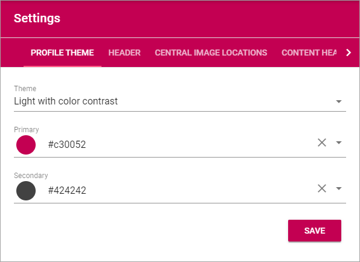
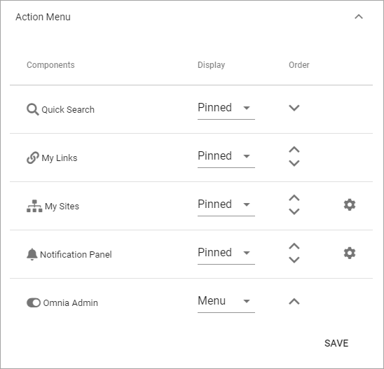
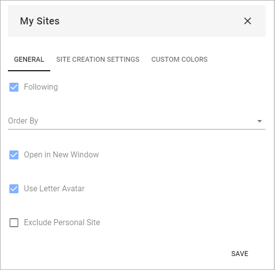
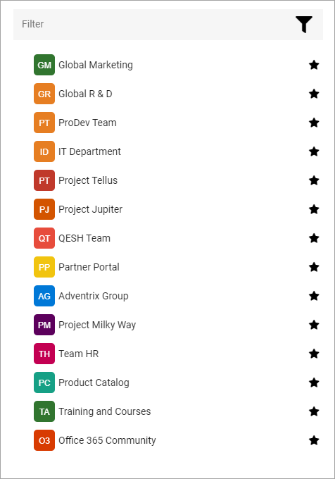
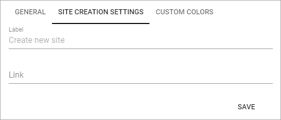
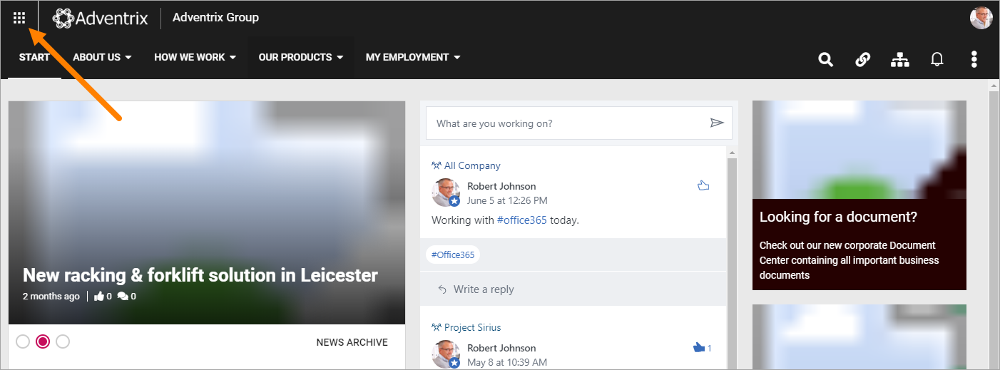
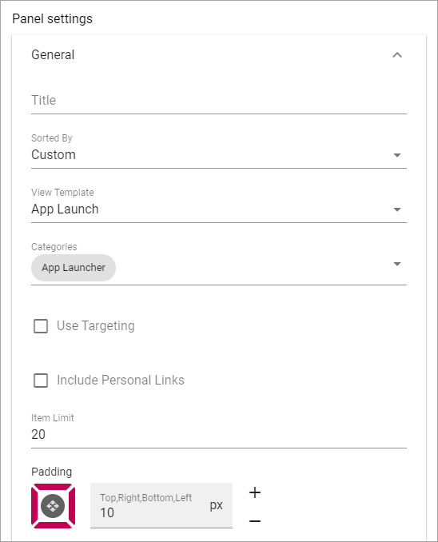
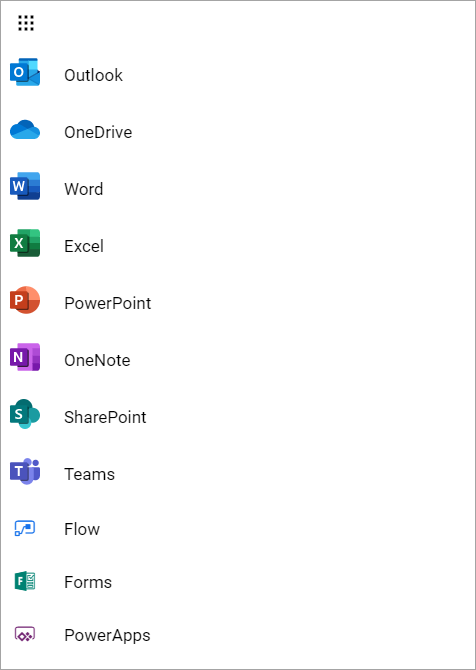
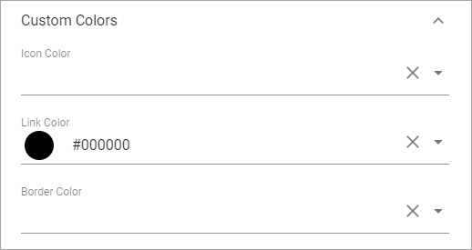

Settings
===========================================

**Note! This is an ongoing work. All options are not described yet.**

Here the following settings can be edited:

Profile Theme
**************
Use these options to set Default Colors for the Business Profile. When working with a Block, en editor can often select other Colors, but if no other Color is chosen for the Block, these settings apply.

.. image:: business-profile-settings-theme.png

+ **Theme**: Select Theme from the list. 
+ **Primary**: If needed, you can adjust the Primary Color. 
+ **Secondary**: If needed, you can adjust the Secondary Color.

Header
*******
The following settings are avaible for the Header:

.. image:: business-profile-settings-header.png

General
--------
Under General you can set Background Color for the Header, and Icon Color. In this example, the Background Color is Black, and the Icon Color is White:

.. image:: heading-example.png

The Icon Color setting apply to the four Icons to the right.

Logo
------
Use these settings for the logo in the Heading.

.. image:: logo-in-heading.png

The following settings are available:

.. image:: logo-settings-bp.png

+ **Url**: Add the Url to the Logo Image here (or use the Media Picker, see below).
+ **ADD IMAGE**: To use the Media Picker to select Logo Image, click this link. See this page for information on how to use the Media Picker: :doc:`The Media Picker </general-assets/media-picker/index>`
+ **Padding**: Use these settings to add som padding around the Logo, if needed.

Mega Menu
------------
The Mega Menu makes it possible for the end user to navigate to any page in the navigation structure. It is displayed across all sites in Omnia. 

.. image:: mega-menu.png

The following settings are available:

.. image:: mega-menu-settings.png

+ **Publishing App**: If you use more than one Publishing App in this Business Profile, you can select Publishing App here.
+ **Page Collection**: Select Page Collection the Publishing Pages of the Business Profile.
+ **Static Display Level**: Defines the number of levels in the navigation term set that will always be displayed in the menu.
+ **Dynamic Display Level**: Defines the number of levels in the navigation term set that should be displayed in the mega menu when a user clicks an item in the static menu.
+ **Max Height**: As Default, the menu's Height is dynamic, meaning it adapts to the Height needed. You can set a fixed Height in pixels if you wish.
+ **Max Width**: As Default, the menu's Width is dynamic, meaning it adapts to the Width needed. You can set a fixed Wodth in pixels if you wish.
+ **Background Color**: As Default, the Background Color for the Mega Menu is the same as the Header, but you can set another Background Color if you wish.
+ **Text Color**: As Default, the Text Color for the Mega Menu is the same as the text in the Header, but you can set another Text Color if you wish.
+ **Selected Border Color**: Ypou can set Border Color separately if you wish. Default=no Color.

Action Menu
-------------
The Action Menu is this part of the Heading:

.. image:: action-menu.png

You can use these settings:

+ **Components**: This columns lists the Components that can be displayed in the Action Menu. "My Sites" and "Notification Panel" has additional settings,. see below.
+ **Display**: You can decide which Components to display, and how: "Pinned" - is default, an Icon will be displayed; "Hidden" - if you don't want the Component to be available; "Menu" - if you want to display the Component in the menu (the three standing dots) instead as an Icon.
+ **Order**:  You can decide the order for the Components you're displaying, from left to right.

My Sites - additional settings
-------------------------------
Click the cog wheel to set additional settings för My Sites. Here's what you can set:

General
^^^^^^^^
+ **Following**: Decides if the "Following" tab is displayed or not. The "All" tab is always displayed. 
+ **Order By**: Sets the Sort Order for the list of sites. Can be by "Title" or "Last Visited".
+ **Open in New Windows**: Decides if the site is opened in a new window ore not.
+ **Use Letter Avatar**: Select to use Letter Avatars or not (see below for an example).
+ **Exclude Personal Site**: If personal sites should not be shown in the list, select this option. A personal site is the OneDrive site where a user’s files are stored.

This an example where Letter Avatars are used:

Site Creation Settings
^^^^^^^^^^^^^^^^^^^^^^^^
Here you can set the following:

+ **Label**: The default Label is "Create new site". You can set another Label here.
+ **Link**:  If a custom form has been created for the Create Site function, the url to the form should be put in here.

Custom Colors
^^^^^^^^^^^^^^
Here you can set a Custom Color for the Icons for the sites. 

Notification Panel - additional settings
-------------------------------------------
Here you can set type of Notification Panel.

.. image:: notification-panel-settings.png

App Launch
-----------
These settings are for the App Launch menu:

You can set the following:

.. image:: applaunch-settings.png

+ **Enable**: Use this option to decide to display the App Launch menu or not. Default=displayed.
+ **App Launch Button**: Here you set Custom colors for the App Launch button. If not set, the default color settings are used.

Panel Settings - General
^^^^^^^^^^^^^^^^^^^^^^^^^^
You can set the following here:

+ **Title**: You can add a title to the App Launch menu.

.. inmage:: app-launch-title.png

+ **Sorted By**: The list of apps can be sorted alphabetically, by Last Visited, or by a Custom sort (see below for Custom Sort Settings).
+ **View Template**: The list of apps can be displayed in four different ways: "Simple list", "App Icons", "Navigation View" or "App Launch". See below for examples.
+ **Categories**: (A description will be added soon)
+ **Use targeting**: (A description will be added soon)
+ **Include Personal Links**: (A description will be added soon)
+ **Item Limit**: Set the number of apps to be displayed on each "page" of the app list. Default=20.
+ **Padding**: Use these options to set som padding around the app list, if needed.

View Template "Simple List" example:

View Template "App Icons" example:

.. image:: app-launch-app-icons.png

View Template "Navigation View" example:

.. image:: app-launch-navigation-view.png

View Template "App launch" example:

.. image:: app-launch-app-launch.png

Panel Settings - Custom Colors
^^^^^^^^^^^^^^^^^^^^^^^^^^^^^^^^
Use these options to set Custom Colors for the App Launch menu. 

Panel Settings - Custom Sort
^^^^^^^^^^^^^^^^^^^^^^^^^^^^^^
If you have selected "Custom" under "Sorted By", this option are available:

.. image:: app-launch-custom-sort.png

Use the arrows to move apps up or down in the list.

