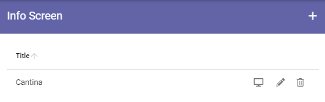
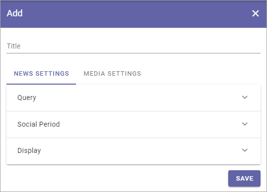
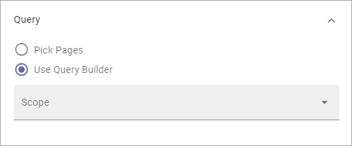
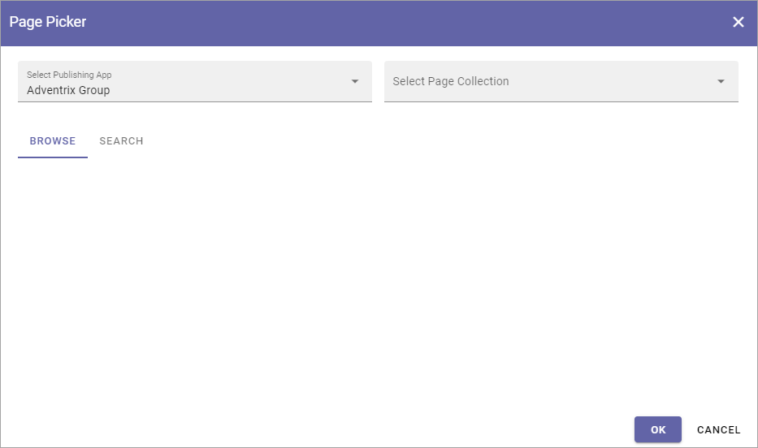
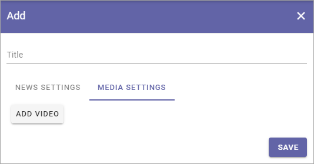

Info screen
=====================

When you select "Info screen" in the business profile settings, something like the following is shown:

You can set up several screens and they are displayed in this list.

Use the pen to edit settings or the dust bin to delete a screen setup. All settings can be edited for an existing setup, see below.

You can use this icon to preview a setup:

.. image:: info-screen-list-icon.png

Create a new Info screen setup
*******************************
Do the following to add a new screen setup:

1. Click the plus.

.. image:: info-screen-list-clickplus.png

2. Use the following settings (and don't forget to save when you're done).

News settings
******************
Here, the following can be set:

As the first step, add a Title for the Info Screen setup.

Query
---------
You can either pick one or more pages to display or use the Query Builder.

If you choose to use the Query Builder, it's used the same way as in the Page Rollup. See the heading "Query" on this page: :doc:`Page Rollup </blocks/page-rollup/index>`

If you choose to pick pages, this is how it's done:

1. Click ADD PAGE.

.. image:: info-screen-settings-query-pickpages.png

(Pick in Write mode is not applicable here).

2. Use the Page Picker to select one or more pages.

You can add additional pages by repeating this step, if needed.

See this page for more information about how to pick pages: :doc:`Page Picker </general-assets/page-picker/index>`

Social period 
---------------
Social Period is used the same way as in the Page Rollup block. See the heading "Social Period" on this page: :doc:`Page Rollup </blocks/page-rollup/index>`

Display
---------
For display you can choose "One Column Full Width", "One Column Wide Width" or "One Column Normal Omnia Width". The available settings fields are the same for all three.

For the six topmost fields, you select the Property to get the information from. Just open the list and select property.

.. image:: info-screen-settings-display-fields.png

Here's a description of the rest of the settings (all are not shown in the image, but described below):

.. image:: info-screen-settings-display-settings.png

+ **Delay Time Before scroll (seconds)**: Set the delay time before next scroll.
+ **Scrolling Speed**: Use the slider to set speed of the scroll.
+ **Delay Time after scroll (seconds)**: Set the delay time after a scroll.
+ **Scrolls Whole Page**: Select this if you want the whole page to scroll.
+ **Show Likes/Comments**: Select if Page Likes and Comments should be shown on the screen.
+ **Logo Url**: To display a logo, add the url here.
+ **Logo Position**: You can select to display the logo Top Right, Bottom Right, Top Left or Bottom Left.
+ **Logo Visibility**: You can turn Logo display on or off here.
+ **Logo Size**: Use the slider to set logo display size.
+ **Indicator Position**: You can select to display the Indicator Top Right, Bottom Right, Top Left or Bottom Left.
+ **Slides Indicator Color**: Use this option if you need to change Slides Indicator Color.
+ **Count Down Text Color**: Use this option if you need to change the Count Down Text Color.
+ **Indicator Visibility**: You can turn Indicator display on or off here.
+ **Item Limit**: Set the item limit to display in each “page” of the list.
+ **Sort by**: Choose what the list should be sorted by, and then select ascending or descending

Media settings
*****************
Use this option if you want to show a video on the screen, instead of pages.

When you click ADD VIDEO, the following is shown:

.. image:: info-screen-settings-media-settings.png

+ **Title**: Add a title to display for the video (mandatory).
+ **Video**: Click the icon to the right in this field to start Media Picker to select the video.

For more information on how to use Media Picker, see :doc:`Media Picker </general-assets/media-picker/index>`
