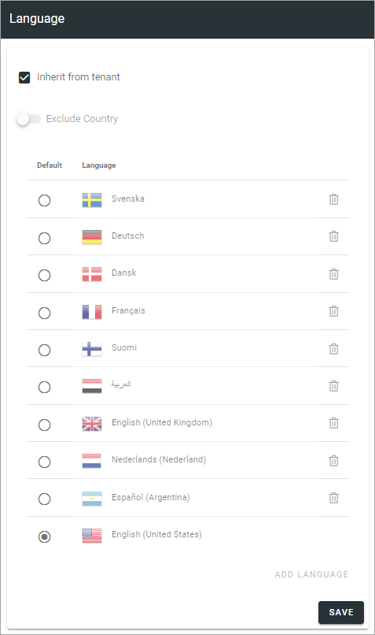

Language settings (Business Profile)
======================================

Regarding Languages for the Business Profile you can select to inherit settings from the tenant or set different Language settings here. Note that this setting is for the user interface, not for pages. See more information in the Language description for the tenant (link below).

To inherit Languages from the tenant, just select that option, and you're done.

To set other language settings for a Business Profile, you add and remove languages exactly the same way as the settings for the tenant, see: :doc:`Regional settings </admin-settings/tenant-settings/settings/regional-settings/index>`

If you need to publish a certain page in more than one language, you use the Option Page Variation, see the section Variations on this page: :doc:`Publishing App Settings </pages/page-settings/index>`
