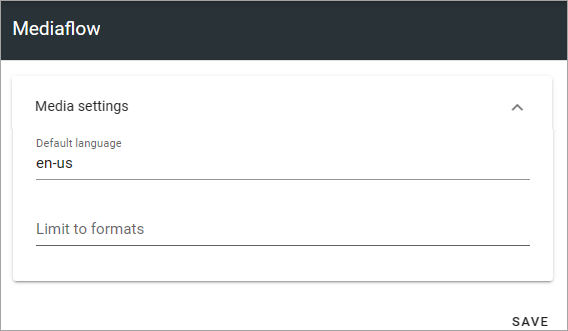

Mediaflow settings
=============================================

To be able to use Mediaflow, there's a number of settings needed. See the heading "Mediaflow" on this page: :doc:`Media picker </general-assets/media-picker/index>`

The settings here, are settings you MAY need/want to edit:

+ **Default language**: Default language in MediaFlow, within the media picker, SHOULD be the user's profile language, and nothing you should have to change here. More information about this setting will be added soon.
+ **Limit to formats**: If just certain image file types (jpg, png etc) should be available in Mediaflow, type the file types here, separated by a comma.
