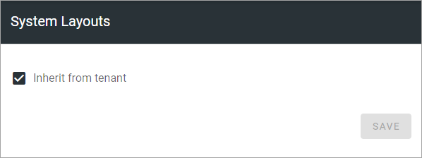
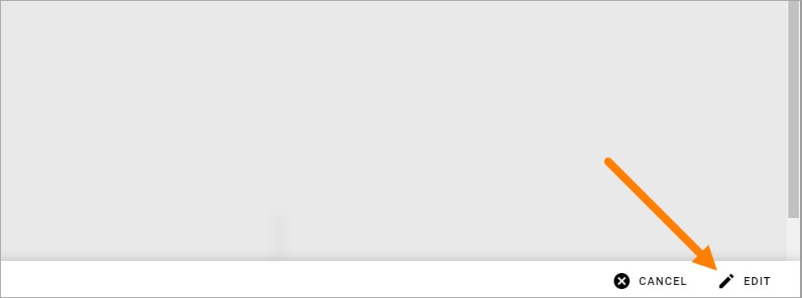

System layouts (Business profile)
=============================================

This option is available in Omnia 7.1 and later.

Here you can create pages for the 401 and 404 messages, specifically for this business profile, if you like. If you just want to use (inherit) the tenant pages, you don't have to do anything, that's the default setting.

If you would like to create one or both pages specifically for this business profile, deselect and click the pen for the page to create.

Start creating the layout by clicking EDIT here.

You create the layout for the page the same way as other layouts in Omnia, see: :doc:`Working with layouts </general-assets/working-with-layouts/index>`

