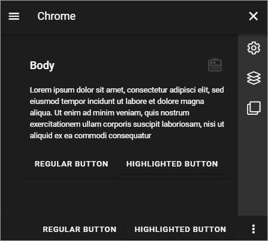

Theme for the Business Profile
=================================

Here you can work with theming for the Business Profile:

.. image:: theme-all.png

Coloar Palette
****************
Use these setings to define the Coilor Palettet that should be available in the Busniess Profile.

+ **Primary**: If needed, you can adjust the Primary Color. 
+ **Secondary**: If needed, you can adjust the Secondary Color.
+ **Additional Colors**: To make sure editors can't choose any other color freely, you can use this section to set up alternative colors that will be available. Click "Add Additonal Color" to add more colors, and the dust bin to delete a color. (Don't forget to save when you're done.)

When you select "Additional Colors" you add Custom Colors.

.. image:: theme-custom.png

You can these add any colour using the blender, the Color slider, the Black and White slider, and even add the exact hex number for a color.

.. image:: theme-custom-blender.png

Theme mappings
****************
As the heading suggests, you use these settings to map default themes for to the Editor, for Layout, the Layout Dialog and for blocks.

Use the list to the left to select a theme and the list to the right for an accessability theme.

.. image:: theme-mappings.png

Theme Definitions
*********************
In a number of occasions, especially when working with pages, a theme can be selected. Here you define the themes that should be available.

.. image:: theme-definitions.png

These default themes canät be edited or deleted, but you can create new themes, see below.

Use the screen icon for a preview of a theme. Here's an example of the "Light woth color":

.. image:: theme-light-color.png

And here's the "Dark" theme:

Create a new theme
-----------------------
To create a new theme, do the following:

1. Click the plus.

.. image:: create-theme-click-plus.png

2. Add a Theme Name.
3. Set the colors for the BODY and CHROME.

You can also select en existing theme as a starting point, by clicking here:

.. image:: create-theme-click-theme.png

4. Add some "Advanced Settings" if you want.

Available are these:

.. image:: create-theme-advanced.png

5. You can see a proview of the progress any time, by clicking here:

.. image:: create-theme-preview.png

6. Save when you're done (Save button is at the bottom).

Edit or delete custom themes
------------------------------
Themes you or anyone else in your organisation has created can be edited (the pen), or deleted (the dust bin).

.. image:: themes-edit-delete.png

