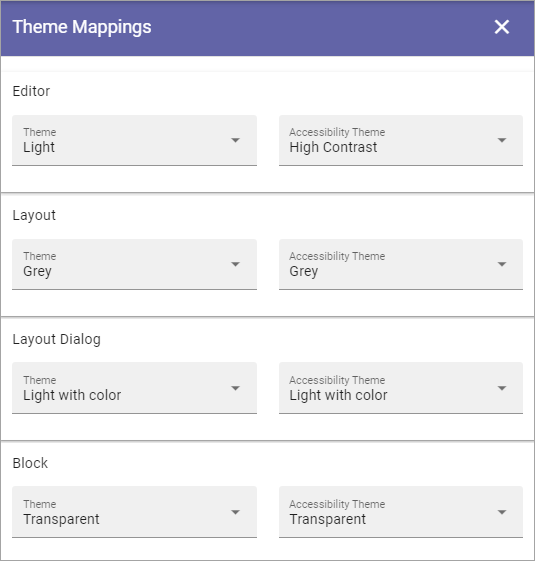
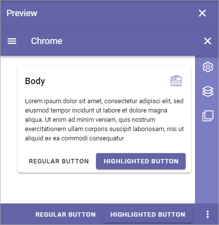

Theme for the business profile
=================================

Here you can work with theming for the business profile:

.. image:: theme-all.png

Color palette
****************
Use these setings to define the color palette that should be available in the business profile.

+ **Primary**: If needed, you can adjust the Primary Color. 
+ **Secondary**: If needed, you can adjust the Secondary Color.
+ **Additional colors**: To make sure editors can't choose any other color freely, you can use this section to set up alternative colors that will be available. Click "Add Additonal Color" to add more colors, and the dust bin to delete a color. (Don't forget to save when you're done.)

When you select "Additional Colors" you can add Custom Colors.

.. image:: theme-custom.png

You can add any colour using the blender, the Color slider, the Black and White slider, and even add the exact hex number for a color to add.

.. image:: theme-custom-blender.png

Theme mappings
****************
As the heading suggests, you use these settings to map default themes for to the Editor, for Layout, the Layout Dialog and for blocks.

The mappings are used for the following:

+ Layout - themes for the root page section.
+ Layout Dialog - themes for dialogs shown for users.
+ Block - default block themes.
+ Editor - themes for the WCM editor.

Use the list to the left to select a normal theme and the list to the right for an accessability theme.

Theme definitions
*********************
In a number of occasions, especially when working with pages, a theme can be selected. A number of themes are available out of the box, and you can also add addtional themes. 

.. image:: theme-definitions.png

These default themes can't be edited or deleted.

Use the screen icon for a preview of a theme. Here's a preview of "Light with color":

And here's "Color"":

.. image:: theme-color.png

Create a new theme
-----------------------
To create a new theme, do the following:

1. Click the plus.

.. image:: create-theme-click-plus.png

2. Add a Theme Name.
3. Set the colors for BODY and CHROME.

You can also select an existing theme as a starting point, by clicking here:

.. image:: create-theme-click-theme.png

4. Add some "Advanced Settings" if you want.

Available are these:

.. image:: create-theme-advanced.png

5. You can see a preview of the theme you're creating, by clicking here:

.. image:: create-theme-preview.png

6. Save when you're done (Save button is at the bottom).

Edit or delete custom themes
------------------------------
Themes you or anyone else in your organisation has created can be edited (the pen), or deleted (the dust bin).

.. image:: themes-edit-delete.png

Themes and inheritance
************************
A theme can be set for the Page Type. When the page type is edited, themes can be set for sections, overwriting the theme settings there. Unique block settings will overwrite theme settings for the sections.

