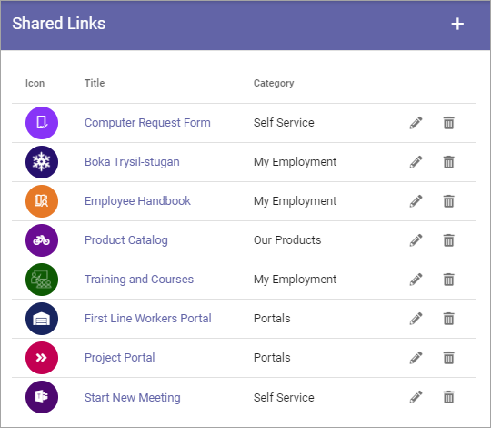

Shared Links
===========================================

Using Shared Links a Business Profile Administrator (or any other users added to the separate Permissions list) can create Business Profile specific links that users can access through "My Links".  

Some links can be mandatory and it's also possible to target links to certain groups. 

These links can also be accessed through a Quick Links block on any page, see: :doc:`The Quick Links block </blocks/quick-links/index>`

**Note!** The Permissons settings available here earlier has been moved in Omnia 6.12 and later, to the general Permissions settings for the business profile: :doc:`Permissions for a Business Profile </admin-settings/business-group-settings/permissions/index>`

Shared links
**************
A list of Shared links for the Business Profile can look like this:

Options for Tenant Shared Links and Business Profile Shared Links are identical. For information on how to create and edit Shared Links, see: :doc:`Shared Links (Tenant) </admin-settings/tenant-settings/shared-links/index>`

Permissions
*************
Shared Links for this Business Profile has a seperate Permissions setting, so any user can be set as a Shared Links administrator. This includes external users that has been invited in the Azure AD, meaning they can log in with their own Microsoft 365 account. 

Note that Business Profile Administrators always can work with Shared Links.

For more information on permissions, see: :doc:`Permissions for a Business Profile </admin-settings/business-group-settings/permissions/index>`.
