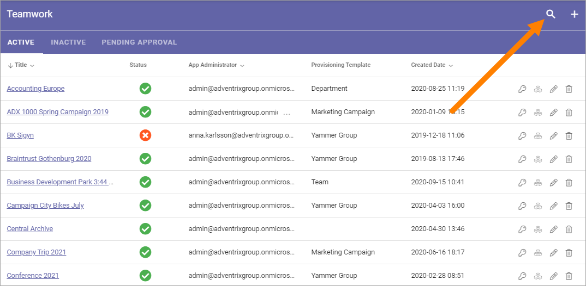
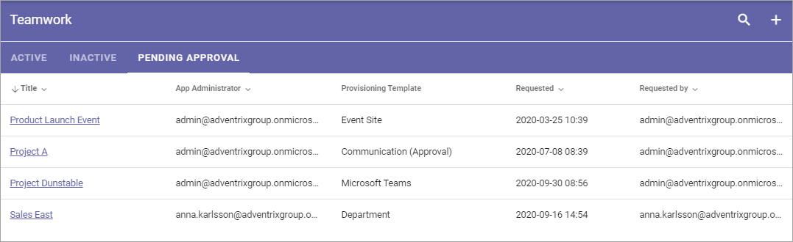

Teamwork
===========================================

Use these settings go to any Teamwork site to, for example, edit settings. You can also create a new Teamwork site, or Attach an existing site to Omnia.

Using the list "Inactive" you can handle sites with pending delete.

For Team Sites with "Approval" as Site Creation Mode, you use the "Pending Approval" list to approve or reject creation of a Team Site.

.. image:: team-collaboration-new4.png

Use the icons this way:

+ The key to edit permissions.
+ The boxes to activate, deactivate and upgrade features.
+ The pen to edit some settings.
+ The dust bin to delete the collaboration site. 

You can use the headings for App Administrator, Provisioning Template and Created Date to sort the list.

You can also search the list.

Create a Teamwork Site
***********************
To create a Teamwork Site from here, do the following:

1. Click the plus.

.. image:: team-collaboration-clickplus-new4.png

2. Select "Create New".

.. image:: team-collaboration-select-new4.png

3. Select Provisioning Template. See this page for more information: :doc:`Provisioning Templates </admin-settings/business-group-settings/provisioning-templates/index>`

.. image:: team-collaboration-template-new3.png

4. Edit the settings.

.. image:: team-collaboration-settings-1new3.png

Available options depend on the template chosen. Here's some common ones:

+ **Title**: Add a Title (name) for the Team Site here.
+ **Description**: It's a good idea to add a Description of the Teamwork site's purpose here, but it's not mandatory.
+ **Show in public listings**: If links to this teamwork should show up in listings available for all colleagues, select this option. Default: selected.
+ **Sharepoint Alias**: The last part of the address to the site is created automatically but can be edited if necessary. If the name (address) already exists an alternative address is suggested.
+ **Languages**: The same language as the main Business Profile language is suggested. Another language can be selected if needed.  
+ **Time Zones**: Normally the correct Time Zone is already selected. Can be changed if needed.

5. When done, click "Next".
6. Now, set the following:

.. image:: team-collaboration-settings-2-new2.png

+ **App Administrator**: You are automatically added as the Administrator of the site. Add or remove Administrators as needed.

7. Click "Next".
8. Set Enterprise Properties if nedded.

.. image:: team-collaboration-settings-4.png

6. Click "CREATE" to create the Team Site.

**Note!** When the Teamwork site has been created, the above settings can not be edited here.

Edit settings
--------------
When you click the pen for a teamwork, the following settings are available for editing:

.. image:: team-collaboration-edit3.png

See above for information about the options.

Features for the teamwork
***************************
To activate, remove or upgrade features for a teamwork, you click the boxes icon. Something like the following is then shown (can vary depending on available functionality).

.. image:: team-collaboration-features-new.png

What you can do is self explanatory, but be careful here and make sure you know exactly what will happen, especially if you plan to remove or upgrade a feature.

Attach a Teamwork Site
************************
Using this option you can attach any Teamwork Site to Omnia. When a Teamwork Site is attached you can handle the site through Omnia the same way as a Teamwork Site created through Omnia.

Do the following:

1. Copy the Url for the Teamwork Site you want to attach.
2. Go to Team Collaboration settings and click the plus.
3. Select "Attach Site".

The following is shown:

.. image:: team-collaboration-attach-new2.png

3. Paste the Url and click "Resolve".

Inactive
**********
When a site of the type Microsoft 365 Team Site, Sharepoint Team Site or Sharepoint Communication Site is created, a Sharepoint site is created and is connected to the site. A Yammer Group can also need a Sharepoint site, depending on how the Yammer Group is set up.

The connected Sharepoint site may be deleted for some reason, but when that happens the Omnia site may not. When that happens a link to the site is placed in this list, so an administrator can take actions.

.. image:: teamwork-inactive-new.png

Pending Approval
*****************
When a user creates a Teamwork site where Approval is needed, an administrator uses this list to approve or reject creation of the site. Here's an example:

Approval (or Rejection) is done this way:

1. Click the link for the site.
2. Check the name, settings and so on for the site.
3. If everything is OK, click "Approve", or if changes are needed, click "Reject".

.. image:: pending-approval-approve-new3.png

If you approve the creation of the Teamwork site a message is sent to the person requesting the site, and the site is created.

If you reject, the following is shown:

4. Type a message stating what needs to be done for approval, and click "Save" to send the message.

The person requesting the site receives the message and can then start a new Teamwork site creation with your comments in mind. 

**Note!** Requesting a Teamwork Site must always be done from start each time. If rejected, nothing from the request is saved.

Important note about Site Ownership when approving
*****************************************************
Because of caching issues in Sharepoint, it can take some time, even up to 2 hours after approval, before site ownership will work as intended - as set in the Teamwork Creation Wizard in Omnia. During this initial period, Site Owners may not have access to the site.

