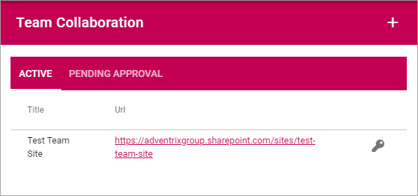
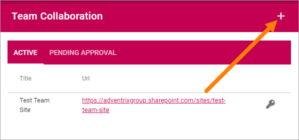
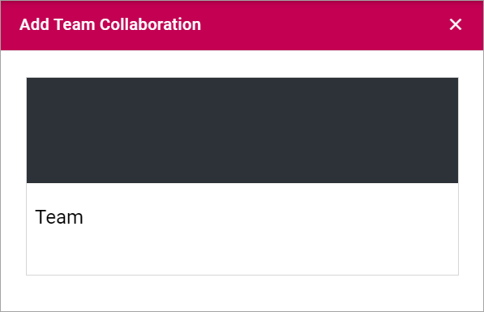
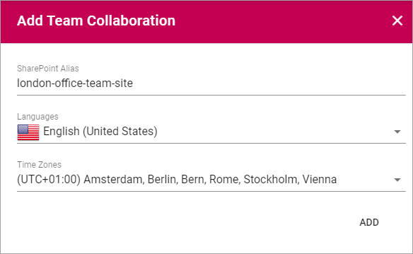
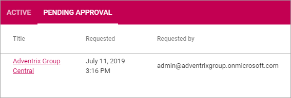
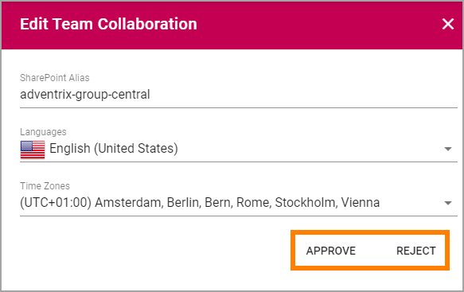

Team Collaboration
===========================================

Use these settings go to any Team Site to, for example, edit settings. You can also create a new Team Site, or Attach an existing Team Site to Omnia.

For Team Sites with "Approval" as Site Creation Mode, you use the "Pending Approval" list to approve or reject creation of a Team Site.

Create a Team Site
*********************
To create a Team Site from here, do the following:

1. Click the plus.

2. Select "Create New".

.. image:: team-collaboration-select-new.png

3. Select Provisioning Template. See this page for more information: :doc:`Provisioning Templates </admin-settings/business-group-settings/provisioning-templates/index>`

4. Set the following settings and click "Next".

.. image:: team-collaboration-settings-1.png

+ **Base App Template**: This is just information stating which Provisioning Template you have selected.
+ **Title**: Add a Title (name) for the Team Site here.
+ **Description**: It's a good idea to add a Description of the Team Site's purpose here, but it's not mandatory.
+ **App Administrator**: You are automatically added as the Administrator of the site. Add or remove Administrators as needed.

5. Set the following settings:

+ **Sharepoint Alias**: The last part of the Url to the Team Site, based on the Title, is shown here. It can be edited if needed.
+ **Languages**: Select Language for the Team Sites menus and other system texts.
+ **Time Zone**: Select correct Time Zone here.

6. Click "ADD" to create the Team Site.

**Note!** - when the Team Site is created, the above settings can not be edited here.

Attach a Team Site
*******************
Using this option you can attach any Team site to Omnia. Do the following:

1. Copy the Url for the Team site you want to attach.
2. Got to Team Collaboration settings and click the plus.

The following is shown:

.. image:: team-collaboration-attach.png

3. Paste the Url and click "Resolve".

Pending Approval
*****************
When a user creates a Team Site where Approval is needed, an administrator uses this list to approve or reject creation of the site. Here's an example:

Approval (or Rejection) is done this way:

1. Click the link for the site.
2. Check the name, settings and so on for the site.
3. If everything is OK, click "Approve", if changes are needed, click "Reject".

If you approve the creation of the team site a message is sent to the person requesting the site, and the site is created.

If you reject, the following is shown:

.. image:: pending-approval-reject.png

4. Type a message stating what needs to be done for approval, and click "Save" to send the message.

The person requesting the site recieves the message and can then start a new team site creation with your comments in mind. 

**Note!** Requesting a Team Site must always be done from the start. If rejected, nothing from the request is saved.

