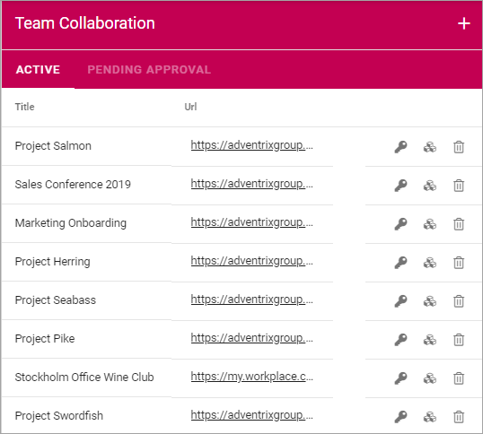
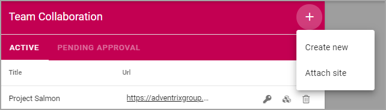
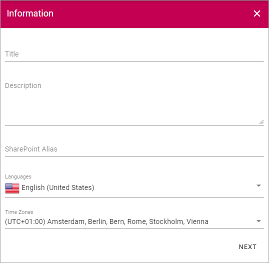
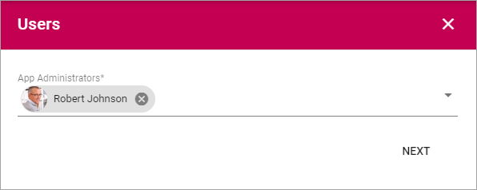
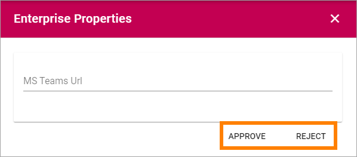
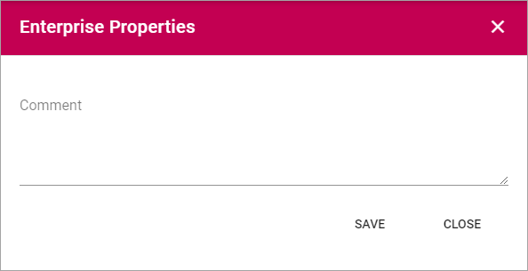

Teamwork
===========================================

Use these settings go to any Team Site to, for example, edit settings. You can also create a new Team Site, or Attach an existing Team Site to Omnia.

For Team Sites with "Approval" as Site Creation Mode, you use the "Pending Approval" list to approve or reject creation of a Team Site.

Use the icons this way:

+ The key to edit permissions.
+ The boxes to activate, deactivate and upgrade features.
+ The dust bin to delete the collaboration site. 

Create a Team Site
*********************
To create a Team Site from here, do the following:

1. Click the plus.

.. image:: team-collaboration-clickplus-new.png

2. Select "Create New".

3. Select Provisioning Template. See this page for more information: :doc:`Provisioning Templates </admin-settings/business-group-settings/provisioning-templates/index>`

.. image:: team-collaboration-template-new.png

4. Set the following settings.

Available options depend on the template chosen. Here's some common ones:

+ **Title**: Add a Title (name) for the Team Site here.
+ **Description**: It's a good idea to add a Description of the Team Site's purpose here, but it's not mandatory.
+ **Sharepoint Alias**: The last part of the address to the site is created automatically but can be edited if necessary. If the name (address) already exists an alternative address is suggested.
+ **Languages**: The same language as the main Business Profile language is suggested. Another language can be selected if needed.  
+ **Time Zones**: Normally the correct Time Zone is already selected. Can be changed if needed.

5. When done, click "Next".
6. Now, set the following:

+ **App Administrator**: You are automatically added as the Administrator of the site. Add or remove Administrators as needed.

7. Click "Next".
8. Set Enterprise Properties if nedded.

.. image:: team-collaboration-settings-3.png

6. Click "CREATE" to create the Team Site.

**Note!** When the Team Site has been created, the above settings can not be edited here.

Attach a Team Site
*******************
Using this option you can attach any Team Site to Omnia. When a Team Site is attached you can handle the site through Omnia the same way as a Team Site created through Omnia.

Do the following:

1. Copy the Url for the Team Site you want to attach.
2. Go to Team Collaboration settings and click the plus.

The following is shown:

.. image:: team-collaboration-attach.png

3. Paste the Url and click "Resolve".

Pending Approval
*****************
When a user creates a Team Site where Approval is needed, an administrator uses this list to approve or reject creation of the site. Here's an example:

.. image:: pending-approval-new.png

Approval (or Rejection) is done this way:

1. Click the link for the site.
2. Check the name, settings and so on for the site.
3. If everything is OK, click "Approve", if changes are needed, click "Reject".

If you approve the creation of the team site a message is sent to the person requesting the site, and the site is created.

If you reject, the following is shown:

4. Type a message stating what needs to be done for approval, and click "Save" to send the message.

The person requesting the site receives the message and can then start a new Team Site creation with your comments in mind. 

**Note!** Requesting a Team Site must always be done from start each time. If rejected, nothing from the request is saved.

