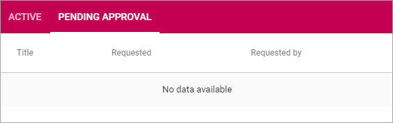

Team Collaboration
===========================================

Use these settings go to any Team Site to, for example, edit settings. You can also create a new Team Site, or Attach an existing Team Site to this list.

For Team Sites with "Approval" as Site Creation Mode, you use the "Pending Approval" list to approve or reject creation of a Team Site.

.. image:: team-collaboration.png

Create a Team Site
*********************
To create a Team Site from here, do the following:

1. Click the plus.

.. image:: team-collaboration-clickplus.png

2. Select "Create New".

.. image:: team-collaboration-select-new.png

3. Select Provisioning Template. (See this page for more information: `Provisioning Templates </admin-settings/business-group-settings/provisioning-templates/index>`

.. image:: team-collaboration-template.png

4. Set the following settings and click "Next".

.. image:: team-collaboration-settings-1.png

+ **Base App Template**: This is just information stating which Provisioning Template you have selected.
+ **Title**: Add a Title (name) for the Team Site here.
+ **Description**: It's a good idea to add a Description of the Team Sites purpose here, but it's not mandatory.
+ **App Administrator**: You are automatically added as the Administrator of the site. Add or remove Administrators as needed.

5. Set the following settings:

.. image:: team-collaboration-settings-2.png

+ **Sharepoint Alias**: The last part of the Url to the Team Site, based on the Title, is shown here. It can be edited if needed.
+ **Languages**: Select Language for the Team Sites menus and other system texts.
+ **Time Zone**: Select correct Time Zone here.

6. Click "ADD" to create the Team Site.

**Note!** - when the Team Site is created, the above settings can not be edited here.

Pending Approval
*****************
When a user creates a Team Site where Approval is needed, an administrator uses this list to approve or reject creation of the site.

(More information will be added soon.)

