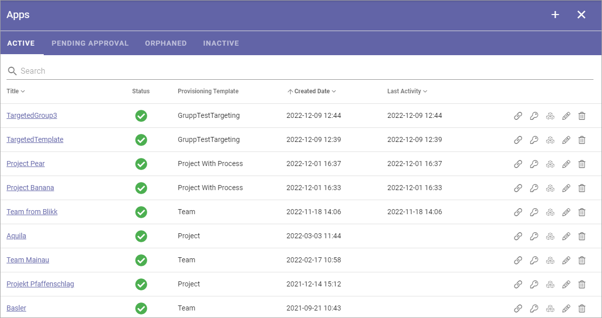
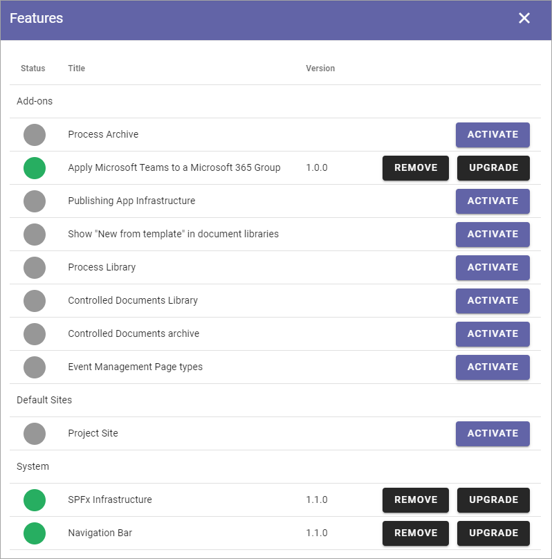
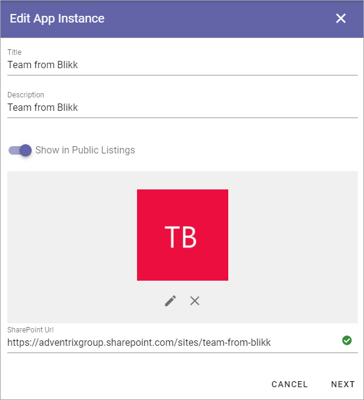
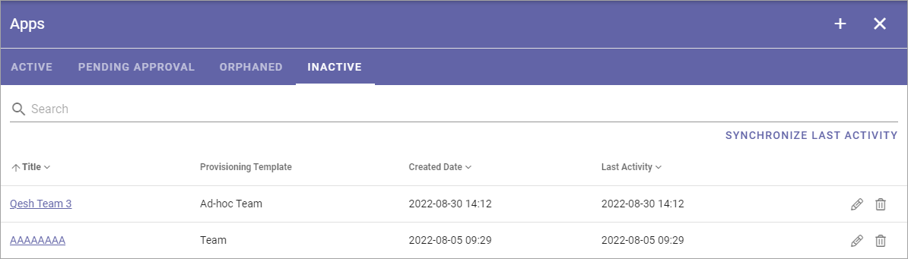
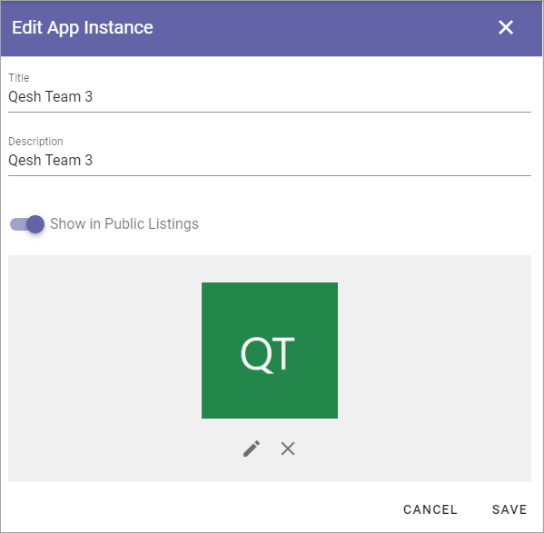
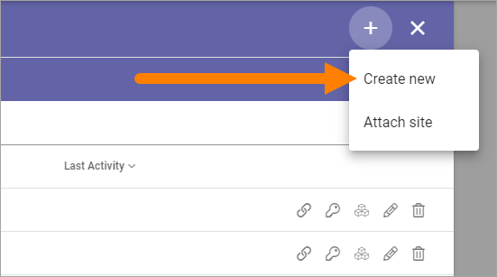
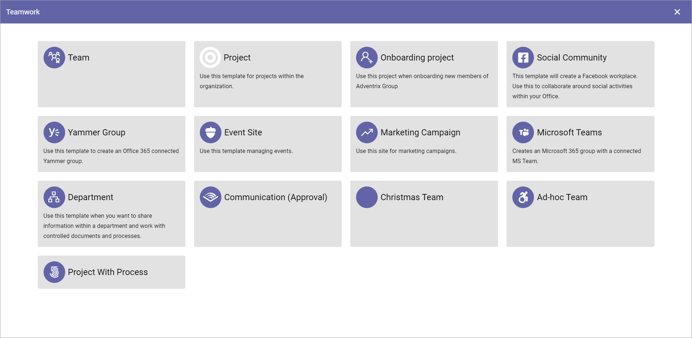
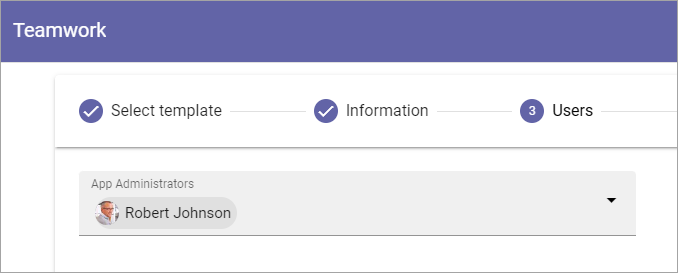
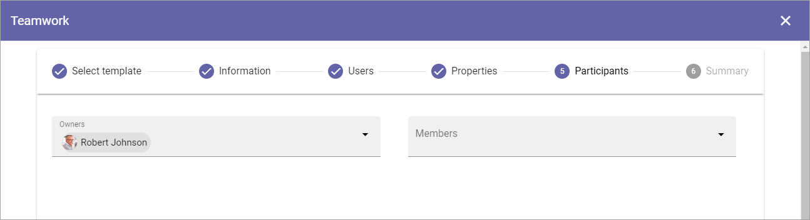

Apps for Teamwork
===========================================

Here Teamworks are listed, the "Active" tab as an example:

Active
*****************
Use the icons this way on the Active tab:

+ The link symbol to edit app route, if needed.
+ The key to edit permissions.
+ The boxes to activate, deactivate and upgrade features. 
+ The pen to edit App Instance.
+ The dust bin to delete. 

You can use the headings for Title, Created Date and Last Activity to sort the list. You can also search the list.

**Note!** To be able to delete a teamwork, you must be App Administrator for the teamwork. Also note that deleting a teamwork from this list does not delete 
the connected SharePoint site.

Edit App Route
----------------
If it should be needed to edit the App Route, click the icon and the following is shown:

.. image:: teamwork-apps-app-route-community-612.png

Edit the app route and save.

Edit Permissions
-----------------
If you need to add or remove owners (administrator) or members for a Teamwork, you do it here:

.. image:: teamwork-app-premissions-612-new-frame.png

Don't forget to save when you're done.

Edit Features
---------------
If it's needed to upgrade a feature for the Teamwork, you need to go here. You also go here to activate or remove a feature. Available features can differ a lot depending on typoer of app. Here's an example:

Edit App Instance
---------------------
If it should be needed to edit the App Instance, click the icon and the following is shown:

Use the ADD IMAGE button to add an image for use in rollups. You can also edit Title, Description, Public Listing setting and edit the Sharepoint Url, if needed. SharePoint Url is not aplicable for all types of teamwork.  

Pending Approval
*****************
When a user creates a Teamwork where Approval is needed, an administrator uses this list to approve or reject. Here's an example:

.. image:: pending-approval-612.png

Approval (or Rejection) is done this way:

1. Click the link for the Teamwork.
2. Check the name, settings and so on.
3. If everything is OK, click "Approve", or if changes are needed, click "Reject".

.. image:: pending-approval-approve-612.png

If you approve the creation of the Teamwork a message is sent to the person requesting it, and the Teamwork is created.

If you reject, the following is shown:
 
.. image:: pending-approval-reject-612.png

4. Type a message stating what needs to be done for approval, and click "Save" to send the message.

The person requesting the Teamwork receives the message and can then start a new Teamwork creation with your comments in mind. 

**Note!** Requesting a Teamwork must always be done from start each time. If rejected, nothing from the request is saved.

Orphaned
**********
When a site of the type Microsoft 365 Team Site, SharePoint Team Site or SharePoint Communication Site is created, a SharePoint site is created and is connected to the site. A Yammer Group can also need a SharePoint site, depending on how the Yammer Group is set up.

The connected SharePoint site may be deleted for some reason, but when that happens the Omnia site may not. When this happens a link to the site is placed in this list, so an administrator can take actions.

Inactive
***********
A teamwork is considered inactive if Last Activity, as registered in the SharePoint site, is more than three months old.

Here's an exampl from a test environment:

Here administrators can check/edit the settings for the teamworks and delete a teamwork that is not needed. The list can be sorted by "Created Date" or "Last Activity", to for example see if any activity has taken place at all.

Click SYNCHRONIZE LAST ACTIVITY to update the list with the latest activities. The list is not updated automatically. Note that if there are a huge number of teamworks in your solution, the update can take some time.

Click the pen to check the settings for a teamwork. All settings can then be checked an edited:

To delete a teamwork, click the dust bin. Then this is shown:

.. image:: teamwork-apps-inactive-edit-ok.png

**Important Note!** When you click OK here the delete is final. There's no way to retrieve a deleted teamwork.

Create a Teamwork
***********************
To create a Teamwork from here, do the following:

1. Click the plus.

.. image:: team-collaboration-clickplus-612.png

2. Select "Create New".

3. Select Template. 

Here's an example with a lot of different alternatives. You may not have as many.

4. Edit the settings.

.. image:: team-collaboration-settings-612.png

Available options depend on the template chosen. Here's some common ones:

+ **Title**: Add a Title (name) for the Teamwork here.
+ **Description**: It's a good idea to add a Description of the Teamwork's purpose here, but it's not mandatory.
+ **Show in public listings**: If links to this teamwork should show up in listings available for all colleagues, select this option. Default: selected.
+ **Sharepoint Alias**: The last part of the address to the Teamwork is created automatically but can be edited if necessary. If the name (address) already exists an alternative address is suggested.
+ **Languages**: The same language as the main Business Profile language is suggested. Another language can be selected if needed.  
+ **Time Zones**: Normally the correct Time Zone is already selected. Can be changed if needed.

5. When done, click "Next".
6. Now, set the following:

+ **App Administrator**: You are automatically added as the Administrator. Add or remove Administrators as needed.

7. Click "Next".
8. Set Enterprise Properties if nedded (remember - what is available depends on the template).

.. image:: team-collaboration-properties-612.png

9. Set Owner and also Members, if needed.

A summary is now shown, where you can click the pen the edit any of the steps.

10. Click CREATE to create the Teamwork or SEND FOR APPROVAL, depending on how the template has been set up.

.. image:: team-collaboration-create-612.png

Attach a Teamwork Site
************************
Using this option you can attach any Teamwork Site to Omnia. When a Teamwork Site is attached you can handle the site through Omnia the same way as a site created through Omnia.

The following permissions are required to be able to attach a site:

+ For an Omnia Teamwork app: App Administrator permissions.
+ For a Sharepoint site: Site Collection Administrator permissions.

Do the following to attach a site:

1. Copy the Url for the Sharepoint site for the Teamwork you want to attach.
2. Go to Team Collaboration settings and click the plus.
3. Select "Attach Site".

.. image:: attach-site-612.png

The following is shown:

.. image:: team-collaboration-attach-612.png

3. Paste the Url and click "Resolve".

You can "detach" (delete) a site if needed. Then the following permissions are needed:

+ For an Omnia Teamwork app: App Administrator permissions.
+ For a Sharepoint site: Site Owner or Site Collection Administrator permissions.

**Note!** What actually happens when you click the dust bin to delete a site, is that the site is detached. That is true for all Teamwork sites, regardless of if they have been created in or attached to Omnia.

**Note!** When a site is detached, an email is sent to the site owner(s). Note that, for a user to be able to receive e-mails, the acccount must be email enabled.

