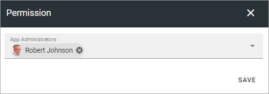
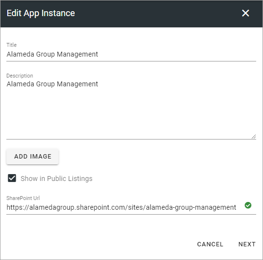
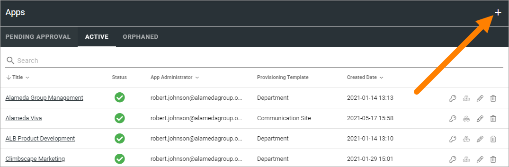
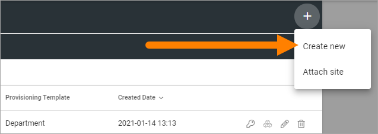
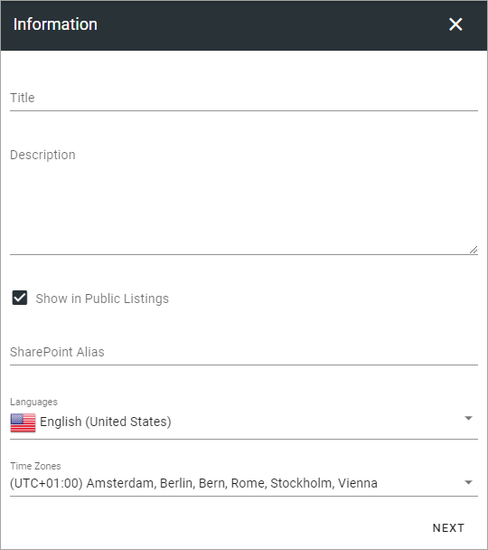
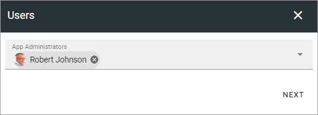
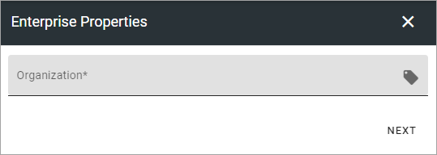
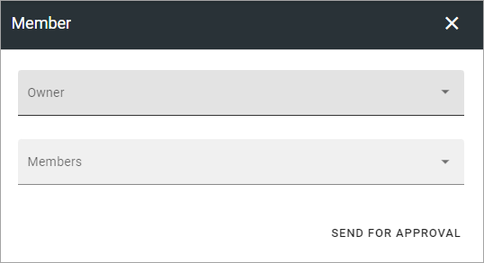
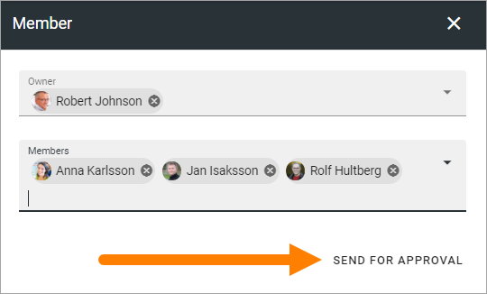
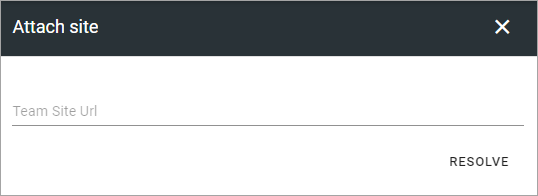

Apps for Teamwork
===========================================

This is an ongoing, preliminary documentatin for this functionality in Omnia 6.5.

Here Teamworks are listed, the "Active" tab as an example:

.. image:: teamwork-65-apps-new.png

Active
*****************
Use the icons this way on the Active tab:

+ The key to edit permissions.
+ The boxes to activate, deactivate and upgrade features. 
+ The pen to edit App Instance.
+ The dust bin to delete. 

You can use the headings for Title, App Administrator, Provisioning Template and Created Date to sort the list. You can also search the list.

Edit Permissions
-----------------
If you need to add or remove administrator(s) for a Teamwork, you do it here:

Don't forget to save when you're done.

Edit Features
---------------
If it's needed to upgrade a feature for the Teamwork, you need to go here. You also go here to activate or remove a feature.

.. image:: teamwork-app-features-65.png

Edit App Instance
---------------------
If it should be needed to edit the App Instance, click the icon and the following is shown:

Use the ADD IMAGE button to add an image for use in rollups. You can alos edit Title, Description, Public Listing setting and edit the Sharepoint Url, if needed.

Pending Approval
*****************
When a user creates a Teamwork where Approval is needed, an administrator uses this list to approve or reject. Here's an example:

.. image:: pending-approval-65.png

Approval (or Rejection) is done this way:

1. Click the link for the Teamwork.
2. Check the name, settings and so on.
3. If everything is OK, click "Approve", or if changes are needed, click "Reject".

.. image:: pending-approval-approve-65.png

If you approve the creation of the Teamwork a message is sent to the person requesting it, and the Teamwork is created.

If you reject, the following is shown:
 
.. image:: pending-approval-reject-65.png

4. Type a message stating what needs to be done for approval, and click "Save" to send the message.

The person requesting the Teamwork receives the message and can then start a new Teamwork creation with your comments in mind. 

**Note!** Requesting a Teamwork must always be done from start each time. If rejected, nothing from the request is saved.

Important note about Site Ownership when approving
-----------------------------------------------------
Because of caching issues in Sharepoint, it can take some time, even up to 2 hours after approval, before site ownership will work as intended - as set in the Teamwork Creation Wizard in Omnia. During this time, the Approver will have Owner permissions. 

Orphaned
**********
(This tab works the same way as the tab that was called "Inactive" in Omnia 6.0).

When a site of the type Microsoft 365 Team Site, Sharepoint Team Site or Sharepoint Communication Site is created, a Sharepoint site is created and is connected to the site. A Yammer Group can also need a Sharepoint site, depending on how the Yammer Group is set up.

The connected Sharepoint site may be deleted for some reason, but when that happens the Omnia site may not. When this happens a link to the site is placed in this list, so an administrator can take actions.

Create a Teamwork Site
***********************
To create a Teamwork from here, do the following:

1. Click the plus.

2. Select "Create New".

3. Select Template. 

.. image:: team-collaboration-template-65.png

4. Edit the settings.

Available options depend on the template chosen. Here's some common ones:

+ **Title**: Add a Title (name) for the Teamwork here.
+ **Description**: It's a good idea to add a Description of the Teamwork's purpose here, but it's not mandatory.
+ **Show in public listings**: If links to this teamwork should show up in listings available for all colleagues, select this option. Default: selected.
+ **Sharepoint Alias**: The last part of the address to the Teamwork is created automatically but can be edited if necessary. If the name (address) already exists an alternative address is suggested.
+ **Languages**: The same language as the main Business Profile language is suggested. Another language can be selected if needed.  
+ **Time Zones**: Normally the correct Time Zone is already selected. Can be changed if needed.

5. When done, click "Next".
6. Now, set the following:

+ **App Administrator**: You are automatically added as the Administratore. Add or remove Administrators as needed.

7. Click "Next".
8. Set Enterprise Properties if nedded.

9. Set Owner and also Members, if needed.

10. Click CREATE to create the Teamwork or SEND FOR APPROVAL, depending on how the template has been set up.

Attach a Teamwork Site
************************
Using this option you can attach any Teamwork Site to Omnia. When a Teamwork Site is attached you can handle the site through Omnia the same way as a site created through Omnia.

Do the following:

1. Copy the Url for the Teamwork Site you want to attach.
2. Go to Team Collaboration settings and click the plus.
3. Select "Attach Site".

The following is shown:

3. Paste the Url and click "Resolve".

