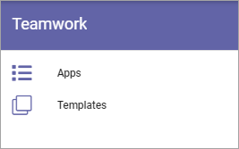
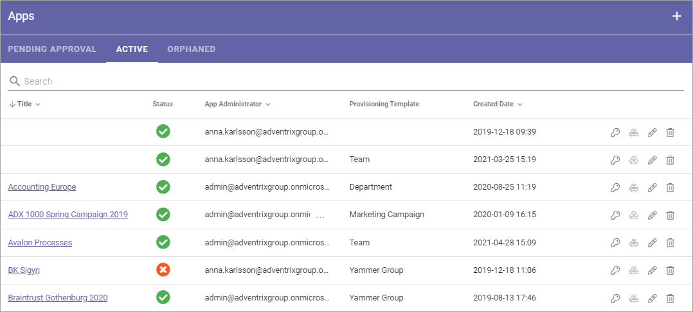
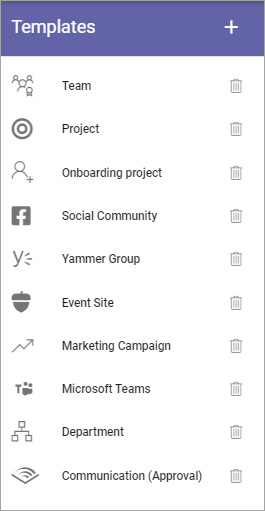
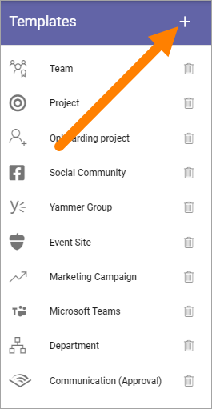
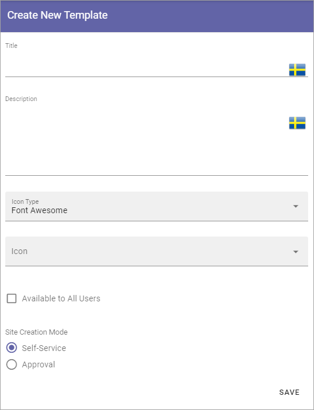
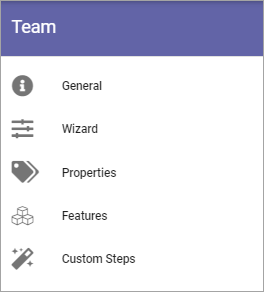
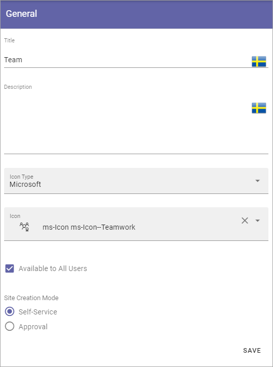
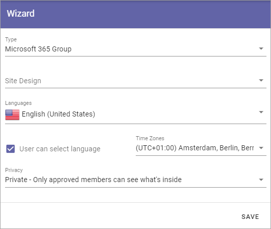
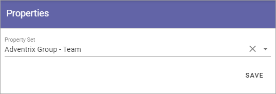

Teamwork in Omnia 6.5
===========================================

This is an ongoing, preliminiary documentation for functionality to come in Omnia 6.5.

The settings for Teamwork will be these:

Apps
*******
Here Teamworks are listed, for example:

The functionality for Apps is very similar to Omnia 6.0. The main difference is that the tab "Orphaned" has been added. It is the same type of functionality as was called "Inactive" in 6.0:

When a site of the type Microsoft 365 Team Site, Sharepoint Team Site or Sharepoint Communication Site is created, a Sharepoint site is created and is connected to the site. A Yammer Group can also need a Sharepoint site, depending on how the Yammer Group is set up.

The connected Sharepoint site may be deleted for some reason, but when that happens the Omnia site may not. When that happens a link to the site is placed in this list, uner Orphaned, so an administrator can take actions.

Templates
**********
In Omnia 6.5 the option "Provisioning templates" will be removed. Instead, templates will be administered under each main option, so here you can work with templates for Teamwork:

To edit a template, click the name - to delete, click the dust bin.

Create a new Teamwork template
*************************************
When creating a teamplet, a difference compared to 6.0 is taht now yoiu first just create the template, and after that edit setings. To create a new template, do the following:

1. Click the plus.

Use the following settings:

+ **Title**: Add a Title for the Template. You can add titles in a number of the languages available in the tenant. Default language is mandatory.
+ **Description**: Add a Description if needed. 
+ **Icon Type**: An icon is always shown for a template. If you would like another icon for this template, select the set of icons here: Font Awesome, Microsoft, Flags or Custom. When selecting Custom you can choose any image as the icon.
+ **Icon**: When you have select Icon Type, use this list to select the icon. If you select Custom, a Url field is shown, where you enter the Url for the image.
+ **Available to All Users**: Select this option if the template should be available for other's than administrators, for example in the user Wizard for creating new teamworks. If this option is NOT selected, the template will be available only for administrators to use in Omnia Admin.
+ **Property Set**: You can select a property set here, to be used for the template, meaning a number of properties that the colleague creating the site will or will have to fill in when the template is used.  
+ **Site Creation Mode**: Here you select if approval is required when users create sites from this template. 

Settings for the template
***************************
There are a lot of settings you can do for the template when it's created.

1. Click the template to edit.

The following is shown:

General
----------
Here you can edit the information you added and the options you selected when creating the template:

See above for a description.

Wizard
---------
Under Wizard, the following settings are found:

Start by selecting type of teamwork to be created and then set available settings. For descriptions, see the respective type heading on this page: :doc:`Provisioning templates </admin-settings/business-group-settings/provisioning-templates/index>`

Properties
------------
You can add a property set to the template. 

The properties in the set can or will have to be filled in when a teamwork is created from this template.

The property sets are set up using the Tenant settings. See this page for more information: :doc:`Property sets </admin-settings/tenant-settings/properties/property-sets/index>`

Features
----------
Select the features that should be available for the teamwork (all are not shown in the image):

.. image:: teamwork-65-edit-features.png

You can find a detailed description under the heading "Provisioning Template Features on this page: :doc:`Provisioning templates </admin-settings/business-group-settings/provisioning-templates/index>`

Custom steps
---------------
If any custom steps has been developed for the creation of communities, you can select them using this option.

