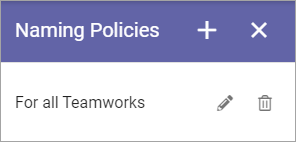
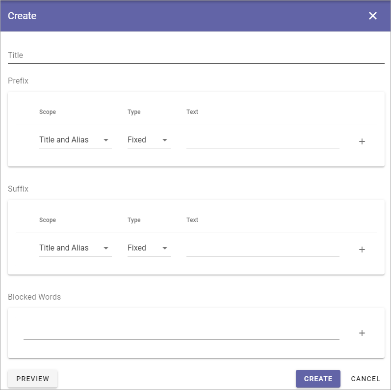

Naming policies (Teamwork)
=====================================

Naming policies are supported for teamwork templates. A naming policy can consist of prefix, suffix and blocked words.

You can use these naming policies for further policies settings for templates. See the heading "Policies" at the bottom of this page: :doc:`Teamwork templates </admin-settings/business-group-settings/team-collaboration/teamwork-65/templates/index>`

The list displays all naming policies that are set up, of any:

To edit a policy, click the pen, to delete click the dust bin. When editing, the same options are available as when creating a new policy, see below.

Creating a new policy
-----------------------
To create a new policy, click the plus.

.. image:: naming-policies-list-plus.png

Use the follwing settings:

+ **Title**: Add a title for the policy here. Not shown for users.
+ **Prefix**: Here you can add one or more prefixes that should always be used when creating teamworks.
+ **Suffix**: Here you can add one or more suffixes that should always be used when creating teamworks.
+ **Blocked words**: If some words should not be used for teamwork names, add them here. These words can never be used in temawork names.
+ **Preview**: Click here to test how this policy will work for the users when creating a teamwork.
+ **CREATE/SAVE**: You must click CREATE to create the policy. When editing an existing policy, this button is named SAVE instead.

Regarding Type for Prefix and Suffix:

+ If you select Fixed, you can add one or more words that will always be suggested as a prefix/suffix for all teamwork names.
+ If you select App, you can select a property for teamworks from the lilst, to be used as a prefix/suffix. If that property is mandatory, it can't be edited.
+ If you select User, you can select a user property from the list, to be used as a prefix/suffix. The property will be populated according to the logged in user creating the teamwork. If that property is mandatory, it can't be edited.
