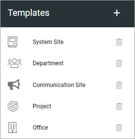
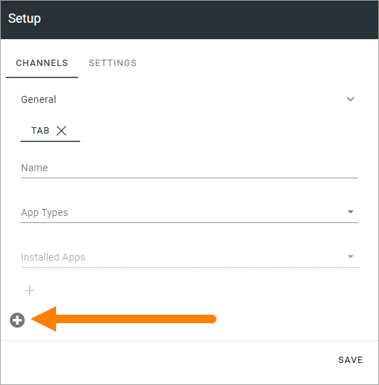
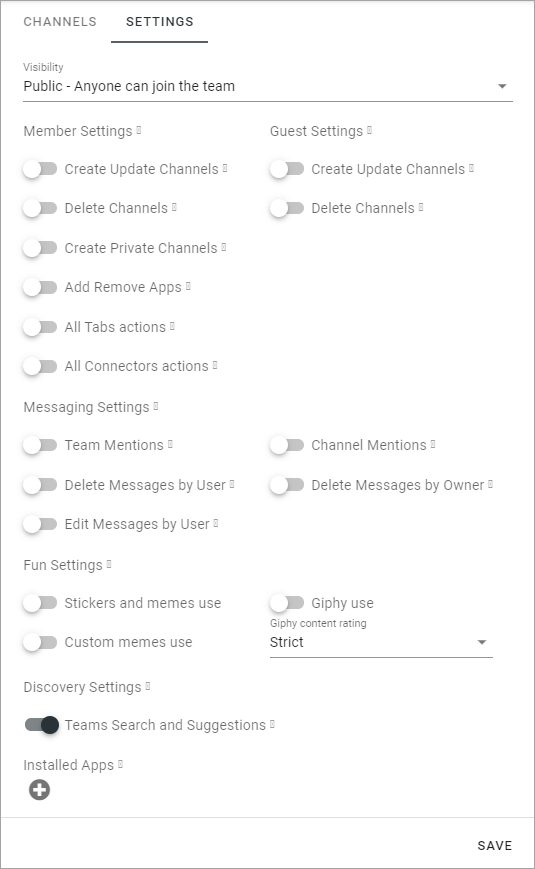
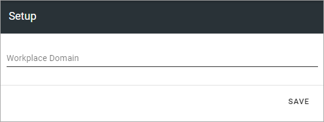

Teamwork templates
===========================================

This is an ongoing, preliminary documentation of how this works in Omnia 6.5.

In Omnia 6.5 the option “Provisioning templates” will be removed. Instead, templates will be administered under each main option, so here you can work with templates for Teamwork:

To edit a template, click the name - to delete, click the dust bin.

Create a new Teamwork template
*********************************
When creating a teamplate, you first just create the template, and after that edit setings. To create a new template, do the following:

1. Click the plus.

.. images: teamwork-65-template-click-plus-new.png

Use the following settings:

.. image:: teamwork-65-template-settings-new.png

+ **Title**: Add a Title for the Template. You can add titles in a number of the languages available in the tenant. Default language is mandatory.
+ **Description**: Add a Description if needed.
+ **Icon Type**: An icon is always shown for a template. If you would like another icon for this template, select the set of icons here: Font Awesome, Microsoft, Flags or Custom. When selecting Custom you can choose any image as the icon.
+ **Icon**: When you have select Icon Type, use this list to select the icon. If you select Custom, a Url field is shown, where you enter the Url for the image.
+ **Available to All Users**: Select this option if the template should be available for other’s than administrators, for example in the user Wizard for creating new teamworks. If this option is not selected, the template will be available only for administrators to use in Omnia Admin.
+ **Site Creation Mode**: Here you select if approval is required when users create sites from this template.

Settings for the template
******************************
There are a lot of settings you can do for the template when it’s created.

1. Click the template to edit.

The following is shown:

.. image:: teamwork-65-edit-all-new.png

General
-------------
Here you can edit the information you added and the options you selected when creating the template, for example:

.. image:: teamwork-65-edit-general-new.png

Properties
----------------
This is available for Properties:

.. image:: teamwork-65-edit-properties-new.png

+ **Property Set**: You can select a property set here, to be used for the template, meaning a number of properties that the colleague creating the site will or will have to fill in when the template is used. If a property is mandatory or not is decided in the settings for the property.

The property sets are set up using the Tenant settings. See this page for more information: :doc:`Property sets </admin-settings/tenant-settings/properties/property-sets/index>`

Features
----------------
Select the features that should be available for the teamwork (all are not shown in the image):

.. image:: teamwork-65-edit-features-new.png

Setup
-----------
The settings here will differ depending on teamwork type.

For **Sharepoint Team Site** and **Sharepoint Communication Site**, these settings are available:

.. image:: teamwork-settings-setup.png

+ **Site Design**: Here templates can be available, templates made according to Microsoft's standard for Site Design. Such templates can be used in Omnia.  Not mandatory. If no such templates are available, the list is empty. For more information about Site Design, see this Microsoft page: https://docs.microsoft.com/en-us/sharepoint/dev/declarative-customization/site-design-overview
+ **Languages**: Select language to be used for system texts in the site.
+ **User can select language**: Select this option to enable language selection by the user creating the site.
+ **Time Zones**: Select the correct time zone here.
+ **Primary Site Collection Administrator**: If empty, the user creating or requesting the site will automatically become the default administrator (Owner) of the site. If a specific group or user should be administrator for all sites created from this template, add that group or user. Only on group or user can be added in this field.
+ **Default Site Collection Administrators**: You can add (several) additional administrators here, if needed.
+ **Default Visitors**: You can use this to set a default visitor group (read permissions) to all sites created from this template. 

For **Microsoft Team**, the following settings are available:

.. image:: teamwork-settings-setup-team.png

For CHANNELS the following settings are available:

+ **Name**: Type the name for the tab here.
+ **App Types**: Select type of app for the tab; Built-in meaning Microsoft Apps, or Organization for other Apps, which can, for example, be Omnia Apps.
+ **Installed Apps**: Open the list and select app.
+ **Content Url**: Add the Url to the content for the Channel.
+ **Website Url**: Add the Url to the website for the Channel.

To add addtional tabs click the plus:

Use the settings as explained above. 

For SETTINGS, this is available:

To learn what the different options are for, point at the i icon and read the tooltip.

The following setting is available for a **Yammer Community** template:

.. image:: teamwork-yammer-community.png

+ **Client id**: Type the Client id for the Yammer Network here.

This setting is available for a **Facebook Workplace Group** template:

+ **Workplace Domain**: Add the Facebook Workplace name here.

Custom steps
-----------------
If any custom steps has been developed for the type of community you have selected, you can add them using this option.

.. image:: teamwork-edit-custom-steps-new.png
