Teamwork templates
===========================================

Here you can work with templates for Teamwork. The first list displays all templates that has been created so far, for example:

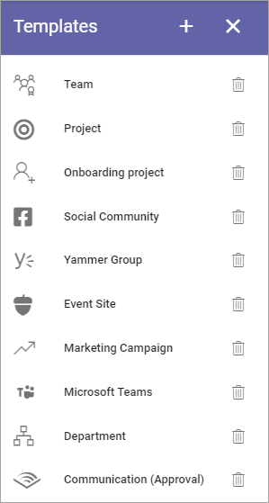

To edit a template, click the name - to delete, click the dust bin. When you edit a template, all options described below are available.

Create a new teamwork template
*********************************
To create a new template, do the following:

1. Click the plus.

.. image:: teamwork-65-template-click-plus-new2.png

2. Use the following settings:

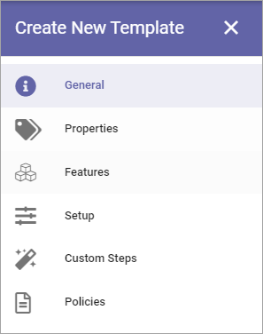

General
***********
The following settings are available here:

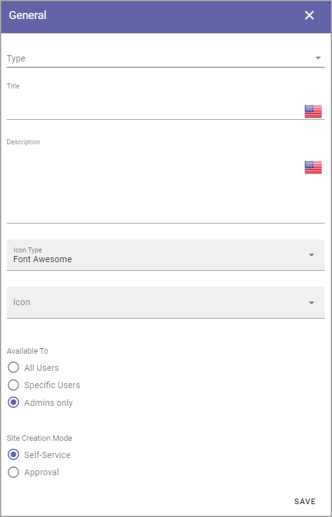

+ **Type**: Select type of Teamwork to create from this template. Note that only Sharepoint Team Site and SharePoint Communication Site is available in Omnia on-prem.
+ **Title**: Add a Title for the Template. You can add titles in a number of the languages available in the tenant. Default language is mandatory. Click the flag to change language.
+ **Description**: Add a Description if needed, in any or all tenant languages. Click the flag to change language.
+ **Icon Type**: An icon is always shown for a template. If you would like another icon for this template, select the set of icons here: Font Awesome, Microsoft, Flags or Custom. When selecting Custom you can choose any image as the icon.
+ **Icon**: When you have select Icon Type, use this list to select the icon. If you select Custom, a URL field is shown, where you enter the URL for the image.
+ **Available to**: Here you can select "All users", "Specific users" or "Admins only". Deafault setting is Admins ony. When you select "Specific users", you can set which users the template will be available for, using the normal targeting functionality in Omnia. For more info, see below.
+ **Site Creation Mode**: Here you select if approval is required when users create sites from this template.

Teamwork templates for specific users
--------------------------------------
When you select "Specific users" the following option is shown:

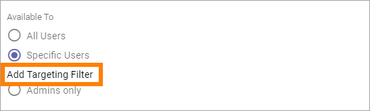

Click "Add Targeting Filter" and the following is shown:

.. image:: specific-users-filter.png

You use targeting here the same way as in other parts of Omnia. For more information, see this page: :doc:`Using Targeting </general-assets/targeting-in-omnia/index>`

Also note that all properties that should be available for targeting must be setup in the Targeting Properties list, see: :doc:`Targeting Properties </admin-settings/tenant-settings/properties/targeting-properties/index>`

Properties
*************
This is available for Properties:

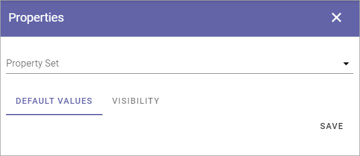

+ **Property Set**: Select property set here. The properties in the set can or will have to be filled in when a teamwork is created from this template, depending on settings for the property. The property sets are set up using the Tenant settings. See this page for more information: :doc:`Property sets </admin-settings/tenant-settings/properties/property-sets/index>`
+ **Default values**: You can set default values for most properties in a set, valid for this template. Default values can be edited when a teamwork is created from this template.
+ **Visibility**: Here you select where the properties should be available: "Show in new form" means when an app is created from this template, "Show in edit form" means when the settings for the teamwork is edited.

Features
*************
Select the features that should be available for the teamwork (all are not shown in the image):

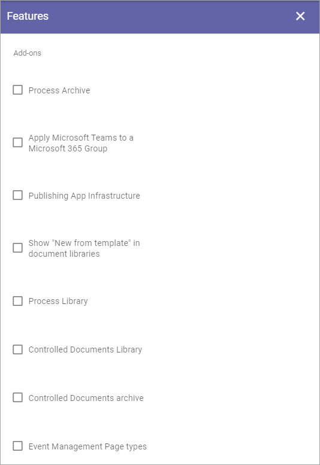

Setup
***********
The settings here will differ depending on teamwork type.

Microsoft 365 Group
-----------------------
The following options are available for a Microsoft 365 Team Group:

.. image:: teamwork-settings-setup-365-612.png

Available only for Microsoft 365 Group are:

+ **Welcome Page**: Choose to link to a SharePoint site or to Microsoft Teams.
+ **Privacy**: Decide if the Group should be Private or Public.

For descriptions of the rest of the options, see below.

SharePoint teamsite and SharePoint communication site
------------------------------------------------------------
For SharePoint teamsite and SharePoint communication Site, these settings are available for Setup:

.. image:: teamwork-settings-setup-new.png

+ **Site design**: Here templates can be available, templates made according to Microsoft's standard for site design. Such templates can be used in Omnia. Not mandatory. If no such templates are available, the list is empty. For more information about site design, see this Microsoft page: https://docs.microsoft.com/en-us/sharepoint/dev/declarative-customization/site-design-overview
+ **Languages**: Select language to be used for system texts in the site.
+ **User can select language**: Select this option to enable language selection by the user creating the site.
+ **Time zones**: Select the correct time zone here.
+ **Primary site collection administrator**: If empty, the user creating or requesting the site will automatically become the default administrator (Owner) of the site. If a specific group or user should be administrator for all sites created from this template, add that group or user. Only on group or user can be added in this field.
+ **Default site collection administrators**: You can add (several) additional administrators here, if needed.
+ **Default visitors**: You can use this to set a default visitor group (read permissions) to all sites created from this template. 

Microsoft Teams
---------------------
For Microsoft Teams, the following settings are available for Setup:

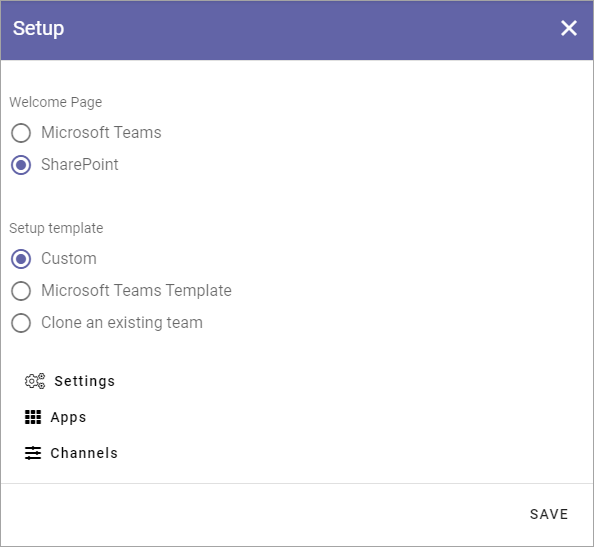

**Note!** Microsoft Teams is not available in Omnia on-prem.

+ **Welcome page**: Choose to link to a SharePoint site or to Microsoft Teams.
+ **Setup template**: Here you can select to create a Custom template, to use a Microsoft Teams template, or to give the user the option to Clone an excisting team. Note that a colleague must be member of a team to be able to clone it. See below for more information on a custom template. To use a Microsoft Teams template you must enter the id of the template (can be found in Teams admin center). 
+ **Settings**: Available for a custom template, see below.
+ **Apps**: Available for a custom template, see below.
+ **Channels**: Available for a custom template, see below.

Create a custom Microsoft Teams template
----------------------------------------
When you have selected to create a custom template the following options are available:

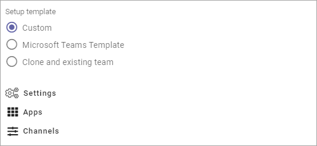

Under **Settings** you can do the following:

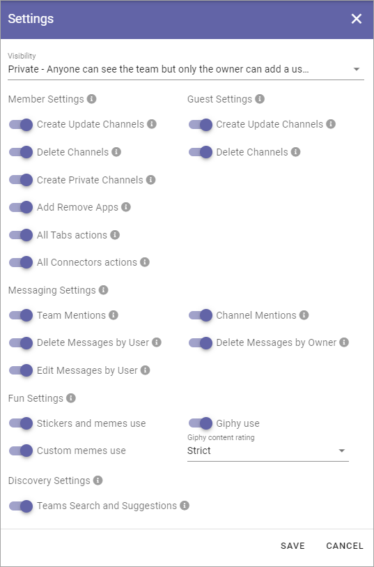

+ **Visibility**: Here you select how joining the team will work; if anyone can join the team or if only administrators can add memebers to the team.

For the rest of the options: point at the i icon and read the tooltip, to learn what the option are for.

For **Apps** the following is available:

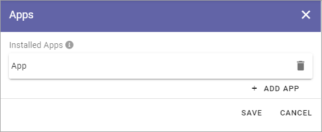

Add the apps that should be added when a teamwork is created from this template.

For **Channels** the following settings are available:

.. image:: teamwork-settings-setup-channels.png

Here a list of channels that are already added to the template is shown. Click the pen to edit a channel. 

To add a new channel, click the plus and use these settings:

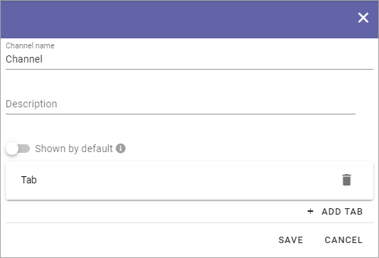

+ **Channel name**: TYpe the name here.
+ **Description**: Add a description of the channel if necessary.
+ **Shown by default**: if the channel should be marked as "Favourite" for all members of the team, select this option.

You can also set which tabs should be added for all teams that are created from this template. When adding a tab, the following settings are available:

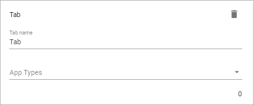

+ **Tab name**: Type the name for the tab here.
+ **App types**: Select type of app for the tab; Built-in meaning Microsoft apps, or Organization for other apps, which can, for example, be Omnia apps.

Viva Engage community
----------------------
The following setting is available for a Viva Engage community (former Yammer community) template for Setup:

.. image:: teamwork-yammer-community-612.png

**Note!** Viva Engage Community is not available in Omnia on-prem.

+ **Welcome page**: Select the default URL for SharePoint or for a Viva Engage group.
+ **Client id**: Type the Client id for the Viva Engage Network here.

Facebook workplace group
-------------------------------
This setting is available for a Facebook Workplace Group template for Setup:

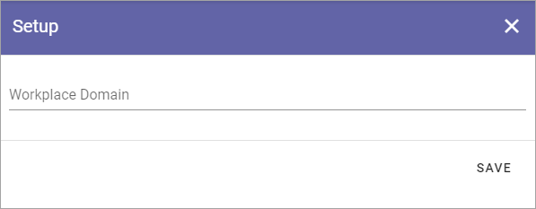

**Note!** Facebook workplace group is not available in Omnia on-prem.

+ **Workplace domain**: Add the Facebook Workplace name here.

Custom steps
*****************
If any custom steps has been developed for the type of community you have selected, you can add them using this option.

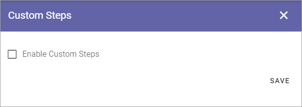

Policies
**********
Use this for further policies settings, that will be applied to teamworks created from specific templates. A prerequisite is that Sensitivity Labels are created in Microsoft 365.

The following can be set here:

.. image:: teamwork-templates-policies.png

+ **Naming Policy**: Select the naming policy to set settings for. The policies listed here are those setup for teamworks, see: :doc:`Naming policies </admin-settings/business-group-settings/team-collaboration/teamwork-65/naming-policies/index>`
+ **Minimum number of characters in description**: Here you can set a number of characters for the teamwork descripton, to force users to add a description of a certain length. 
+ **Minimim number of administrators**: There must always be at least one administrator for a teamwork, but you can decide that more administrators should be required, up to 5.
+ **Default Administrators**: Use this to add one or more administrators for teamworks created from this template. These administrators will always be added, can not be removed in the Create Teamwork wizard. Must be persons, can not be groups.
+ **Sensitivity Label**: Here you decide how Microsoft 365 Sensitivity Labels will be handled for this Teamwork Template; No senitivity label, Fixed or Let user decide. If you select "Fixed", a list of the existing sensitivity labels are shown and you select one from the list. It can't be changed when a teamwork is created. If you select "Let user decide", the user creating a teamwork from this template can select which sensitivity label to use for the teamwork. It's still mandatory to select one when creating the teamwork.
