Teamwork directory in Omnia v7
==================================

Here Teamworks are listed, the "All" tab as an example:

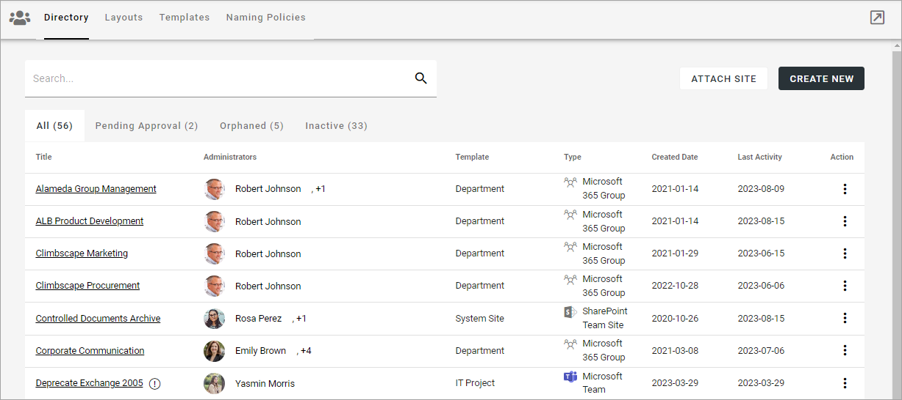

On this tab active and inactive teamworks are listed, but not teamworks with pending approval or Orphaned teamworks (see below for more information).

Use this icon to close the menu to the left and work in full window mode:

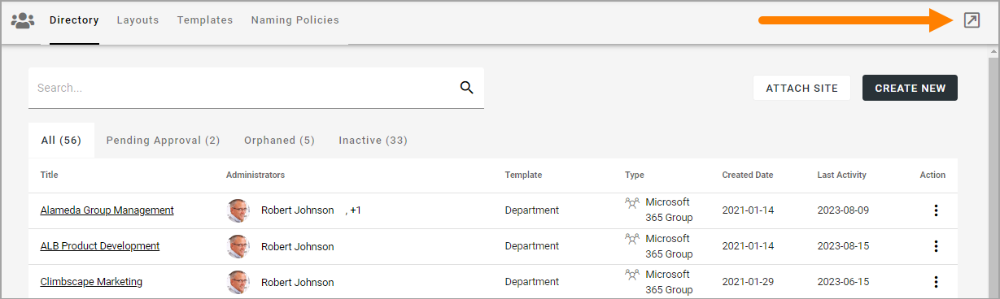

You can click the link to go to a teamwork. You can search for a teamwork and use the headings "Title", "Template", "Created Date" and "Last Activity" to sort the list.

The following actions, using the dot menu to the right, are available for a teamwork (in the All, Orphaned and Inactive lists):

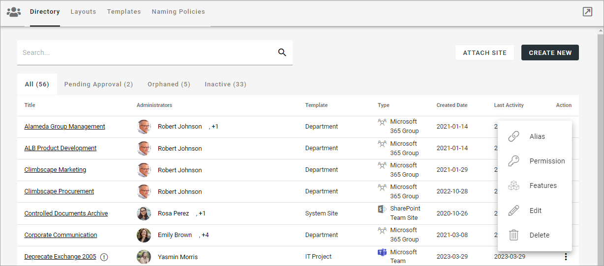

**Note!** To be able to delete a teamwork, you must be app administrator for the teamwork. Also note that deleting a teamwork from this list does not delete 
the connected Sharepoint site.

For more information, see below.

Create a teamwork
***********************
To create a teamwork from here, do the following:

1. Click CREATE NEW.
2. Select "Create New".
3. Select template. 

Here's an example with a lot of different alternatives. You may not have as many.

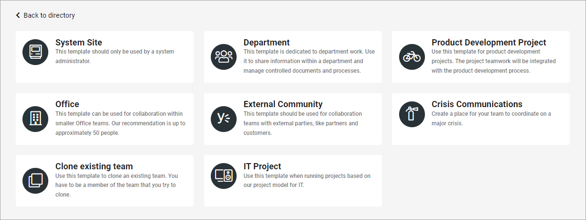

4. Add the information needed. (All steps in the setup may not be needed for a certain template. Here's a common example).

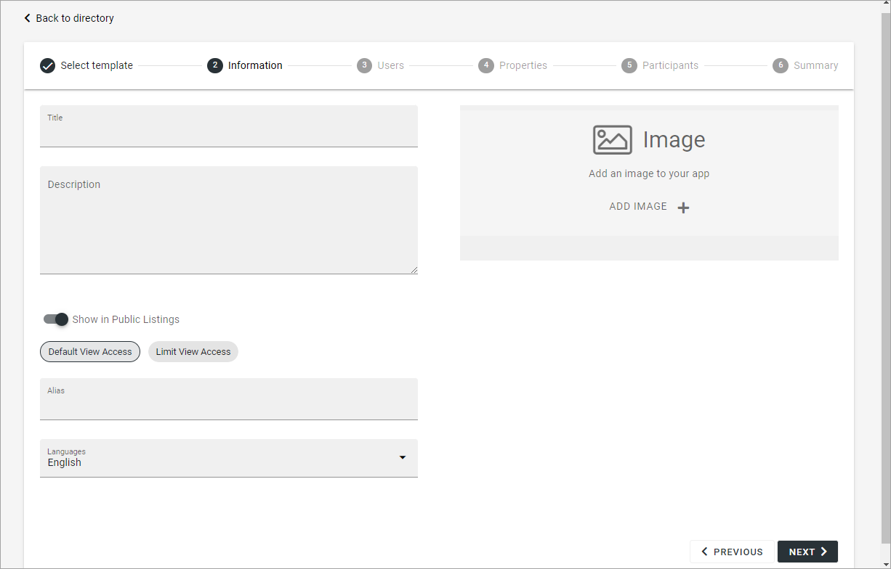

Available settings depends on how the template is set up. 

+ **Title**: Add a title for the teamwork.
+ **Description**: Add a description if needed.
+ **Show in Public Listings**: If a link to the teamwork should be available in public listings (meaning listings in Omnia) select this option. If this option is deselected, the app can only be reached by specific links, for example in a Workspace navigation.
+ **Default View Access/Limit View Acess**: If you select “Limit View Access” you can change view permissions for the app to specific users.
+ **Alias**: The last part of the address to the site is created automatically but can be edited if necessary. If the name (address) already exists an alternative address is suggested.
+ **Languages**: The same language as the main business profile language is suggested. Another language can be selected if needed.  
+ **ADD IMAGE**: The editor setting up a rollup can choose to show images for the apps, both for List and for Card display. Here you can select an image to be shown there, using the Media Picker. When an image has been selected it can be deleted or edited using the X and the pen that is shown then.

4. Click "Next" and use the following settings:

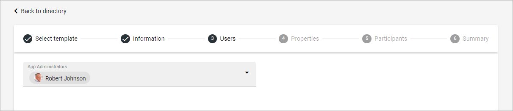

+ **App Administrators**: The active administrator (you) is automatically added as app administrator. Add or delete administrators as needed. There must always be at least one.

5. The Properties step may be very different in different templates, or maybe not be neded at all. Here's a simple example. Note that a star indicates if that the property is mandatory.

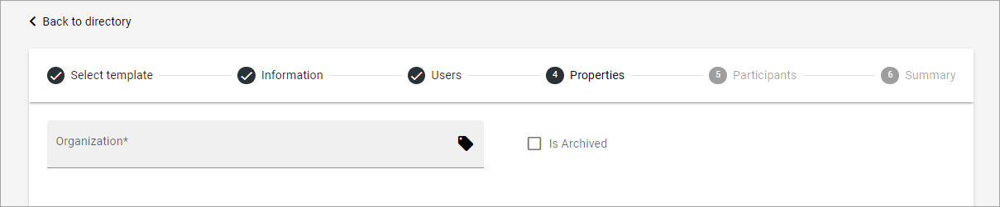

Here's another example, from a template for projects. As you can see, there can be quite a lot properties to set.

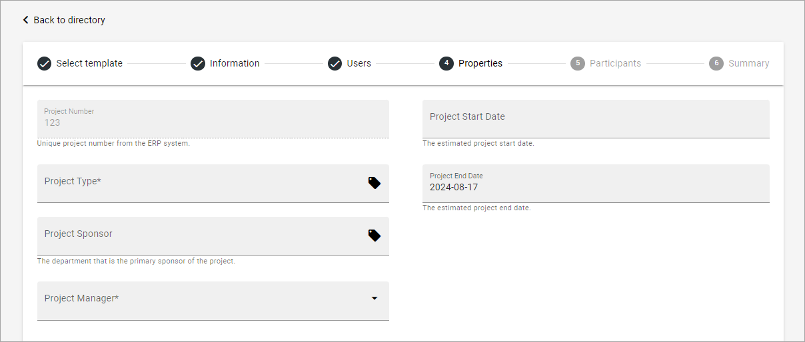

6. Set owner and also members, if needed. 

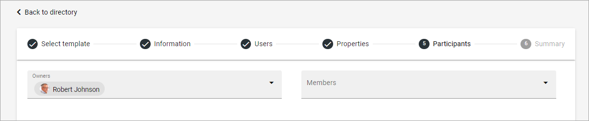

There may be teamwork types that don't need these settings. In that case this step is simply empty or not available at all.

When you click NEXT, a summary is shown, where you can click the pen the edit any of the steps.

7. Click CREATE to create the Teamwork or SEND FOR APPROVAL, depending on how the template has been set up.

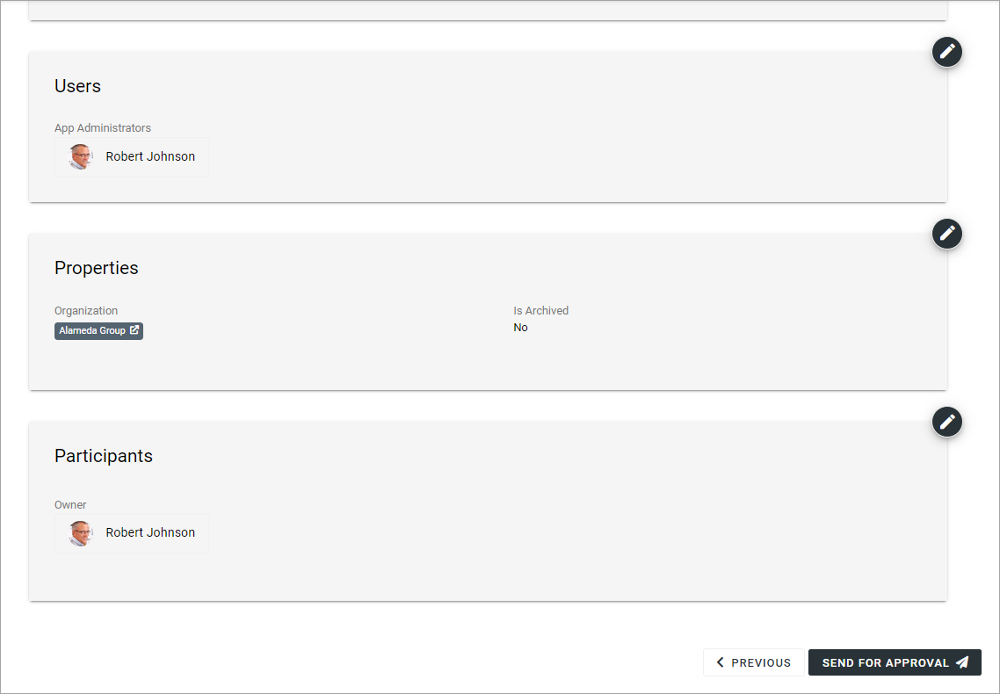

Cloning a teamwork
--------------------
A special case is the possibility to clone an existing teamwork, if that is made available through a template. It will probably be available as step 4. What you do is search for a teamwork to clone, and then decide which parts of teamwork to clone, for example:

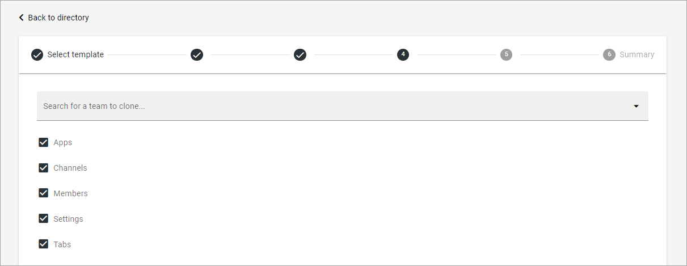

Edit settings for a teamwork
**********************************
Using the action EDIT you can edit the settings for a teamwork. What can be edited can depend on the template used. Here's an example:

.. image:: edit-teamwork.png

+ **Sharepoint Url**: The app instance connected site's Url can be edited here, if needed.

For a description of the rest of the options, see above.

Attach a teamwork site
************************
Using this option you can attach any teamwork site (Sharepoint Team Site) to Omnia. When a teamwork is attached you can handle it through Omnia the same way as it was created through Omnia.

The following permissions are required to be able to attach:

+ For an Omnia Teamwork app: app administrator permissions.
+ For a Sharepoint site: site collection administrator permissions.

Do the following to attach a site:

1. Copy the Url for the teamwork you want to attach.
2. Select ATTACH SITE.

The following is shown:

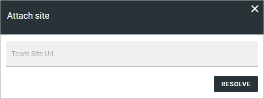

3. Paste the Url and click RESOLVE.

You can "detach" (delete) a site if needed. Then the following permissions are needed:

+ For an Omnia Teamwork app: app administrator permissions.
+ For a Sharepoint site: site owner or site collection administrator permissions.

**Note!** What actually happens when you click the dust bin to delete a site, is that the site is detached. That is true for all teamwork sites, regardless of if they have been created in or attached to Omnia. When a site is detached, an email is sent to the site owner(s). Note that, for a user to be able to receive e-mails, the acccount must be e-mail enabled.

Edit App Route
****************
If it should be needed to edit the app route, Select "Alias" in the dot menu for the teamwork and the following is shown:

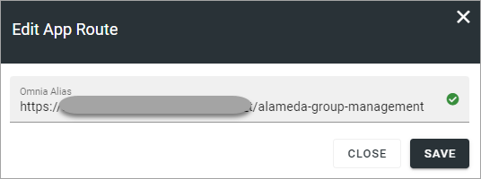

Edit the app route and save.

Edit Permissions
******************
If you need to add or remove owners (administrators) or members for a teamwork, select "Permission" in the dot menu for the teamwork.

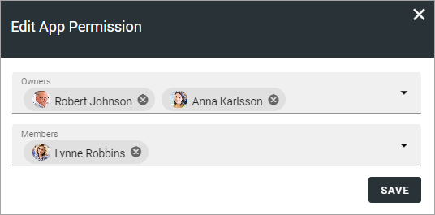

Don't forget to save when you're done.

**Note!** A user or a group must be permissions enabled to show up in the list.

Edit Features
***************
If it's needed to upgrade a feature for the teamwork, you need to go here. You also go here to activate or deactivate a feature. Available features can differ a lot depending on type of teamwork. Here's an example:

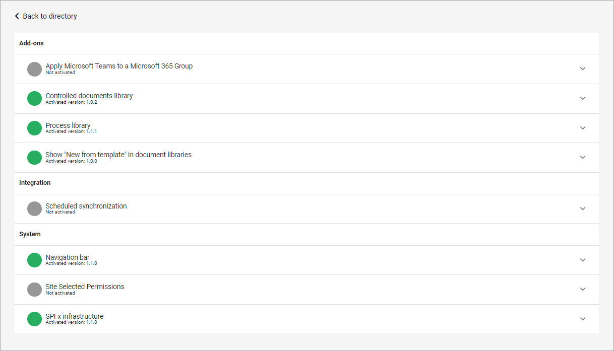

For more information about a feature, expand it.

Pending Approval
*****************
When a user creates a teamwork where approval is needed, an administrator uses this list to approve or reject. Here's an example:

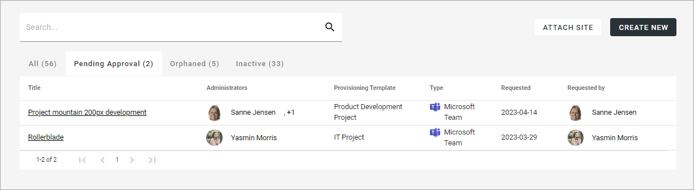

Approval (or rejection) is done this way:

1. Click the link for the teamwork.
2. Check the name, settings and so on.
3. If everything is OK, click "Approve", or if changes are needed, click "Reject".

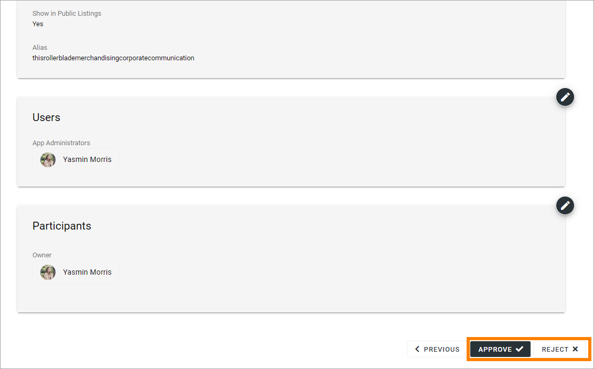

If you approve the creation of the teamwork a message is sent to the person requesting it, and the teamwork is created.

If you reject, the following is shown:
 
.. image:: pending-approval-reject-v7.png

4. Type a message stating what needs to be done for approval, and click "Save" to send the message.

The person requesting the teamwork receives the message and can then start a new teamwork creation with your comments in mind. 

**Note!** Requesting a Teamwork must always be done from start each time. If rejected, nothing from the request is saved.

Orphaned
**********
When a site of the type Microsoft 365 Team Site, Sharepoint Team Site or Sharepoint Communication Site is created, a Sharepoint site is also created and is connected to the site. A Yammer group can also need a Sharepoint site, depending on how the Yammer group is set up.

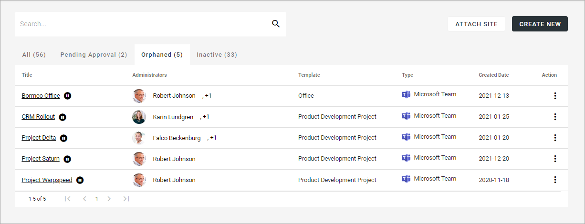

The connected Sharepoint site may be deleted for some reason, but when that happens the Omnia site may not. When this is the case, a link to the site is placed in this list, so an administrator can take actions.

The same dot menu actions are available here as described above.

Inactive
***********
A teamwork is considered inactive if Last Activity, as registered in the Sharepoint site, is more than three months old.

Here's an example from a test environment:

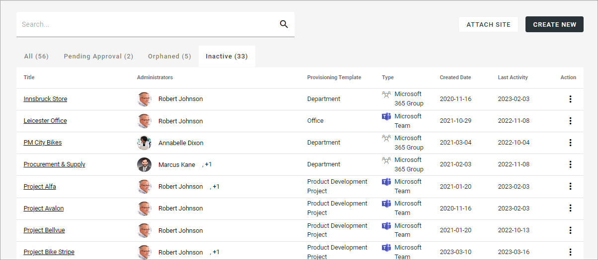

Here administrators can check/edit the settings for the teamworks and delete a teamwork that is not needed. The list can be sorted by "Title", "Created Date" or "Last Activity", to for example see if any activity has taken place at all.

The same dot menu actions are available here as described above.

**Important Note!** When you click OK to delete, it's final. There's no way to retrieve a deleted teamwork.

