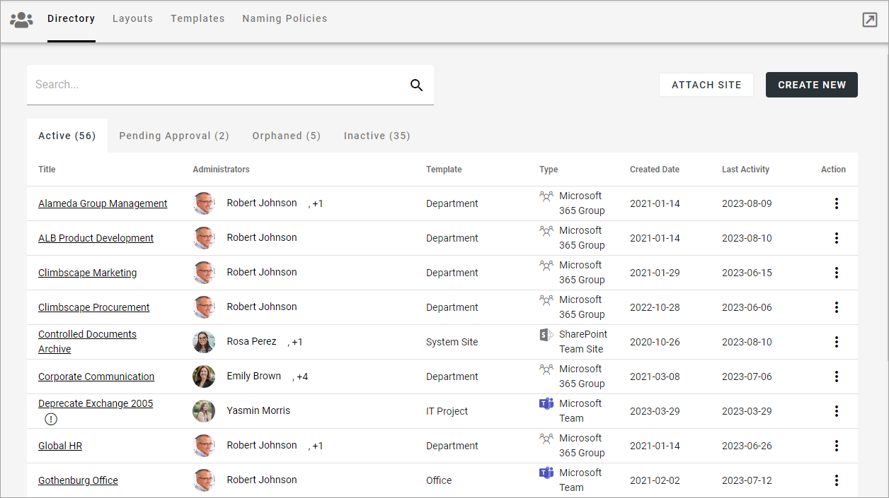

Teamwork settings in Omnia 7
================================================

**This page in under construction.**

This page and the pages available here, describes how these options work in Omnia 7.0 and later. For Omnia 6.13, see this page: :doc:`Teamwork settings in Omnia 6.13 </blocks/admin-settings/business-group-settings/team-collaboration/teamwork-65/index>`

The following settings are available in Omnia 7.0 and later:

Select section for more information:

.. toctree::
   :titlesonly:

   Directory/index
   layouts/index
   templates/index
   naming-policies/index

A Teamwork Rollup block is also available: :doc:`Teamwork Rollup block </blocks/team-collaboration-rollup/index>`

