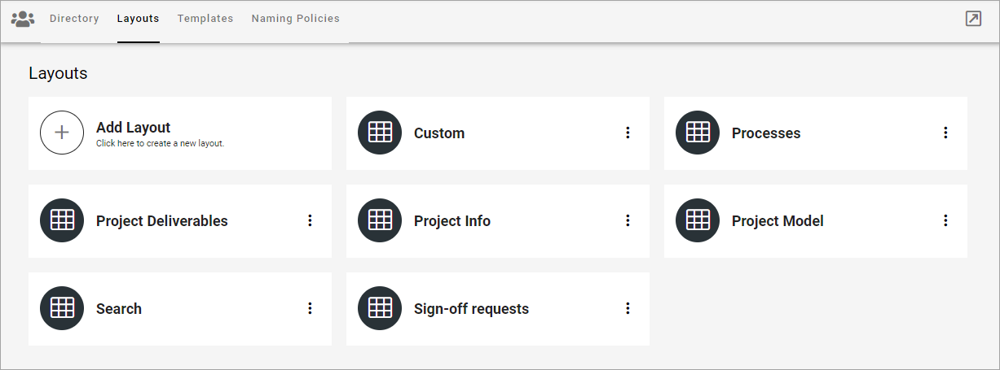

Layouts for Teamwork in Omnia v7
=====================================

**This page is under construction.**

Using these options you can create a start page for a teamwork. First you see the list of the layouts created so far, for example:

To edit a layout, just click the name. All settings available when creating a new layout can be edited, see below.

Create a new publishing layout
********************************
To create a new layout, do the following:

1. Click "Add Layout".
2. Add a name for the layout in any or all the available tenant languages (click the flag to change language).
3. Click CREATE.

.. image:: publishing-click-create-v7.png

To start working on the layout, continue this way:

4. Click on the name or select "Edit Layout" in the dot menu for the layout.

.. image:: publishing-click-create-dotmenu-v7.png

5. Use the work area to create the layout. 

How to work with layouts in Omnia is described on this page: :doc:`Working with Layouts </general-assets/working-with-layouts/index>`

If you need to delete a layout, you can also use the dot menu for the layout:

.. image:: publishing-click-create-dotmenu-delete-v7.png

