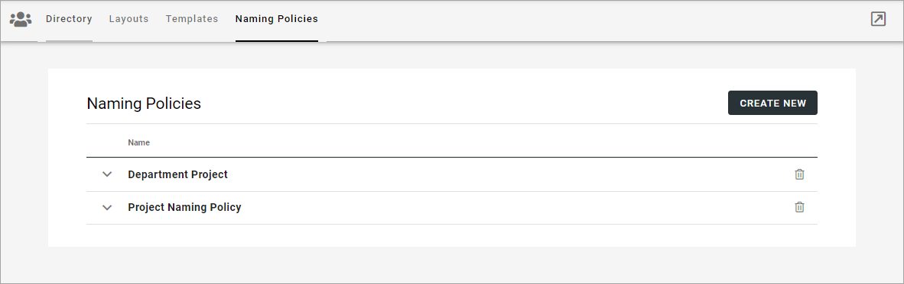
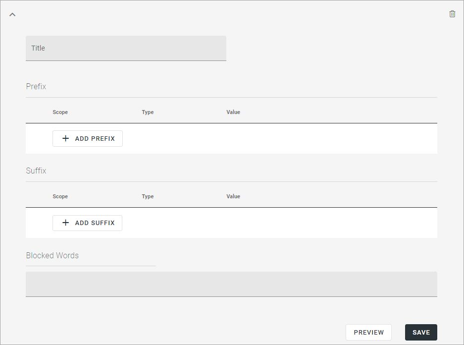
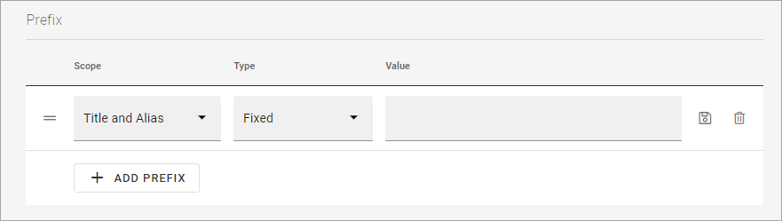
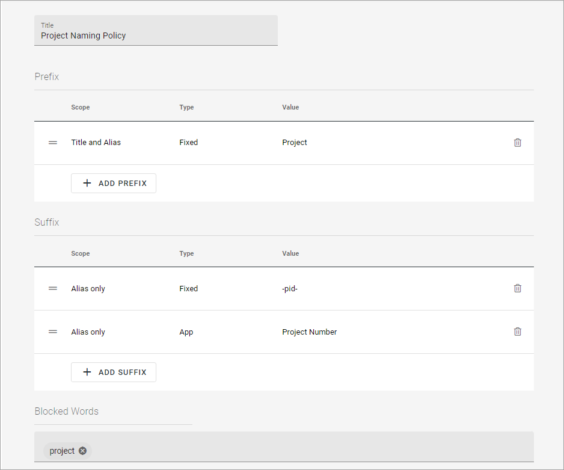

Naming Policies (Teamwork) in Omnia v7
========================================

Naming policies are supported for teamwork templates. A naming policy can consist of prefix, suffix and blocked words.

The list displays all naming policies that are set up, of any:

To edit a policy, expand it, to delete click the dust bin. When editing, the same options are available as when creating a new policy, see below.

Creating a new policy
*************************
To create a new policy, click CREATE NEW.

Use the follwing settings:

+ **Title**: Add a title for the policy here. Not shown for users.
+ **Prefix**: Here you can add one or more prefixes that should always be used when creating teamworks.
+ **Suffix**: Here you can add one or more suffixes that should always be used when creating teamworks.
+ **Blocked words**: If some words should not be used for teamwork names, add them here. 
+ **Preview**: Click here to test how this policy will work for the users when creating a teamwork.
+ **SAVE**: You must click SAVE to create the policy, or to update settings when editing.

When adding a prefix or a suffix, the following settings are available:

+ **Title and Alias**: You can allow both title and alias to be used, or alias only.
+ **Fixed/App/User**: If you select "Fixed", you can add one or more words that will always be suggested as a prefix/suffix for all teamwork names. If you select "App", you can select a property for teamworks from the list, to be used as a prefix/suffix. If that property is mandatory, it can't be edited. If you select "User", you can select a user property from the list, to be used as a prefix/suffix. The property will be populated according to the logged in user creating the teamwork. If that property is mandatory, it can't be edited.

**Important note!** Naming policies for alias will not be applied to the SharePoint URL of teamworks based on a template of type Microsoft Teams.

Here's a naming policy for projects, as an example:

