Teamwork templates in Omnia v7
=======================================

Here you can work with templates for teamwork; Microsoft 365 group, SharePoint teamsite, Microsoft Teams, private Yammer community and Facbook workplace group. The first list displays all templates that has been created so far, for example:

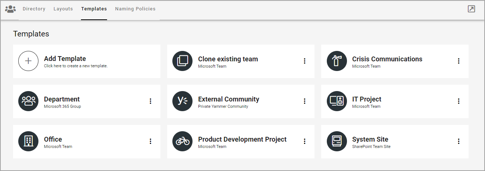

The following actions are available in the dot menu for a template:

.. image:: teamwork-templates-dotmenu-v7.png

To edit a template, you can also just click the name. When you edit a template, all options that are described below are available.

You create templates for publishing apps, community sites and Teamwork the same way, see this page: :doc:`Creating app templates in Omnia v7 </general-assets/creating-app-templates/index>`

The settings for General, Properties and Custom steps are handled as described on the page linked above, even if available property sets and available features can differ. Available settings under Setup differ depending on type of teamwork. The differences is descibed here. A few additional settings for Policies are also described here.

Microsoft 365 Group
-----------------------
What is different for a Microsoft 365 Team Group is the Setup step:

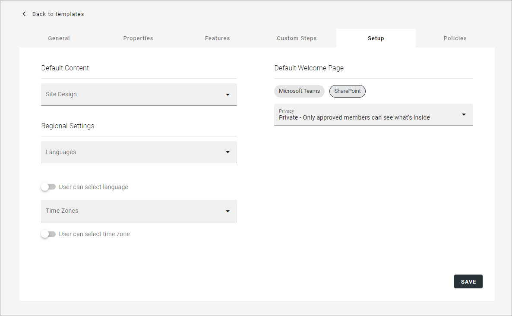

+ **Site design**: Here templates can be available, templates made according to Microsoft's standard for site design. Such templates can be used in Omnia. Not mandatory. If no such templates are available, the list is empty. For more information about site design, see this Microsoft page: https://docs.microsoft.com/en-us/sharepoint/dev/declarative-customization/site-design-overview
+ **Languages**: Select language to be used for system texts in the site. **Note!** Only languages available in Microsoft 365 can be selected here. That is what the list contains.
+ **User can select language**: Select this option to enable language selection by the user creating the site.
+ **Time Zones**: Select the correct time zone here.
+ **User can select time zone**: Select this option to enable time zone selection by the user creating the site.
+ **Welcome page**: Choose to link to a SharePoint site or to Microsoft Teams.
+ **Privacy**: Decide if the Group should be Private or Public.

SharePoint teamsite
------------------------------------------------------------
For a SharePoint teamsite, these settings are available for Setup:

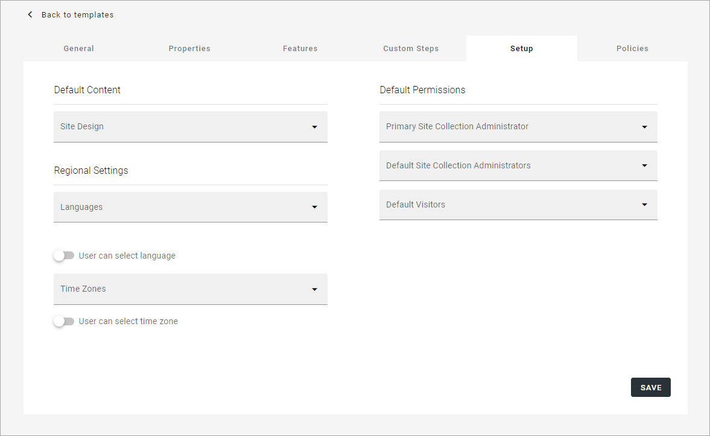

+ **Site Design**: Here templates can be available, templates made according to Microsoft's standard for site design. Such templates can be used in Omnia. Not mandatory. If no such templates are available, the list is empty. For more information about site design, see this Microsoft page: https://docs.microsoft.com/en-us/sharepoint/dev/declarative-customization/site-design-overview
+ **Languages**: Select language to be used for system texts in the site. **Note!** Only languages available in Microsoft 365 can be selected here. That is what the list contains.
+ **User can select language**: Select this option to enable language selection by the user creating the site.
+ **Time Zones**: Select the correct time zone here.
+ **User can select time zone**: Select this option to enable time zone selection by the user creating the site.
+ **Primary Site Collection Administrator**: If empty, the user creating or requesting the site will automatically become the default administrator (Owner) of the site. If a specific group or user should be administrator for all sites created from this template, add that group or user. Only on group or user can be added in this field.
+ **Default Site Collection Administrators**: You can add (several) additional administrators here, if needed.
+ **Default Visitors**: You can use this to set a default visitor group (read permissions) to all sites created from this template. 

Microsoft Teams
---------------------
For Microsoft Teams, the following settings are available for Setup:

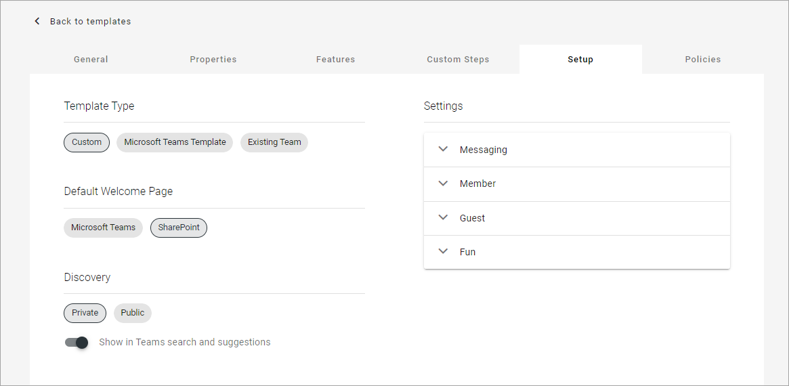

and these:

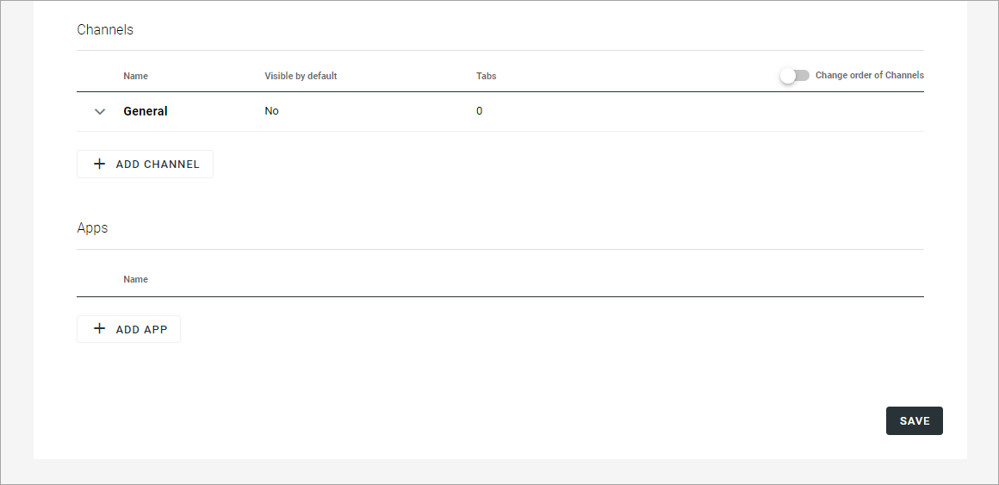

**Note!** Microsoft Teams is not available in Omnia on-prem.

To use a Teams template, add the template id and choose default welcome page.

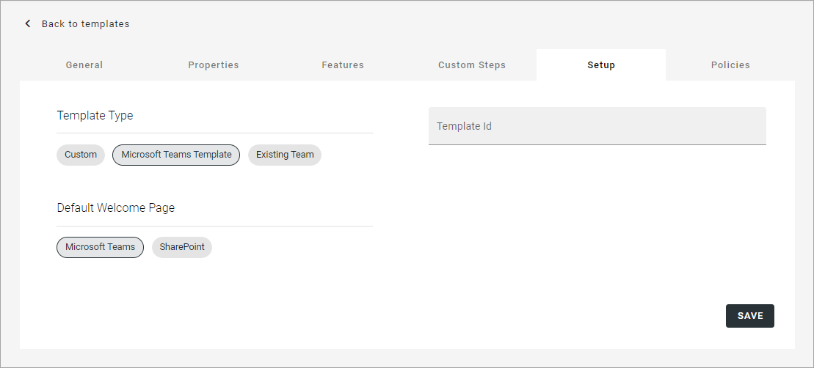

For an existing team, just choose welcome page.

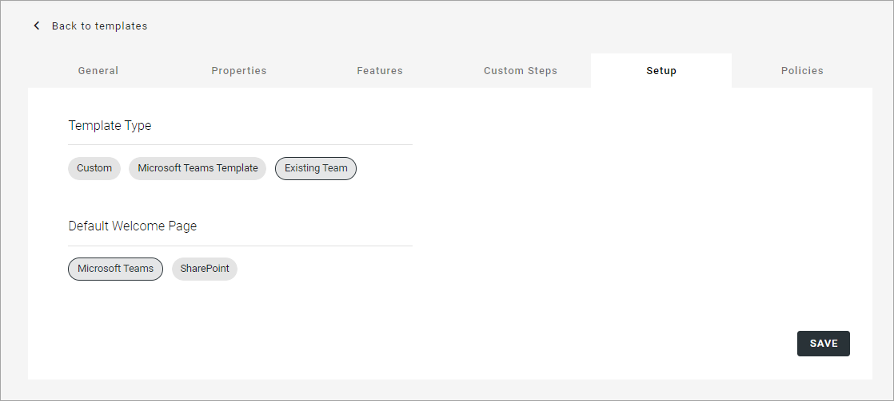

Create a custom Microsoft Teams template
-------------------------------------------
Here's how to create a custom Teams template:

1. Select "Microsoft Teams" or "Sharepoint" as default welcome page.
2. Decide of Discovery should be private or public, and decide to show it in Teams search and suggestions, or not.
3. Decide which settings should be active.

All settings work the same way, and all are active per default.

4. Open settings (Messaging as an example).

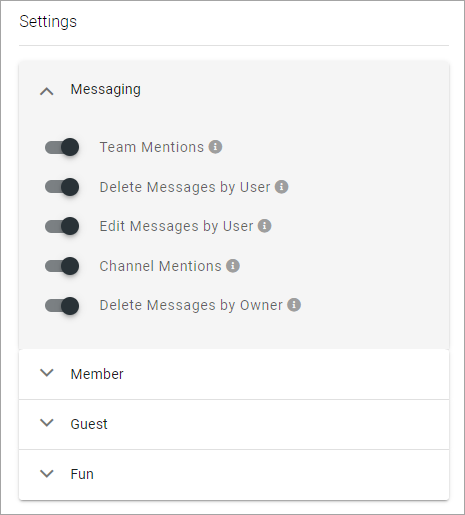

5. Point at the i-icon of a setting for more information.
6. Click to deactive if it should be used.

If any channels should be added to the template, do the following:

7. Click ADD CHANNEL and use the settings:

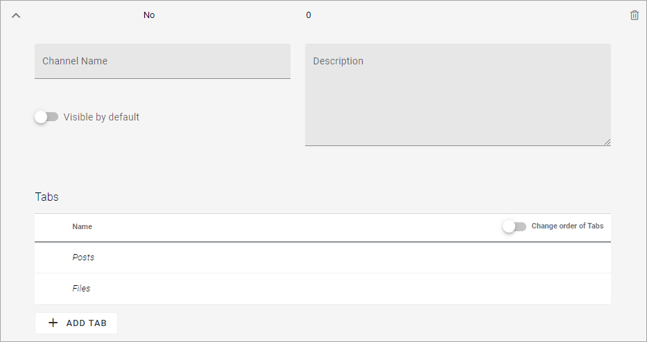

+ **Channel name**: Type the name here.
+ **Description**: Add a description of the channel if necessary.
+ **Visible by default**: if the channel should be marked as "Favourite" for all members of the team, select this option.

8. Add additionall tabs for the channel, if needed.

For **Apps** the following settings are available:

  .. image:: teamwork-settings-setup-team-apps-v7.png

9. Save the template.

Private Yammer community
--------------------------
The following setting is available for a Private Yammer Community template for Setup:

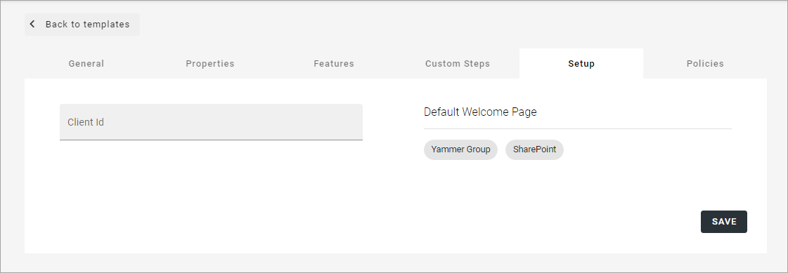

**Note!** Yammer Community is not available in Omnia on-prem.

+ **Client id**: Type the Client id for the Yammer Network here.
+ **Welcome Page**: Select the Yammer Group or SharePoint for welcome page. 

Facebook Workplace Group
-------------------------------
There are no features available for a Facebook Workplace Group. This setting is available for Setup:

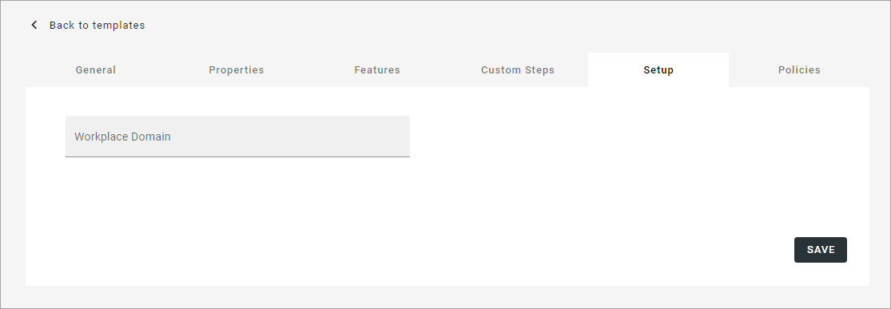

**Note!** Facebook Workplace Group is not available in Omnia on-prem.

+ **Workplace Domain**: Add the Facebook Workplace name here.

Policies
**********
For Policies, the following options are available especially for teamwork templates. 

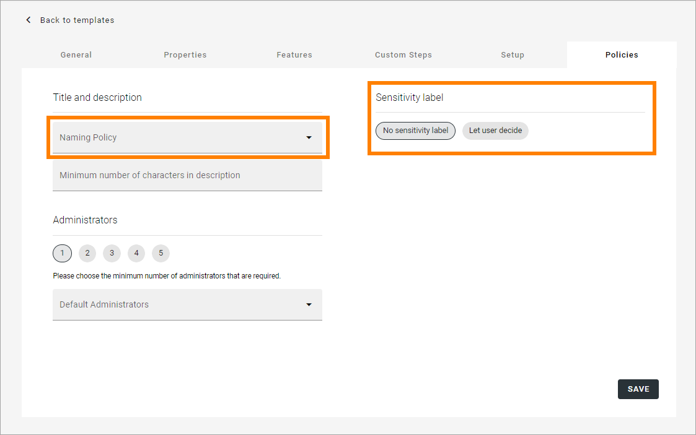

+ **Naming policy**: Select a naming policy, if any is available. They are setup using the Naming policy tab, see: :doc:`Naming Policies (Teamwork) in Omnia v7 </admin-settings/business-group-settings/team-collaboration/teamwork-v7/naming-policies/index>`
+ **Sensitivity label**: A prerequisite for "Let user decide" to make any sense is that Sensitivity Labels are created in Microsoft 365.

