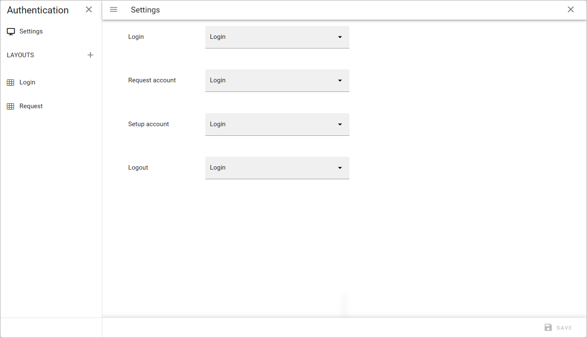
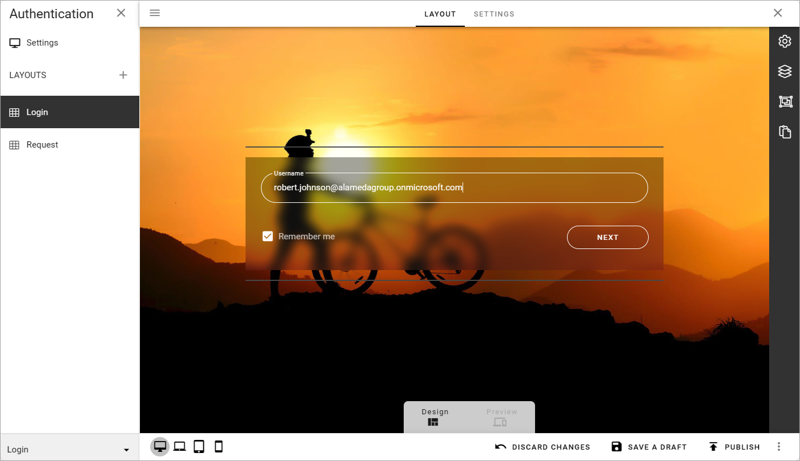
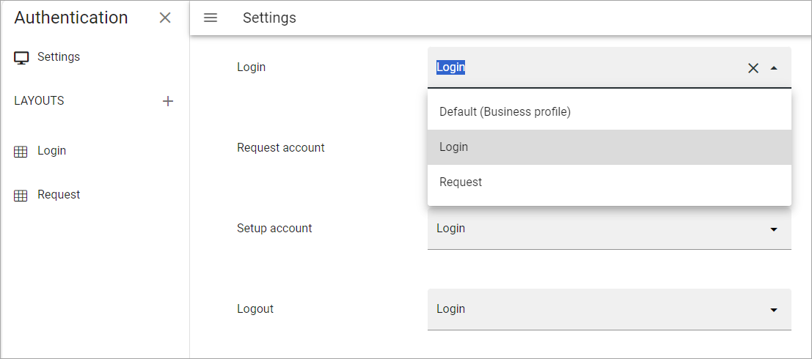
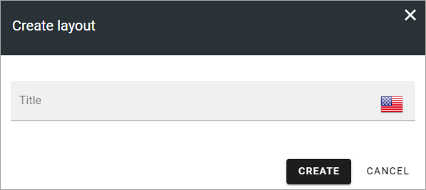
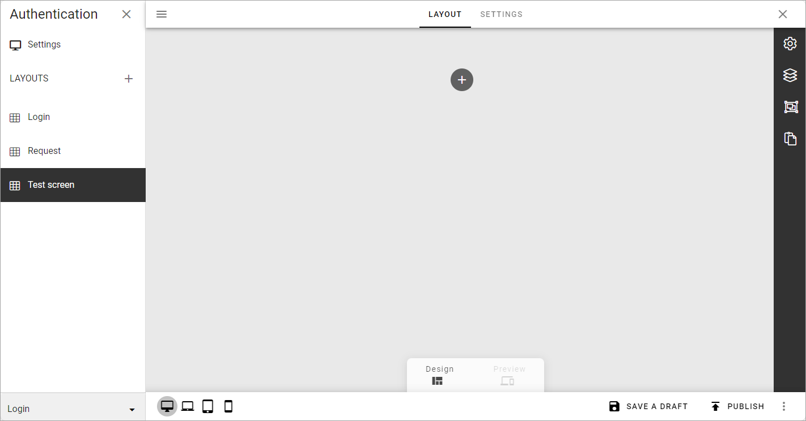
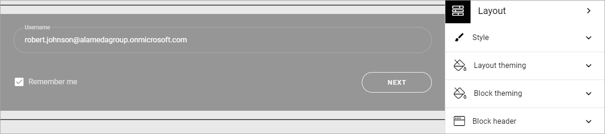

Authentication screens - business profile
=============================================

**This option is available in Omnia 7.5. Work on the page is just started.**

Using this option you can create authentication screens to be used for Omnia users in this business profile, using these settings:

Here's an example of an authentication screen:

Settings
*********
Here you can handle settings for which authentication screen to use for various authentications:

For each option you can select any of the screens you have created here, or the default authentication screen for a business profile (which is also used if you don't set up any authentication screens).'

Create a new authentication screen
**************************************
To create a new screen, click the plus to the right of LAYOUTS and add a new for the new screen.

And now you can start working on the layout for the screen.

This is very similar to working with other layouts in Omnia, see: :doc:`Working with layouts </general-assets/working-with-layouts/index>`

Two important differences are that there are fewer blocks available for authentication screens than other layouts, and that a specific block is available only for authentication screens, named "Authentication".

The Authentication block comes with a ready to use style that can be edited using the settings:

For more information, see: (link to be added)

