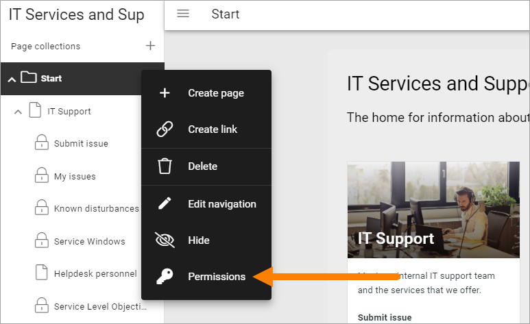
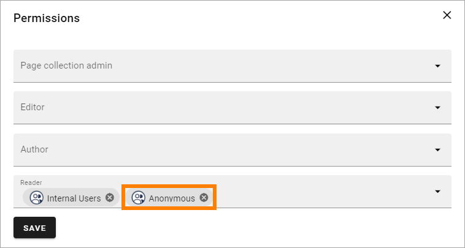

Authentication
=============================================

The main authentication settings are available when setting up user types. It's done on tenant level. See this page for more information: :doc:`User types </admin-settings/tenant-settings/user-management/user-types/index>`

Here you can select default login screen and if anonymous access should be possible for Omnia users in this business profile. 

.. image:: authentication-users-bp.png

+ **Default login screen**: You can choose to use either Azure AD:s or Omnia's login screen as default.
+ **Anonymous access**: Default setting is Disabled, meaning login (authentication) is always needed, but you can choose that the workspace home page or a specific app does not need login. This can be useful, for example, for welcome pages for new users that does not yet have a login or haven't yet logged in, or for general information that is free for anyone to access. 

How to make anonymous access work
************************************
Several setup steps are needed to make anonymous access work. 

1. The tenant feature "Enable anonymous access" must be active. (When it is activated, an Anonymous group is created automatically, can't be managed, but can be used for permissions).
2. One of the options for anonymous access must be selected in a business profile, where anonymous access should be allowed (Business profile - User Management - Authentication).
3. Make sure "Business profile viewer" contains the Anonymous group (Business profile - Permissions - Business Profile).
4. If you selected anonymous access for Workspace, make sure "Workspace reader" contains the Anonymous group (Business profile - Permissions - Workspace). If you selected an app, anonymous access can be set for each page collection, see below.

To set anoymous access for a page collection, select "Permissions" for that page collection.

Then add the Anonymous group for Reader access.

