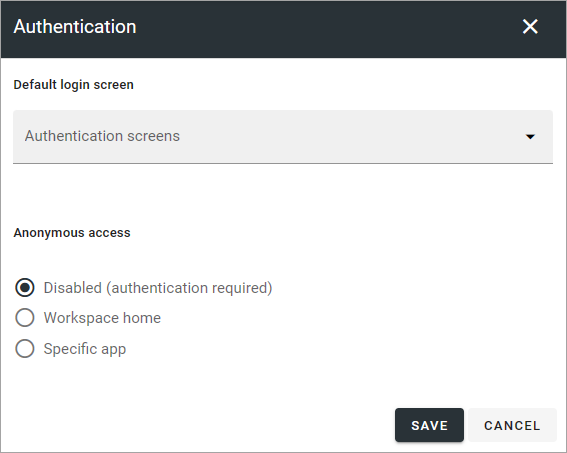

Authentication
=============================================

**This option is available in Omnia 7.5. Work on the page is ongoing.**

Here you can select default login screen and if anonymous access should be possible for Omnia users in this business profile.

+ **Default login screen**: Youn can choose to use either Azure AD:s or Omnias login screen as default.
+ + Anonymous access**: Default setting is Disabled, meaning login (autenthication) is always needed, but you can choose that the workspace home page or a specific app does not need login. This can be useful, for example, for welcome pages for new users that does not yet have a login or haven't yet logged in, or for general information that is free for anyone to access. Note that a dynamic group must be used for anonymous login to work.

