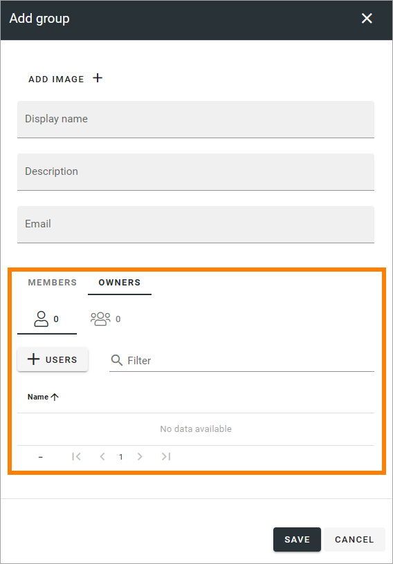

Groups - business profile
=============================================

This list displays groups for User management for the business profile. You can create, edit and delete groups here, if you are business profile administrator. 

.. image:: groups-bp-list.png

The options here works the same way as in User management for the tenant. There are only two major differences (three in Omnia 7.6 and later):

+ Groups set up in a business profile is valid for that business profile only.
+ The filter "Owner", available in the tenant list, is not available for a business profile, as this list can't show any users from another business profile.
+ In Omnia 7.6 and later, local user groups can be managed, see below.

For more detailed information on the various options, see: :doc:`Groups (tenant) </admin-settings/tenant-settings/user-management/groups/index>`

User management of local groups
********************************
In Omnia 7.6 and later, it's possible for a local manager on any level to manage a group of users, within a business profile.

This is how it's done:

1. A tenant administrator or a business profile administrator creates a group and adds the local manager as owner of that group.
2. The local manager can then add users to the group and manage the users the way it's decsribed for User management in the tenan (see link above).

The local manager is added/replaced as owner here when a new group is created or an existing group is edited:

There can be only one owner of a group, but the owner can easily be replaced here when necessary.

