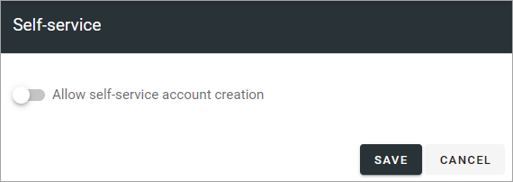
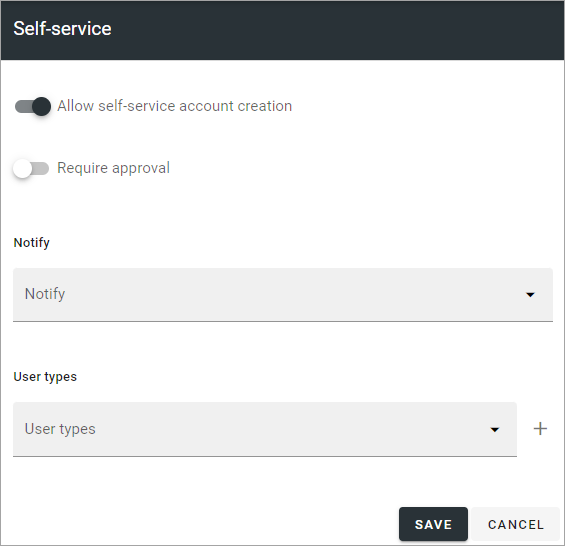
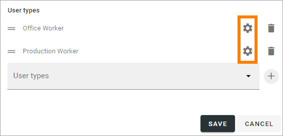
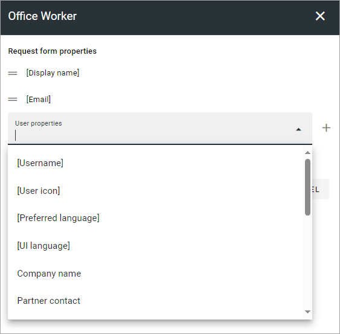

Self-service settings
=============================================

Using this option, you decide if users should be able to create Omnia accounts themselves. You also need a request authentication screen for that purpose.

If self-service should not be possible in this business profile, you don't have to do anything. The default setting is:

If self-service should be possible, select this option and use the following settings:

+ **Require approval**: Select if approval should be needed. If it is, requests for an account must be handled using the "Pending approval" list.
+ **Notify**: If one or more colleagues should be notified of a new request, add them here.
+ **User types**: If it should be possible for users to select a user type when requesting an account, add one or more user types (select a user type and then click the plus).

When you have added one or more user types, you can add additional properties that must be filled in during the request. Click the cog wheel to open the settings.

Open the list and select a property.

and click the plus. You can add as many properties that are needed.

To change the order of the properties (fields), grab the left-most icon and use drag and drop.

A property you added can always be deleted. Note that Display name and Email are mandatory and can not be deleted.
