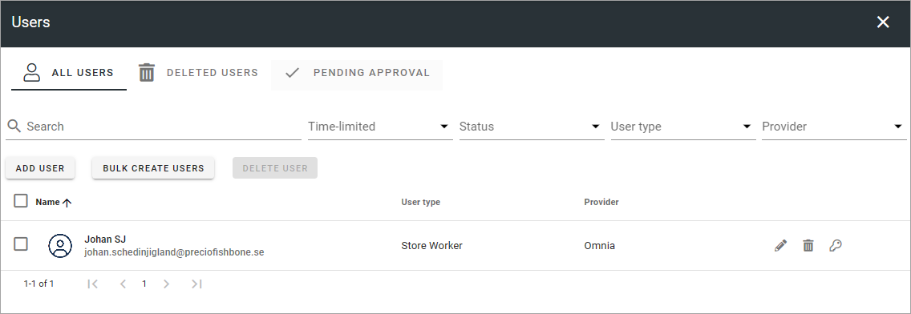

Users - business profile
=============================================

A list of Omnia users that has access to this bunisess profile only is displayed in this list. You can add, edit and delete users here. In User management for the tenant, you must be tenant administrator to be able to work with users there. Here you just need to be business profile adminstrator to work with users for the business profile.

The users you add here are available in   the User management lists for the tenant.

(Image from a test environment).

The options here works the same way as in User management for the tenant. There are only two major differences:

+ Users set up in a business profile has access to that business profile only.
+ The filter "Owner", available in the tenant list, is not available for a business profile (as it's not possible to list users from any other business profile here).

For more detailed information on the various options, see: :doc:`Users (tenant) </admin-settings/tenant-settings/user-management/users/index>`
