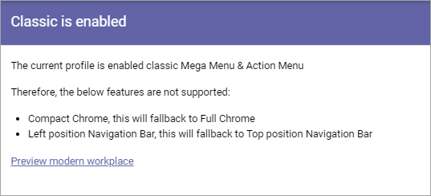

Classic is enabled
====================

This is an ongoing, preliminary description of functionality to come in Omnia 6.5-

If the option "Classic Action Menu & Mega Menu" is selected for the Business Profile it is noted in the main Workspace menu. Here you can read information about what that means.

When you have started working with the Workspace settings, you can use the link "Preview modern workspace" for a preview.
