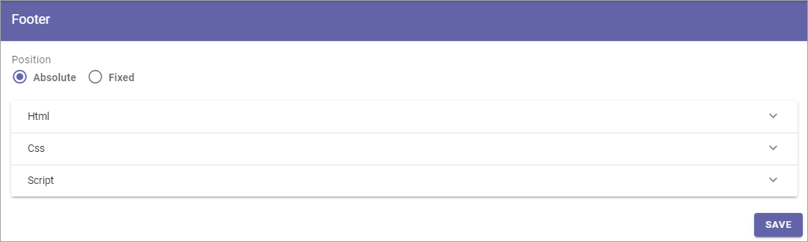

Footer
=========

This is an ongoing preliminary documentation for functionality to come in Omnia 6.5.

Here you can edit  footer settings for the business profile's workspace.

You work with the settings here as described for the business profile footer in Omnia 6.0: :doc:`Footer (Business Profile) </admin-settings/business-group-settings/settings/footer/index>`

Decide whether the position of the footer should be positioned at the bottom of the page (Absolute) or the bottom of the screen (Fixed). Then create  the footer using HTML/CSS and Javascript.

As an example, here's how it looks when you select HTML:

.. image:: footer-html-new.png
