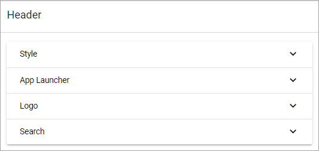
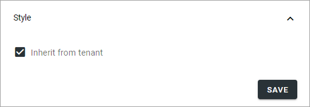
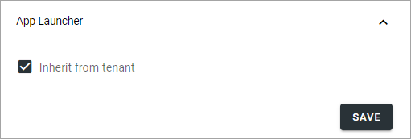
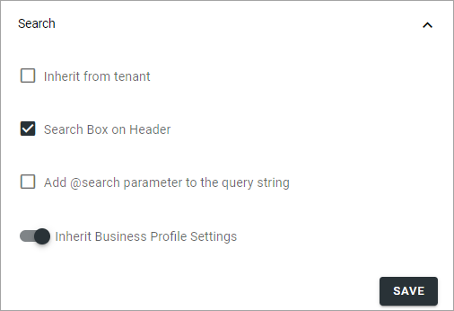

Header for Workspace
==========================

**This page is being edited. Will be finished soon.**

Here you can edit header settings for the Business Profile's Workspace.

Style
********
Here you can set the following:

+ **Inherit from tenant**: I you would like to inherit the header style settings from the tenant, instead of using specific settings here, select this option.
+ **Background**: If you choose to not inherit settings, add background color for the header, using these settings.
+ **Text**: If you choose to not inherit settings, add text color for the header, using these settings.

App Launcher
****************
The following can be set here:

+ **Inherit from tenant**: I you would like to inherit the app launcher settings from the tenant, instead of using specific settings here, select this option.

If you choose to not inherit the app launcher settings, add settings using the options. You use them the same way as the App Lancher settings for the tenant. See the heading "App Launcher" on this page: :doc:`Tenant Header settings </admin-settings/tenant-settings/settings/header/header-65/index>`

Logo
******
The Logo settings are these:

.. image:: workplace-header-app-logo-url-v7.png

+ **Inherit from tenant**: If you would like to inherit the logo settings from the tenant, instead of using specific settings here, select this option.

I you do not choose to inherit settings, set the desired logo settings here. You use them the same way as the Logo settings for the tenant, see link above.

Search
**********
Under Search, you can either inherit from tenant, or use these settings:

+ **Search Box on Header**: If a search box should be available in the header, select this option.
+ **Add @search parameter to the query string**: Available when the option above is selected. For advanced search implementations. With this option active you can add parameters to the search query string, for various implementations.
+ **Inherit Business Profile settings**: This regards settings for Quick Search and Advanced search. If you would like to use the Business Profile Search setttings, keep this option selected. If you would like to set specific settings, deselect and use the settings shown. They work the same ways as the settings for the Search block, see: :doc:`Search block settings </blocks/search/index>`

