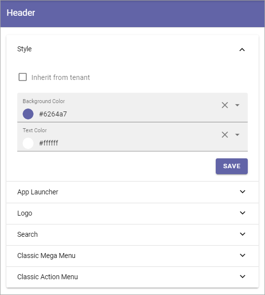
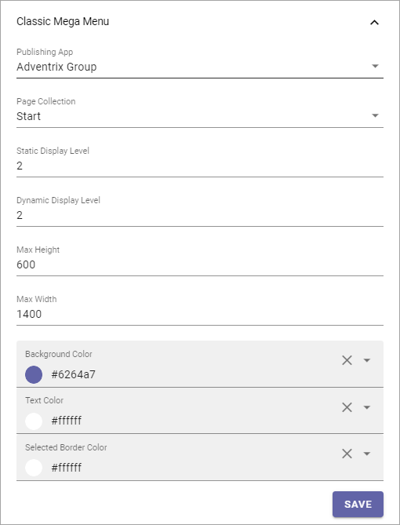
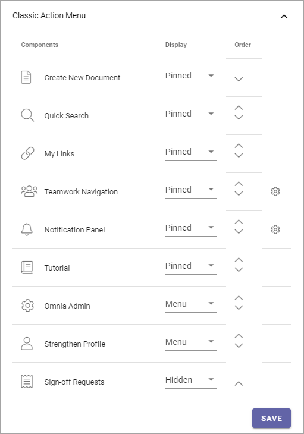

Header for Workplace
==========================

This is an ongoing preliminary documentation for functionality to come in Omnia 6.5.

Here you can edit default header settings for Workplace.

Style
********
Here you can set the following:

+ **Inherit from tenant**: I you would like to inherit the header style settings from the tenant, instead of using specific settings here, select this option.
+ **Background**: If you choose to not inherit settings, add background color for the header, using these settings.
+ **Text**: If you choose to not inherit settings, add text color for the header, using these settings.

App Launcher
****************
The following can be set here:

.. image:: workplace-header-app-launcher.png

+ **Inherit from tenant**: I you would like to inherit the app launcher settings from the tenant, instead of using specific settings here, select this option.

If you choose to not inherit the app launcher settings, add settings using the options. You use them the same way as the App Lancher settings for the Business Profile. See the heading "App Launcher" on this page: :doc:`Header settings for the Business Profiler </admin-settings/business-group-settings/settings/header/index>`

Logo
******
The Logo settings are these:

.. image:: workplace-header-app-logo.png

+ **Inherit from tenant**: I you would like to inherit the logo settings from the tenant, instead of using specific settings here, select this option.
+ **Text**: (A description will be added soon.)
+ **Logo Text**: (A description will be added soon.)
+ **(Image area)**: To use the Media Picker to select a Logo Image, click the plus. To remove an image, click the x. See this page for information on how to use the Media Picker: :doc:`The Media Picker </general-assets/media-picker/index>`
+ **Padding**: Use these settings to add som padding around the Logo, if needed.

Search
**********
Under Search, the following is available:

.. image:: workplace-header-search.png

(A description will be added soon).

Classic Mega Menu
*******************
These settings are available when “Classic Action Menu & Mega Menu” is selected for the Business profile.

You use them the same way as the Mega Menu settings in Omnia 6.0. See the heading "Mega Menu" on this page: :doc:`Header settings for Business Profile </admin-settings/business-group-settings/settings/header/index>`

Classic Action Menu
**********************
These settings are available when “Classic Action Menu & Mega Menu” is selected for the Business profile.

You use them the same way as the Action Menu settings in Omnia 6.0. See the heading "Action Menu" on this page: :doc:`Header settings for Business Profile </admin-settings/business-group-settings/settings/header/index>`
