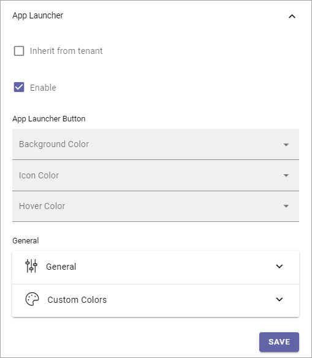
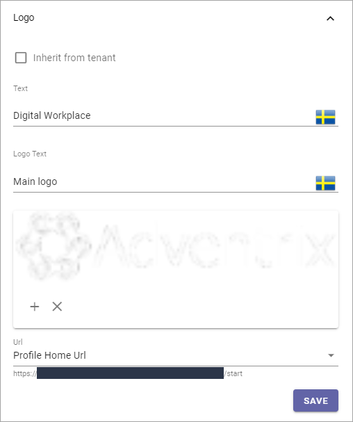
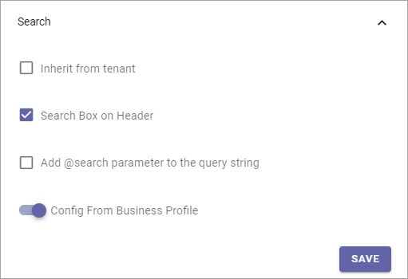
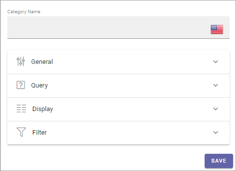
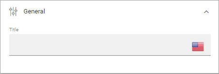
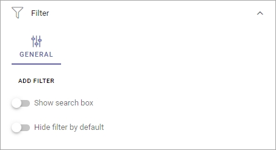

Header for Workspace
==========================

**This page is being edited. Will be finished soon.**

Here you can edit header settings for the Business Profile's Workspace.

.. image:: workplace-header-v7.png

Style
********
Here you can set the following:

+ **Inherit from tenant**: I you would like to inherit the header style settings from the tenant, instead of using specific settings here, select this option.
+ **Background**: If you choose to not inherit settings, add background color for the header, using these settings.
+ **Text**: If you choose to not inherit settings, add text color for the header, using these settings.

App Launcher
****************
The following can be set here:

+ **Inherit from tenant**: I you would like to inherit the app launcher settings from the tenant, instead of using specific settings here, select this option.

If you choose to not inherit the app launcher settings, add settings using the options. You use them the same way as the App Lancher settings for the tenant. See the heading "App Launcher" on this page: :doc:`Tenant Header settings </admin-settings/tenant-settings/settings/header/header-65/index>`

Logo
******
The Logo settings are these:

+ **Inherit from tenant**: If you would like to inherit the logo settings from the tenant, instead of using specific settings here, select this option.

I you do not choose to inherit settings, set the desired logo settings here. You use them the same way as the Logo settings for the tenant, see link above.

Search
**********
Under Search, the following is available:

+ **Search Box on Header**: If a search box should be available in the header, select this option.
+ **Default Search Box text to Query string**: Available when the option above is selected. For advanced search implementations. With this option active you can add parameters to the search query string, for various implementations.
+ **Inherit Business Profile settings**: This regards settings for Quick Search and Advanced search. If you would like to use the Business Profile Search setttings, keep this option selected. If you would like to set specific settings, deselect and use the settings shown. They work the same ways as the settings for the Search block, see: :doc:`Search block settings </blocks/search/index>`

Teamwork Navigation - additional settings
*******************************************
Click the cog wheel to set additional settings for Teamwork Navigation. Here's what you can set:

.. image:: teamwork-navigation-overview-new.png

You can edit which Categories (tabs) to display in Teamwork Navigation and you can work with a number of details for what is actually shown under each category. Using the option Create Teamwork you can edit the settings for what is to be displayed regarding Show Create New Site, and if that option should be available for users at all.

Note that a category is basically a Team Collaboration Rollup, so if you think along this line when you edit the settings for a category, you're on the right track.

Categories
------------
You can edit categories this way:

+ Click the dust bin to remove a category.
+ Click the cog wheel to handle the detailed settings for a category. 

When editing settings for a category, the same settings are available as when creating a new category, see below.

+ To add a new category, click ADD.

.. image:: teamwork-navigation-add-new.png

The following settings are available:

+ **Category Name**: Add a name for the category (tab) here, in some or all the available languages. Click the flag to change language.

General
----------
Here you can add a Block Title if needed. Click the flag to change language.

The Title is shown under the Categories.

Query
'''''''
For Query you can set:

.. image:: teamwork-navigation-addquery-new2.png

+ **Scope**: Select scope, for example All, Followed or Member of. (See more information about this below.).
+ **Only Current Business Profile**: Below you can select Business Profile to execute the query in. If you want to do that for the Current Business profile only, select this option.
+ **Business Profile**: You can select a Business Profile for the query in this list.
+ **Site Template**: Here you can select one or more Site Templates for the query, meaning all sites that are created from this template, in the selected Business Profile. Don't forget to click ADD when you have salected a Tamplate. It's not mandatory. If you don't select Site Templates here, the query is run for all sites.
+ **Run Query On Load**: For a shorter list of Teamworks, it most likely works fine to run a query when the list is opened, but for longer lists it may not. For a longer list, for example a list of all Teamworks, deselecting this option and instead displaying a search box, may be a better choice. 

To add a search box, use the Filter settings, see below.

Regarding Scope, here’s more detailed information:

Note that the first three scopes only include teamwork connected to Omnia that are assigned a provisioning template and can be found in the Teamwork list within Omnia admin.

+ All (public): All Teamwork App Instances where "Show in public listings" is checked. (Omnia Database).
+ Followed: All followed Teamwork App Instances. (Omnia Database).
+ Last Visited: All last visited Teamwork App Instances. (Omnia Database).
+ All (SharePoint Sites): All sites in SharePoint. (SharePoint Search).
+ Followed (SharePoint Sites): All followed sites in SharePoint. (SharePoint Social API).
+ Member of (Office 365 Groups): Member of Office 365 Groups. (MS Graph).

Display
'''''''''''
Display has the follwing settings:

.. image:: teamwork-navigation-add-display-new2.png

+ **View**: Select type for view for the list; List View or Navigation View. If you select List View you must also add at least one column.
+ **Paging**: Use this option to decide how paging should be handled for this list; No paging, Classic or Scroll.
+ **Icon Mode**: You can choose to use Letter Avatar or the template's icon.  
+ **Item Limit/Page Size**: Set the number of links that should be displayed before a Show more message is shown.
+ **Sort By**: Here you can select what to sort the list by.
+ **Descending/Ascending**: Choose to how to sort the list here.
+ **Show Follow Status**: Set to show the stars for follow status, or not (se below for an example.)
+ **Open in New Window**: Decide if the teamwork should open in a new window or not, when the link is clicked.
+ **Padding**: Set some padding between the border of the list and the lit's content, if needed.

Here's an example with Show Follow Status selected. A filled star indicates that the user follows the teamwork.

.. image:: teamwork-navigation-add-display-follow-new.png

Use the filter settings to make filters available for users, in the list.

Filter
''''''''''''''
Here you can add filters so users can filter a long list (= choose to just see some).

For more information on how to add filters, or a search box, see this page: :doc:`Filter UI </blocks/general-block-settings/filters/index>`

Create Teamwork
--------------------
The following is available here (as an example):

.. image:: teamwork-navigation-add-create.png

You work with the settings here the same way as in the Create App Block, see: :doc:`The Create App block </blocks/create-app/index>`

Notification Panel - additional settings
*******************************************
Click the cog wheel to set additional settings for Notification Panel. The following settings can be used:

.. image:: notification-panel-settings-notification-panel-new.png

What you actually do is using a Notification Panel block to display in the heading. Therefore, these settings are exactly the same as are described here: :doc:`The Notification Panel block </blocks/notification-panel/index>`
